こんにちは。

遊休PCになっていた **Lenovo X1 Yoga** をリカバリしたので記録を兼ねて記事にします。
**※今回は完全クリーンアップします**

この作業は **2019年1月25日に実施** しました。
作業には **1時間程度** の時間がかかりますのでご注意ください。

**USBメモリのリカバリディスク**を準備し、**電源オフの状態でPCに装着**します。

USBメモリの準備については、以下の公式サイトを参考にしてください。
[リカバリーメディアを作成、または Lenovo から入手する - NZ](https://support.lenovo.com/nz/ja/solutions/ht035659)

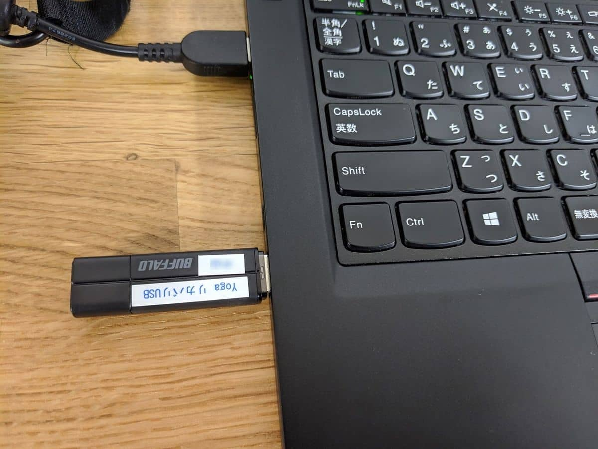

## リカバリの流れ

1. 電源をONし、**F12キー** で起動選択メニューに遷移し、**USB HDD** を選択し **Enterキー** で進みます
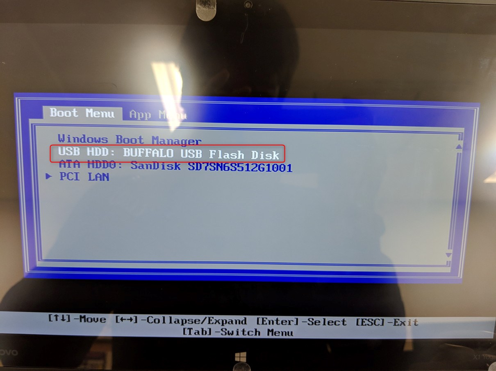

1. キーボードレイアウトに **Microsoft IME** を選択します
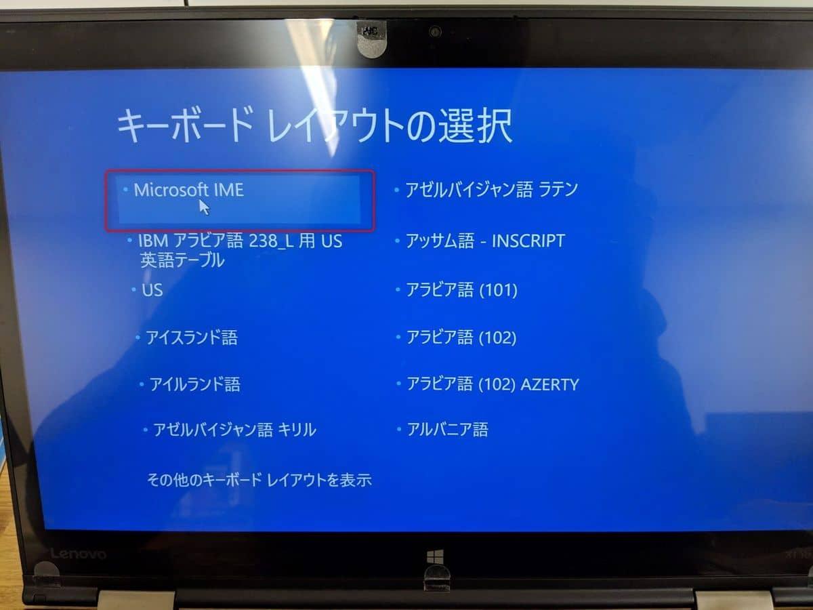

1. **トラブルシューティング** へ進みます
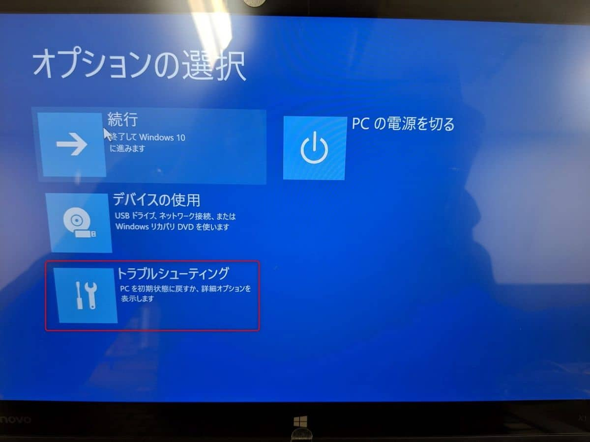

1. **ドライブから回復する** を選択します
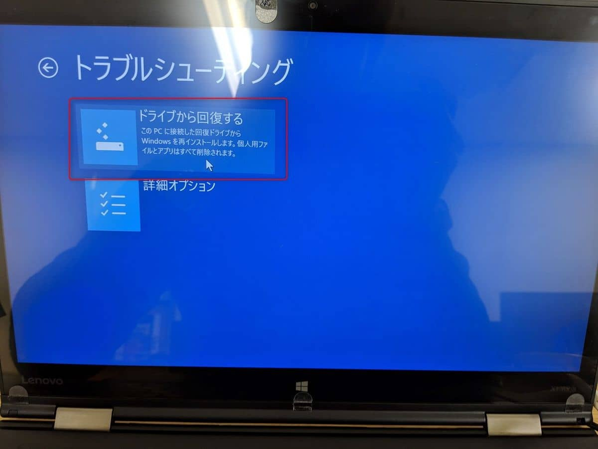

1. **BitLocker回復キー**を入力します ※BitLockerをかけていた場合のみ本手順は発生します
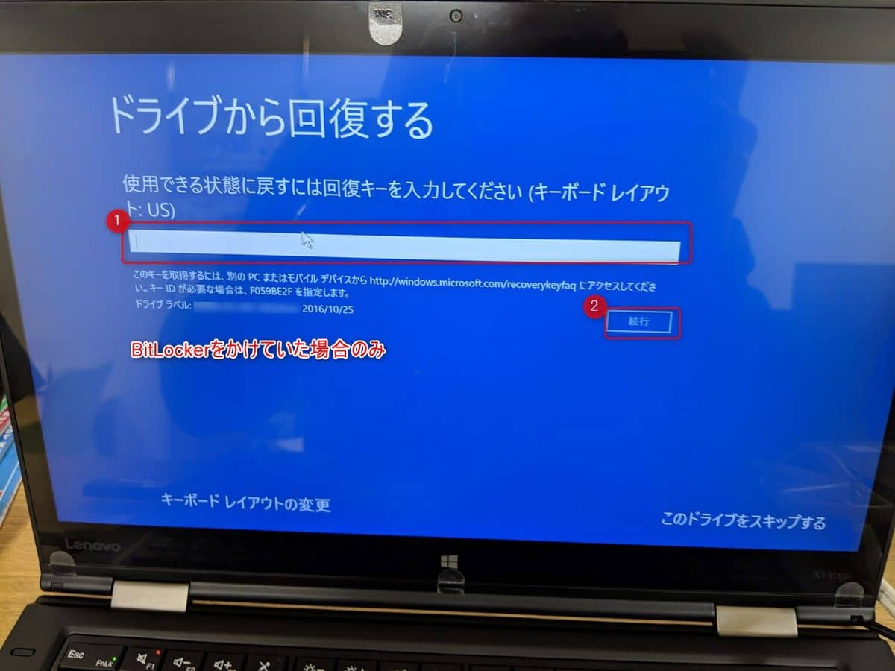

1. **ドライブを完全にクリーンアップする** を選択します
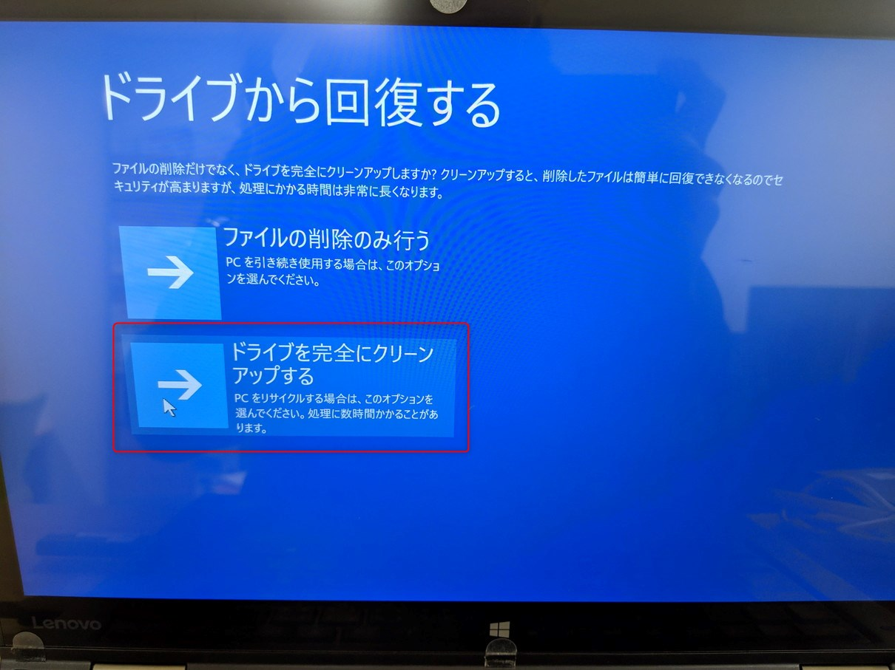

1. 確認事項を読み **回復** をクリックし開始します
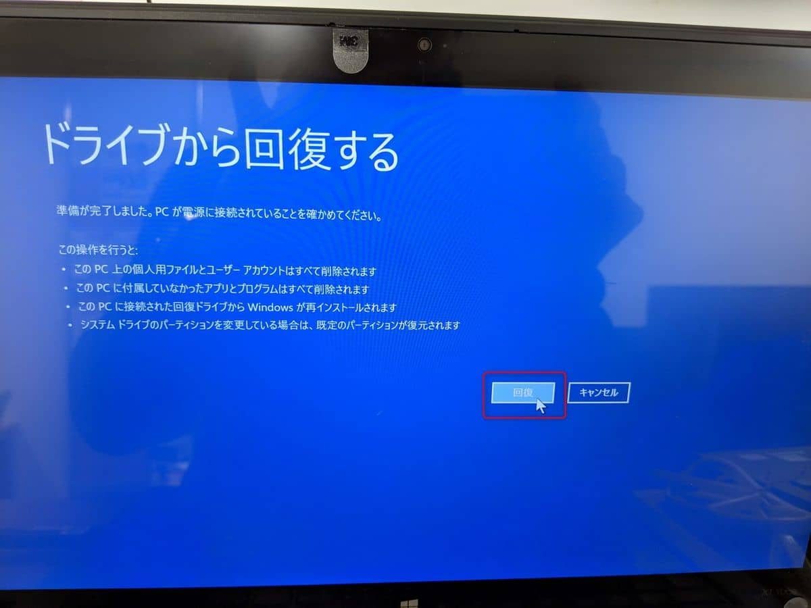

1. リカバリ完了を待ちます
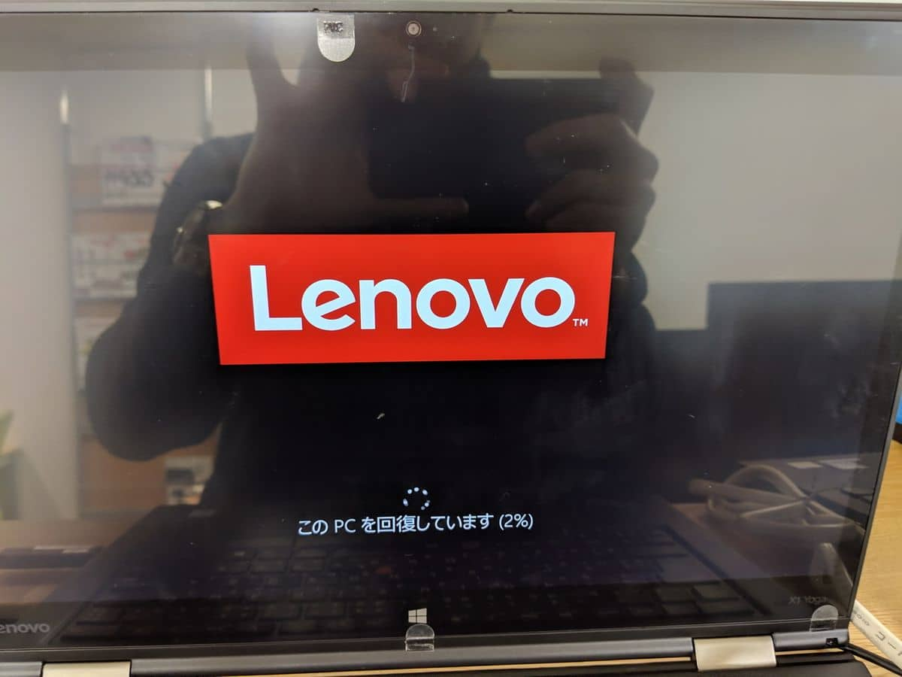

1. 以下の画面で **F9** を押下し再起動します　
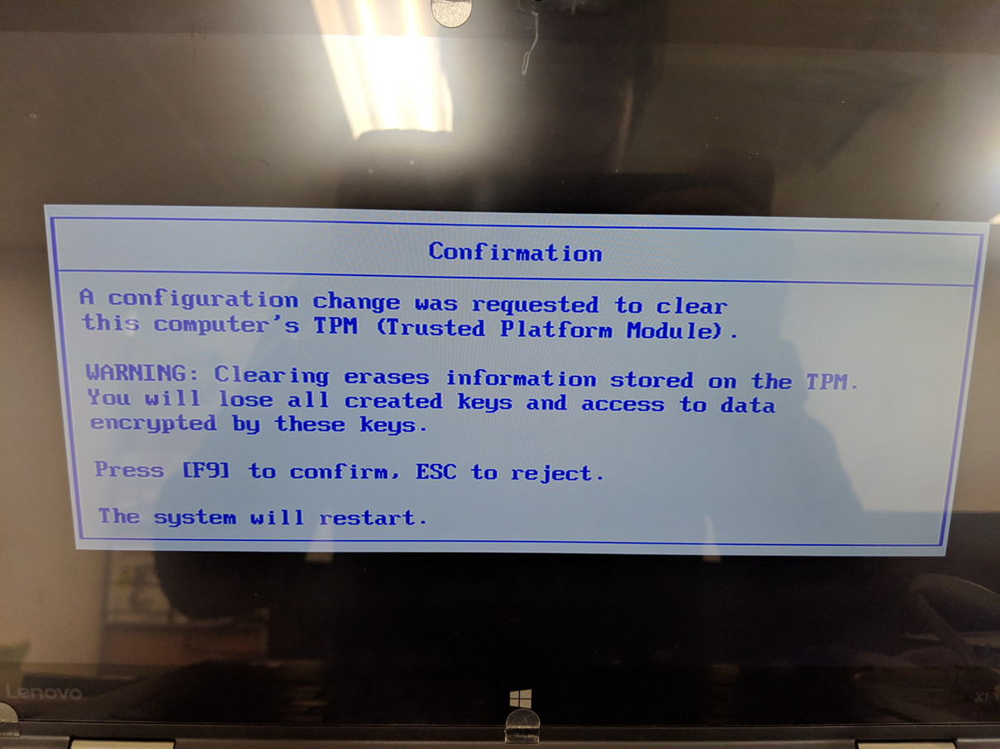

1. Windowsのインストールが完了するまで待ちます
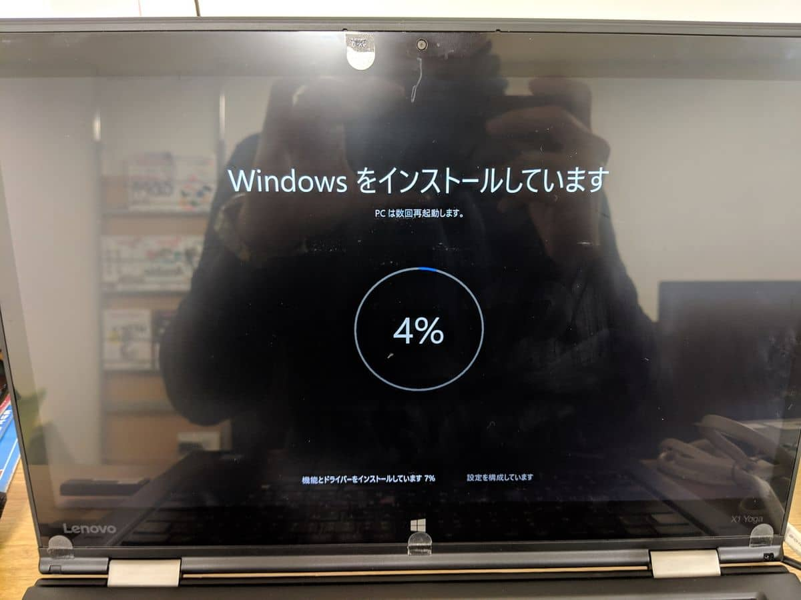

インストールが完了し、あとはWindowsのセットアップを実施します。
こちらの手順は割愛します。

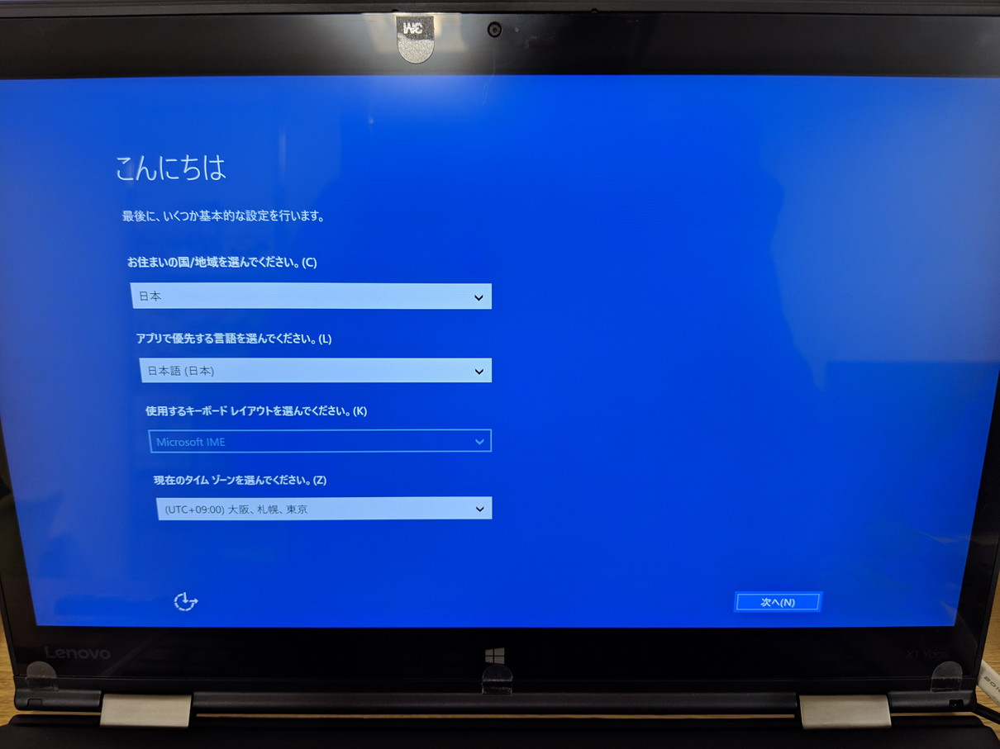

## あとがき

リカバリメディアがないと、Lenovoから購入することになりますが1万円近くします。。
正常に動作しているうちにリカバリメディアを作成しておきましょう。

それでは次回の記事でお会いしましょう。
