こんにちは。

今回は **XServer** で発行できるメールアドレスを **Gmailで送受信できるように** 設定してみたいと思います。
応用で他のメールサービスも利用できると思いますので参考にしてください。

XServerの設定はサーバーパネルのこのあたりを参考にしてください。
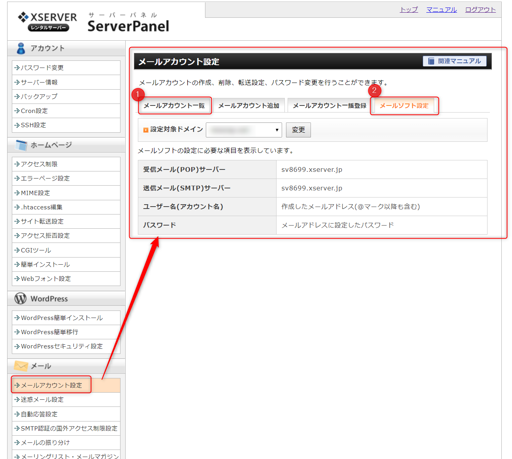

## 手順

1. **歯車マークから設定** に進みます。
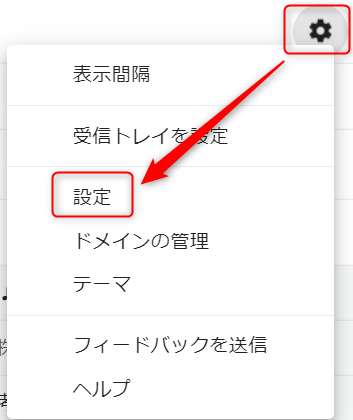

1. **アカウント** から **メール アカウントを追加する** を選択します。
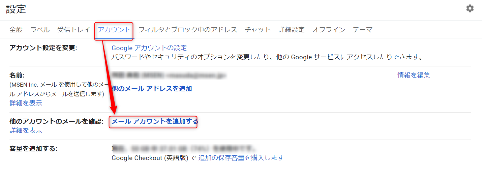

1. **追加するメールアドレスを入力** し次へ
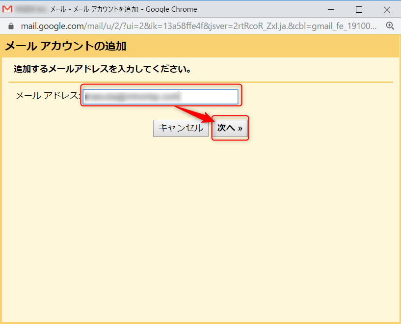

1. オプションが出ますが、 **POP3を選択** します。
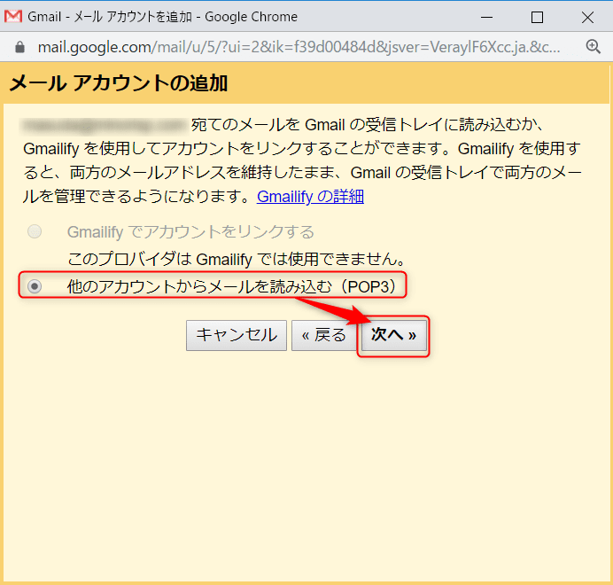

1. **サーバーの情報を入力** します。これで設定は完了です。
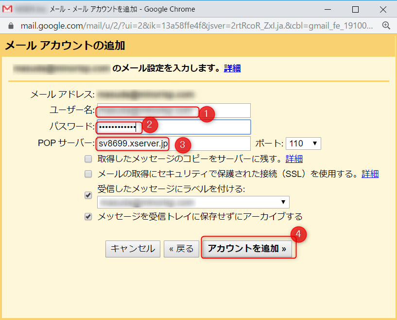

1. 続けて以下のように **送信もできるように設定** します
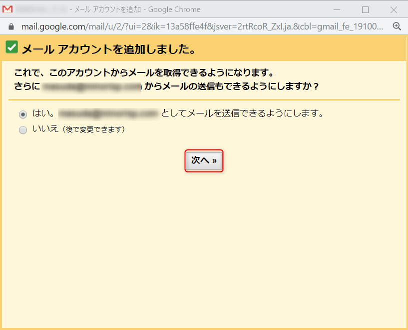

1. **送信される名前を入力** して次へ

1. **サーバー設定を入力** して次へ
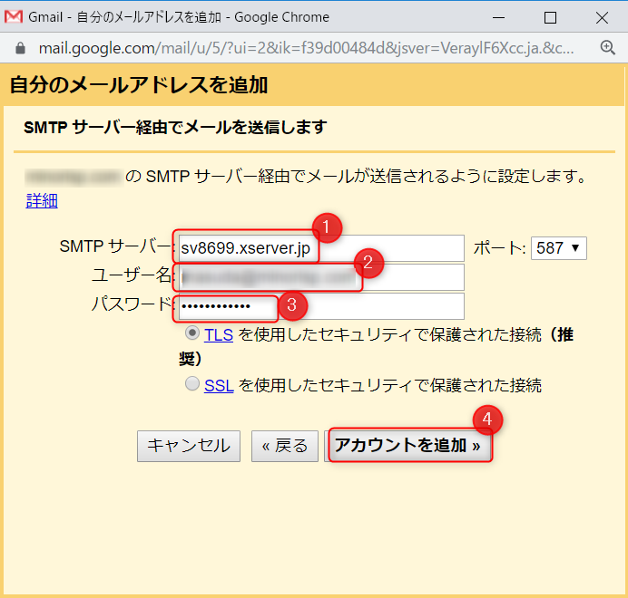

1. **確認コードを入力** して完了です
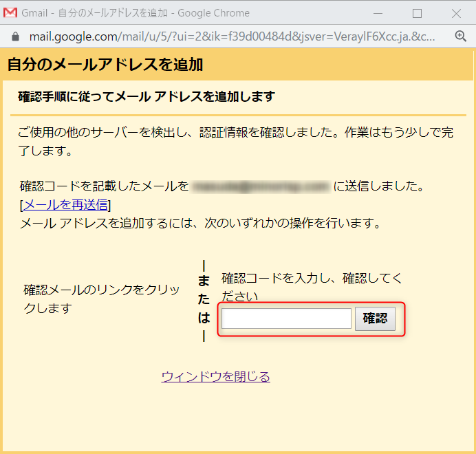

上記までの設定で **送信時にどちらから送るか選択**　できます
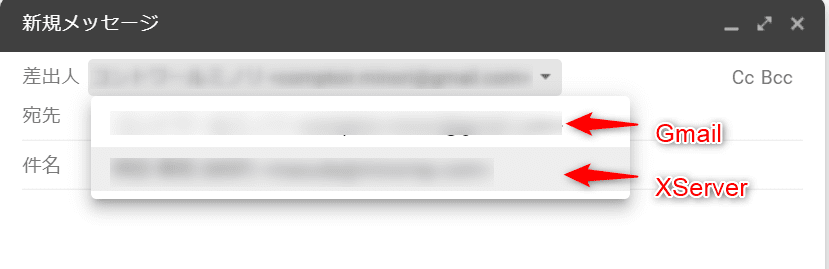

## あとがき

前述までの手順は **GSuiteでは送信設定をしようとすると以下のエラー** となりできないことが確認できました。
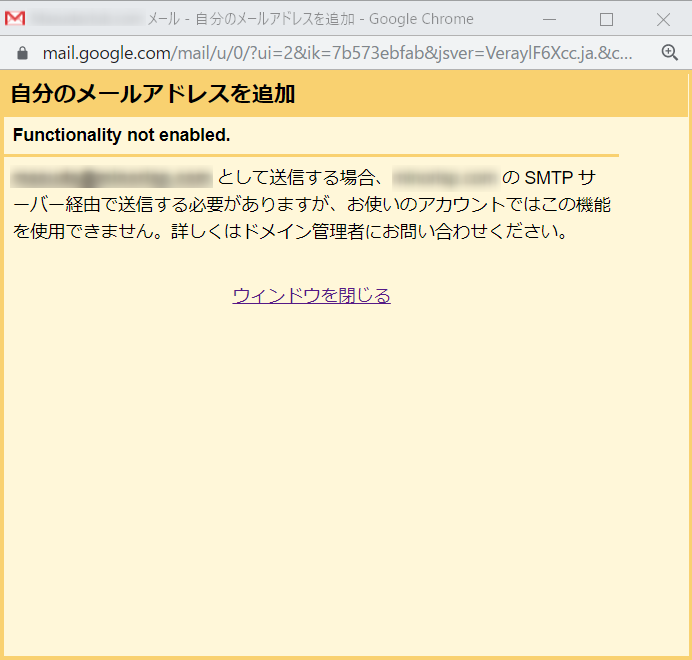

よって今回の記事は、個人アカウントを利用して評価しています。

それでは次回の記事でお会いしましょう。