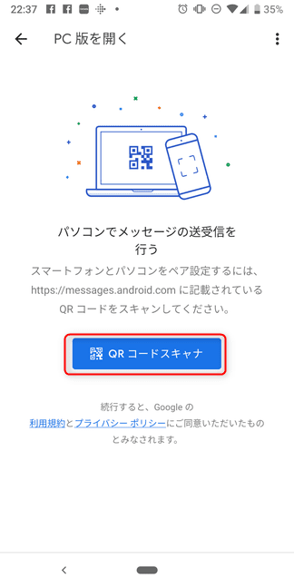
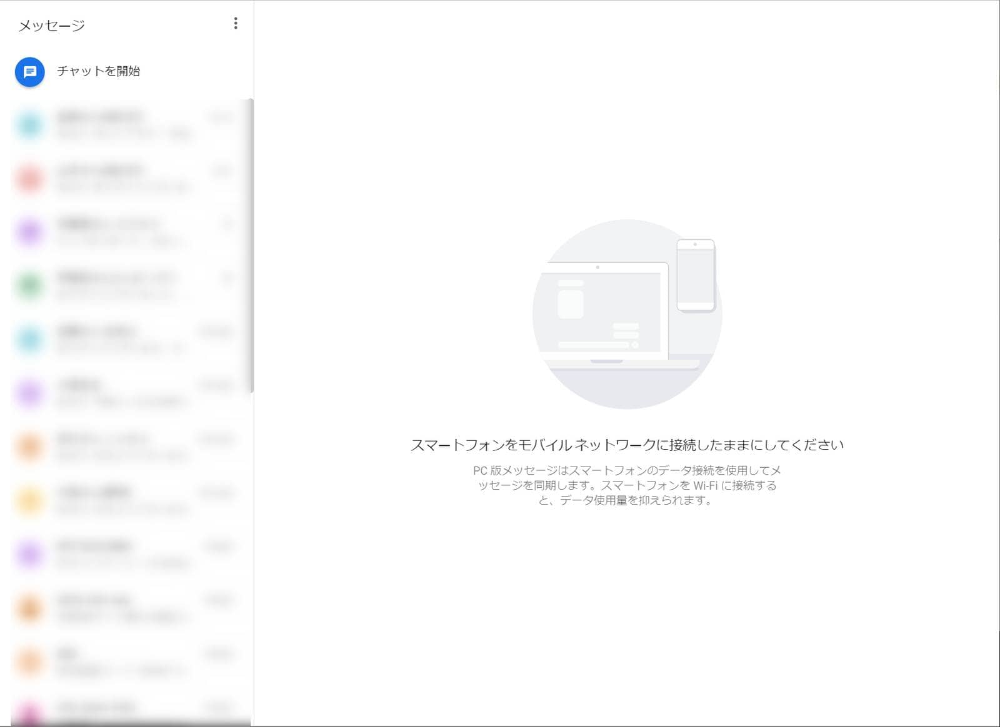

こんにちは。

最近、**Google Pixel3** に替えました。
[Google Pixel 3 - 日本 - 世界を見る新しい方法 - Googleストア](https://store.google.com/jp/product/pixel_3)

執筆直前に知ったのですが、 **PCのブラウザでSMSが送受信できる** んです。
(当たり前の機能だったらすみません。。。)

## 設定は簡単

1. Androidで **SMSアプリ** (私の場合メッセージというアプリ) を開き右上の **︙** から **ウェブ版Androidメッセージ** をタップします。

1. 続けてAndroidで **QRコードスキャナ** をタップします。

1. 次はPCで 以下のURLに接続します。
>[PC 版メッセージ](https://messages.android.com/)

1. PCに表示されたQRコードを **2** で起動したAndroidのQRコードスキャナで読み取ります。

1. PC側のブラウザにポップアップで許可を求められるので **許可** します。

## PCでSMSが！

使えるようになりました！

LINEやSlackなどのチャットツールが当たり前になってもまだまだSMSって使いませんか？

嬉しくて書いた記事でした。

## あとがき

**Firefox** と **Chrome** で利用できることを確認しました。

機種やAndroidのバージョンによっては実現出来ないかもしれませんが、方法が異なるよ、などありましたらお気軽にコメントいただけると嬉しいです。

ちなみに、Pixel3の **Androidバージョンは9** です。

それでは次回の記事でお会いしましょう。

