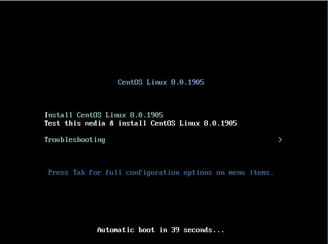
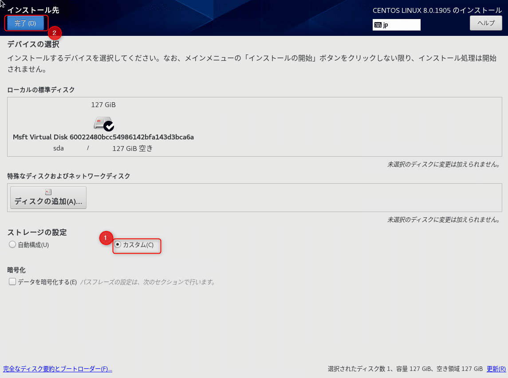
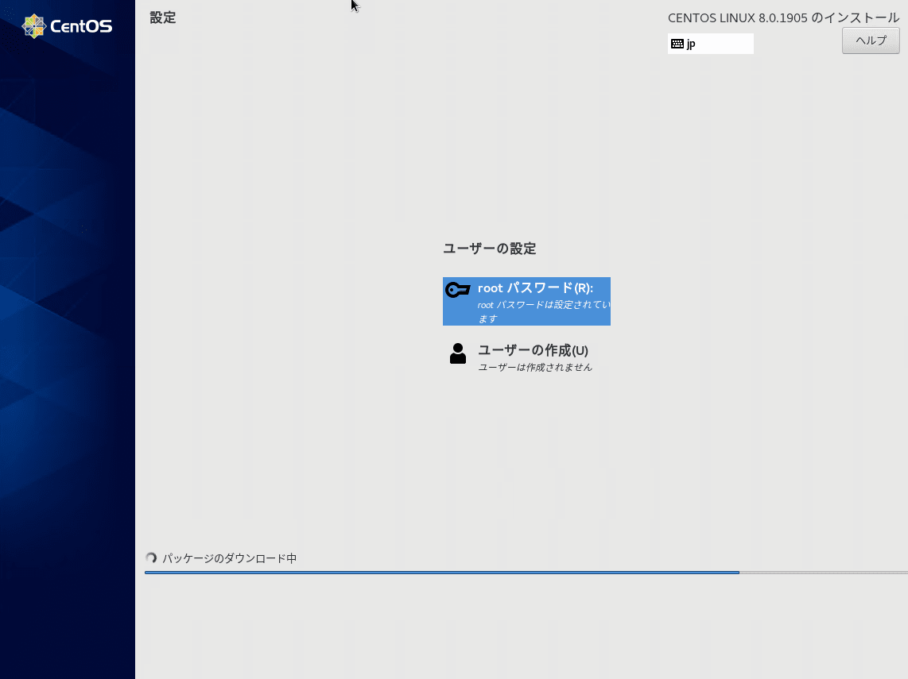

こんにちは。

CentOSの最新版バージョン8が2019年9月24日にリリースされました。

早速、インストールをしてみたいと思います。
まずは、インストールISOを以下からダウンロードしましょう。

[Download CentOS](https://www.centos.org/download/)


適当なリンクからISOをダウンロードします。
CentOS7までにあった、Minimalバージョンはなくなっているようです。


執筆時点では、 `CentOS-8-x86_64-1905-dvd1.iso` でした。

6.6GB・・・大容量です。。


CentOS8をインストールした環境は、 **Windows Server 2019上のHyper-V** です。
Hyper-V の **バージョンは 10.0.14939.0**


仮想マシンのスペックは、 **CPU1コア** 、 **メモリ2GB** です。

## インストール

1. まずは、ISOでブートした状態。


1. 続いて言語選択です。これまでと変わりませんね。


1. インストール概要に進みます。以下はデフォルト状態です。


1. ソフトウェアの選択から、最小構成も選択することができました。GUIを見てみたいのでデフォルトのまま進めます。


1. インストール先を選択し、ストレージ設定で **カスタムを選択** して **完了をクリック** します。


1. どのようなパーティションになるか確認したいので、 **標準パーティションを選択** へ変更して **自動的に作成します** をクリックします。


1. CentOS7と変わらず、デフォルトの **ファイルシステムはxfs** でした。評価なのでこのままインストールします。


1. **インストールの開始** をクリックします。


1. ユーザー作成についてもCentOS7までと変わりはなさそうです。rootのみを設定して進めます。


環境に依存しているところもあると思いますが、インストールが完了するまでの所要時間は、およそ30分程度でした。

## 起動しない・・・

いよいよインストールが完了して起動をしてみると・・・


**画面が真っ黒で起動しません。。**

キーボードは受け付けているようですが押しても何の変化もなし。
Rescue モード で起動してみても同じ現象で起動しませんでした。

※2，3度同じことを試しましたが、同様の現象でした。

## 最小構成でインストールしてみる

GUIに問題があるかと思い、最小構成で再度インストールしてみました。


おー、起動しました。
rootでログインも出来ました。


## 変わったこと

とりあえず動いたので、変更点をまとめてくださっている方の記事を参考に触ってみました。

[Red Hat Enterprise Linux 8 新機能をわかりやすく解説【RHEL8】 – Hacker's High](https://hackers-high.com/linux/rhel8-new-features/)

概ね、CentOS7からの違和感はないように思いましたが、上記の記事にもある **DNF（YUM v4） の登場** が気になるところでしょうか。

* CentOS7のyum
```
# ll /usr/bin | grep yum
-rwxr-xr-x  1 root root        801  8月  6  2017 yum
```

* CentOS8のyum
```
# ll /usr/bin | grep yum
lrwxrwxrwx. 1 root root       5  5月 13 15:34 yum -> dnf-3
```

ただ、これまでの yum と同じような使いかたで大丈夫そうです。

```
# yum --help
usage: dnf [options] COMMAND

主要コマンドの一覧:

alias                     List or create command aliases
autoremove                当初は依存関係としてインストールされた不要なパッケージをすべて削除します
check                     packagedb の問題を確認します
check-update              利用可能なパッケージのアップグレードを確認します
clean                     キャッシュデータを削除します
deplist                   パッケージの依存関係とこれを提供するパッケージがどれかを一覧表示します
distro-sync               インストール済みパッケージを利用可能な最新バージョンに同期します
downgrade                 パッケージをダウングレードします
group                     グループ情報を表示または使用します
help                      有用な使用方法のメッセージを表示します
history                   トランザクション履歴を表示、または使用します
info                      パッケージもしくはパッケージのグループについての詳細を表示します
install                   システムに 1 つのパッケージまたは複数のパッケージをイ ンストールします
list                      パッケージまたはパッケージのグループを一覧表示します
makecache                 メタデータキャッシュを生成します
mark                      インストール済みパッケージをユーザーがインストールしたとマークするか、またはマークをはずします。
module                    モジュールと対話します。
provides                  どのパッケージが特定の値を提供するか見つけます
reinstall                 パッケージを再インストールします
remove                    システムから 1 つのパッケージまたは複数のパッケージを 削除します
repolist                  設定済みのソフトウェアリポジトリーを表示します
repoquery                 キーワードに一致するパッケージを検索します
repository-packages       特定のリポジトリーのすべてのパッケージに対して、コマンドを実行します
search                    特定の文字列のパッケージの詳細を検索します
shell                     対話式 DNF シェルを実行します
swap                      1 つの  spec を削除およびインストールするために対話式 dnf モッドを実行します
updateinfo                パッケージに関する勧告を表示します
upgrade                   システム上の 1 つのパッケージまたは複数のパッケージを アップグレードします
upgrade-minimal           システムに影響する問題を修正する「最新の」パッケージに一致したもののみをアップグレードします

プラグインコマンドの一覧

builddep                  Install build dependencies for package or spec file
changelog                 Show changelog data of packages
config-manager            dnf 設定オプションおよびリポジトリーの管理
copr                      Copr リポジトリーとの対話。
debug-dump                ファイルにインストール済みの rpm パッケージに関するダ ンプ情報
debug-restore             debug-dump ファイルに記録されたパッケージを復元します
debuginfo-install         debuginfo パッケージのインストール
download                  現在のディレクトリーにパッケージをダウンロードします
needs-restarting          再起動が必要な更新済みバイナリーを決定します
playground                Playground リポジトリーとの対話。
repoclosure               リポジトリーの未解決の依存関係の一覧を表示します
repodiff                  List differences between two sets of repositories
repograph                 ドット形式でパッケージの依存関係グラフ全体を出力
repomanage                rpm パッケージのディレクトリーを管理します
reposync                  リモート repo からすべてのパッケージをダウンロードします

オプションの引数:
  -c [config file], --config [config file]
                        設定ファイルの場所
  -q, --quiet           静かな操作
  -v, --verbose         詳細な操作
  --version             DNF バージョンを表示して終了します
  --installroot [path]  インストール root を設定します
  --nodocs              ドキュメントをインストールしません
  --noplugins           すべてのプラグインを無効にします
  --enableplugin [plugin]
                        名前ごとにプラグインを有効にします
  --disableplugin [plugin]
                        名前ごとにプラグインを無効にします
  --releasever RELEASEVER
                        設定ファイルと repo ファイルの $releasever の値をオーバ ーライドします
  --setopt SETOPTS      任意の設定オプションと repo オプションを設定します
  --skip-broken         パッケージをスキップして depsolve 問題を解決します
  -h, --help, --help-cmd
                        コマンドのヘルプを表示する
  --allowerasing        依存関係を解決するために、インストール済みパッケージの消去を許可します
  -b, --best            トランザクションにおいて利用可能な最適なパッケージバージョンを試してください。
  --nobest              do not limit the transaction to the best candidate
  -C, --cacheonly       システムキャッシュから全面的に実行し、キャッシュは更新しません
  -R [minutes], --randomwait [minutes]
                        コマンドの最大待ち時間
  -d [debug level], --debuglevel [debug level]
                        出力レベルをデバッグします
  --debugsolver         ファイルに詳細な解決結果をダンプします
  --showduplicates      一覧/検索コマンドで repo の重複を表示します
  -e ERRORLEVEL, --errorlevel ERRORLEVEL
                        エラー出力レベル
  --obsoletes           dnf の廃止されたアップグレードの処理ロジックを有効にするか、情報、一覧、repoquery
                        を廃止するパッケージの機能を表示します
  --rpmverbosity [debug level name]
                        rpm の出力レベルをデバッグします
  -y, --assumeyes       すべての質問に「はい」(yes) と自動的に答えます
  --assumeno            すべての質問に「いいえ」(no) と自動的に答えます
  --enablerepo [repo]
  --disablerepo [repo]
  --repo [repo], --repoid [repo]
                        id または glob により特定のリポジトリーだけを有効にしま す。複数回指定することが可能です
  --enable, --set-enabled
                        enable repos with config-manager command
                        (automatically saves)
  --disable, --set-disabled
                        disable repos with config-manager command
                        (automatically saves)
  -x [package], --exclude [package], --excludepkgs [package]
                        名前または glob ごとにパッケージを除外します
  --disableexcludes [repo], --disableexcludepkgs [repo]
                        excludepkgs を無効にします
  --repofrompath [repo,path]
                        追加のリポジトリーに対するラベルおよびパスは、複数回指定することが可能です。
  --noautoremove        もはや使用されていない依存関係の削除を無効にします
  --nogpgcheck          disable gpg signature checking (if RPM policy allows)
  --color COLOR         色を使うかどうか制御します
  --refresh             コマンド実行前にメタデータを期限切れに設定します
  -4                    IPv4 アドレスのみを解決します
  -6                    IPv6 アドレスのみを解決します
  --destdir DESTDIR, --downloaddir DESTDIR
                        パッケージをコピーするディレクトリーを設定します
  --downloadonly        パッケージのみをダウンロードします
  --comment COMMENT     トランザクションにコメントを追加します
  --bugfix              バグ修正関連パッケージを更新に含めます
  --enhancement         機能拡張関連パッケージを更新に含めます
  --newpackage          newpackage の関連パッケージを更新に含めます
  --security            セキュリティー関連パッケージを更新に含めます
  --advisory ADVISORY, --advisories ADVISORY
                        特定のアドバイザリーの修正に必要なパッケージを更新に含めます
  --bzs BUGZILLA        特定の BZ の修正に必要なパッケージを更新に含めます
  --cves CVES           特定の CVE の修正に必要なパッケージを更新に含めます
  --sec-severity {Critical,Important,Moderate,Low}, --secseverity {Critical,Important,Moderate,Low}
                        深刻度に一致するセキュリティー関連パッケージを更新に含めます
  --forcearch ARCH      アーキテクチャーの使用を強制します
```

## あとがき

GUIで動かせなかった部分については、今後の課題として解決できれば記事を更新したいと思います。
何か情報あればコメントいただければ幸いです。

ちなみに、Wikipedia によると **CentOS7の期限は 2024年6月30日** ですが、CentOS8についてはまだ記載がありませんでした。

[CentOS - Wikipedia](https://ja.wikipedia.org/wiki/CentOS#%E3%83%AA%E3%82%B9%E3%83%88)

それでは次回の記事で会いましょう。