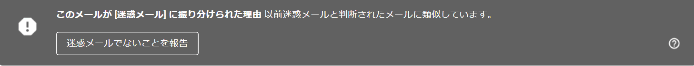
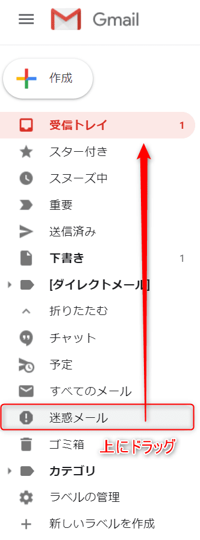
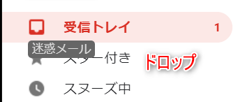
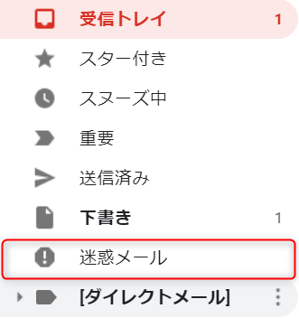

こんにちは。

弊社はメールサービスにGSuiteのGmailを利用していますが、 **ここ最近 (気になったの10月初旬から) Gmail でこれまでやりとりしていた方々のメールが 迷惑フォルダに入ってしまう事象が発生** しています。

内容としては、 **以前迷惑メールと判断されたメールに酷似しています。** というものですがメールの内容も特に問題になるようなことはありませんでした。

10/21にGoogleに問い合わせをしたところ、

> 世界各国から届くユーザーの情報により、日々更新されており、ユーザーを最大限保護するために今まで受信できていたメールに対しても、翌日急に迷惑メール扱いされてしまうことが発生いたします事、ご理解いただけますと幸いでごいざいます。

とだけ・・・。

## Gmail で迷惑メールに判別されない方法

Google から提示された迷惑メール分類を防ぐ方法を下記に転載いたします。

### 送信元のサーバーの IP アドレスが分かる場合

メールのホワイトリストを設定することが可能です。
ホワイトリストに送信元のサーバーの IP アドレスを登録することにより、当該サーバーから送信するメールを安全なメールと判断するようになります。

[Gmail で IP アドレスをホワイトリストに登録する - G Suite 管理者 ヘルプ](https://support.google.com/a/answer/60751?hl=ja)

### 送信元のメールアドレスやドメインが特定されている場合
迷惑メールフォルタをバイパスする設定が可能です。

[迷惑メールフィルタの設定のカスタマイズ - G Suite 管理者 ヘルプ](https://support.google.com/a/answer/2368132?hl=ja)

#### 設定箇所

1. Google 管理コンソールにログイン
2. [アプリ] > [G Suite] > [Gmail] > [詳細設定] > [迷惑メール]

#### 設定内容

1. 短い説明文を入力
2. [これらの承認済み送信者リストにあるアドレスまたはドメインから受信したメッセージについて、スパム フィルタをバイパスする] にチェックを入れ、[新しいリストを作成してください] をクリック
3. リスト名を入力し、[作成] をクリック
4. 作成されたリストをマウスでポイントすると表示される [編集] をクリックし、[追加] をクリック
5. 送信元のメールアドレスかドメインを記入し、[保存] をクリック
6. 右下の [設定を追加] をクリックし、[保存] をクリック

### 個別に判断する場合

1. 迷惑メールに分類されたメールを開き [ 迷惑メールではない ] ボタンをクリックする
    - 迷惑メールに対し再分類を行うことで Gmail が徐々に学習を行い、以降のメールを迷惑メールに分類しないようにします。
2. 送信元アドレスを連絡先へ登録する
    - 連絡先に登録されているアドレスから、迷惑メールを受信する確率が低いと判断し、以降のメールを迷惑メールに分類しないようにします。
3. Gmail のフィルタにて迷惑メールに分類しない設定を追加する

#### フィルタの作成例

1. Gmail へアクセス
2. 右上の歯車のアイコンをクリックし、[設定] をクリック
3. [フィルタとブロック中のアドレス] を選択し、[新しいフィルタを作成] をクリック
4. From の欄に送信元のメールアドレスまたはドメイン名を記入し、右下の [この検索条件でフィルタを作成] をクリック
5. [迷惑メールにしない] にチェックをつけ、[フィルタを作成] をクリック

## 判別されても気づきやすくする対策

とはいえ・・・

メールでやりとりする方々のメールアドレスを全て設定することは現実的ではなく、
**迷惑メールでないことを報告** ボタンで個別の判断をしていてもまた迷惑判別されることもあります。

目視で気づけるように、 取り急ぎ **迷惑メールフォルダを左ペインの上の方に上げる** 対策を実施しました。

1. 迷惑メールフォルダをドラッグします

1. 受信トレイ付近にドロップします

1. これで移動します。ただ、 **下書きフォルダの下までしか移動できない** 仕様のようです

くれぐれも見落としにご注意ください・・・。
他の有効な対策など、進展があれば記事を更新したいと思います。

それでは次回の記事でお会いしましょう。