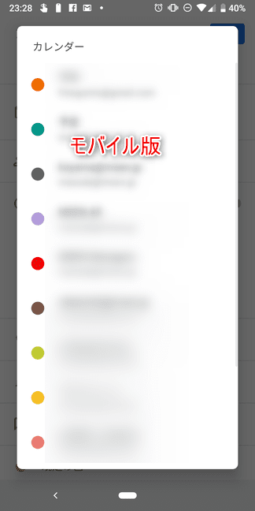
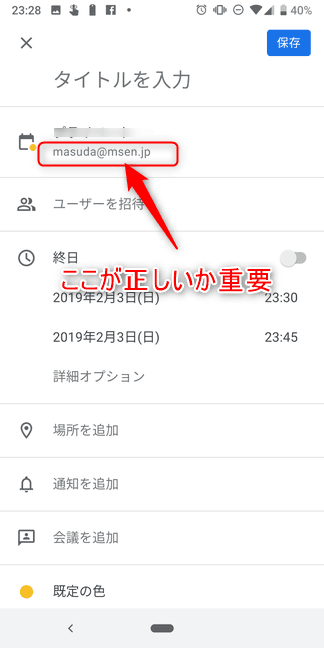

こんにちは。

今回は、私が普段実践している **スケジュール管理術** を紹介したいと思います。

私なりの方法であるため、賛否両論があるかと思いますがどうか温かい目でご覧ください。

## スケジュール種別

私はスケジュールというのは **2種類** あると考えています。

1つは、その時間に打合せや出張など **参加型の予定** で、
1つは、指定時間や指定日に実施しなければいけない **実践型の予定** です。
2つめは、**TODO** とも言うかと思います。

## ツールと意識

複雑な方法は利用していません。

私は以下の **ツール** と **意識** で抜けのないスケジュール管理を実践しています。

まず **ツール** ですが、これまでいろいろなのツールや、便利・万能とされる手帳を使ってきましたが、 **今のところ** これに落ち着いています。

それは、　**Googleカレンダー** ！
「ベタやな・・・」という声が聞こえてきそうですが、許してください。
でも、本当に有料アプリなど色々やってきましたがコレが一番だと思っています。

そして、**意識** ですが、2つあります。

1つめは、 **スケジュール関連する事象が発生した時点で入力する** です。
状況によってはすぐに入力できないこともあるかもしれませんが、**できるだけ** を目指します。
間違っても、**あとでまとめて整理しよう** ということはしません。

2つめは、 **寝る前などに翌日以降のカレンダーを確認する** です。

次項に記載していますが、私はGoogleカレンダーの **予定** と **リマインダー** の2つを組み合わせてスケジュール管理をしています。

**リマインダー** は消化できなかったものは **翌日に繰り越される** 仕様になっているため、この3点を確認します。

1 .**未来の予定**
2. **積み残っているリマインダー**
3. **未来のリマインダー** 

これらを寝る前などにさっとみて「そうだそうだ」と思い返すようにしています。
ふと思いついた時に、スマホ等で確認もしています。

※画面はPC版です。

## 管理術

**参加型の予定** は **予定** 機能を使います。
[video width="1480" height="886" mp4="/wp-content/uploads/2019/02/2019-02-03_22h50_20.mp4"][/video]

そして、 **実践型の予定** **リマインダー** 機能を使います。
[video width="1484" height="886" mp4="/wp-content/uploads/2019/02/2019-02-03_22h57_45.mp4"][/video]

**予定** と **リマインダー** を前項に記載した意識のとおり、とにかく発生したタイミングや思いついたタイミングで入れておきます。

例えば、1月某日に3か月先の4月にやらないといけないことが発生したら **4月1日に内容が分かるようにリマインダーを入れます。**

絶対に忘れてはいけないものなのどは、こまめにリマインダーを入れておきます。

スマホにアカウントを連携し、プッシュ通知をONにしておくことで通知してくれるので、終わるまでこの通知を消さないようにしてスマホの通知を見る度に思い出せるようにもしています。

## 注意点
Googleカレンダーの仕様として、PC版のカレンダーは指定されているアカウントのカレンダーのみが表示されますが、**モバイル版の場合は登録しているアカウント全て** が表示できます。

これは一概にどちらが便利とは言えませんが、モバイル版で入力する場合、この仕様を分かっていないと違うアカウントで入力してしまってPC版に戻ったときに「あれ？入力したはずなのに予定がない！」という自体が発生します。

これが原因で予定やリマインダーが抜けてしまったとなっては致命的ですので、複数アカウントをモバイルで管理されている方は頭の片隅に意識をお願いします。

ちなみに、私はモバイルで異なるアカウントに入力していていたことでPCで確認したときに予定抜けになりダブルブッキングしてしまったことがあります・・・。

## あとがき

私はこの方法で実践し、スケジュール管理はGoogleカレンダーに任せています。

これにより、それぞれのスケジュールを記憶しておく必要がなくなり、別のことに頭が使えます。
いわば秘書のような存在です(笑)

こういう使い方もあるよ、といったコメントも是非お待ちしています。

それでは次回の記事でお会いしましょう。