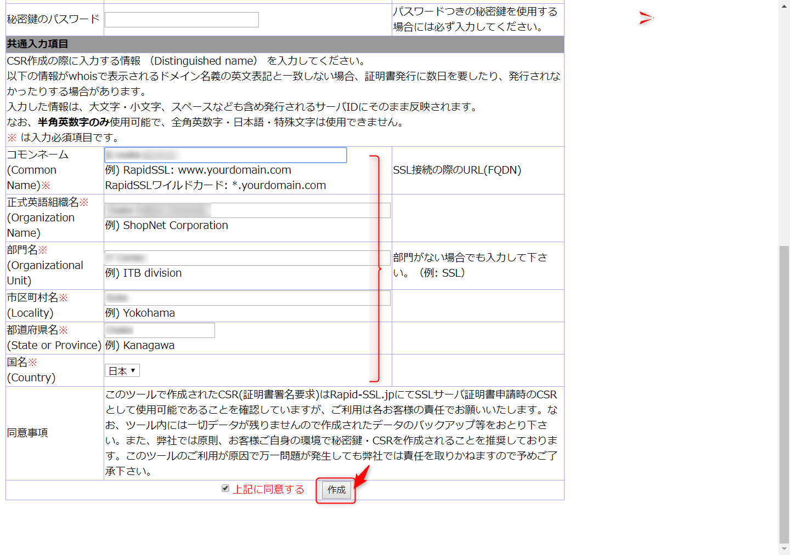
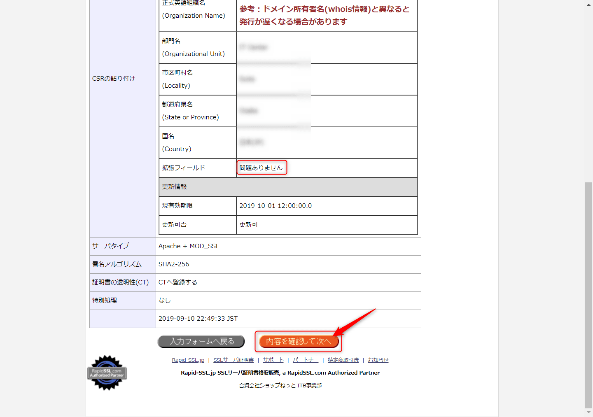

こんにちは。

今回はRapid-SSLで取得している証明書を更新する方法を紹介します。

1. Rapid-SSLへ接続します。
[SSL証明書 RapidSSL 4300円 ワイルドカード 39000円 (RapidSSL Strategic Partner)](https://www.rapid-ssl.jp/)

1. **更新お申込** をクリックします。

1. 最下部にスクロールし、 **お申し込みフォームへ** へ進みます。

1. 以下を参考に入力します。ページ中のCSRはCSR作成ツールを利用します。

[Rapid-SSL.jp 秘密鍵＆CSR(証明書署名要求)作成ツール2048ビット対応版](https://securitycenter.rapid-ssl.jp/tools/makePkeyCsr2048SHA2.php)

1. 別ページで作成されますので、ページを閉じずに置いておきます。

1. 作成したCSRを入力、各項目を入力して **作成** をクリックします。(ここまでは **手順4と同じ画面** です）

1. 内容を確認し、進みます。

1. 担当者情報を入力します。
今回の紹介では、**発行承認はファイルアップロードで承認** を選択します。

1. 申し込みを確定します。

1. 決済情報を入力し、決済します。

1. 承認のために、 **http(s)://documentroot/well-known/pki-validation/fileauth.txt** にメールで指定された文字列(PIN)を記載したファイルを配置します。配置すると、 **10分ほど** で　**「【通知】 SSL サーバ証明書発行完了のお知らせ」** というタイトルのメールが到着します。
以下から状況を確認することもできます。
[SSL サーバ証明書 RapidSSL RapidSSLワイルドカード サポートページ](https://securitycenter.rapid-ssl.jp/rapidssl-support/ssl-support.htm)
承認されたあとは、 **fileauth.txtを削除** しましょう。

1. 証明書はメール本文に記載されていますので、CSR発行時にコピーした秘密鍵を更新してWebサービスを再起動して反映します。

以上で簡単に証明書を更新することができます。
参考になれば幸いです。

それでは次回の記事でお会いしましょう。