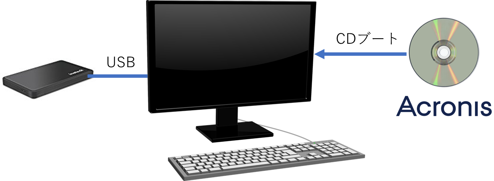
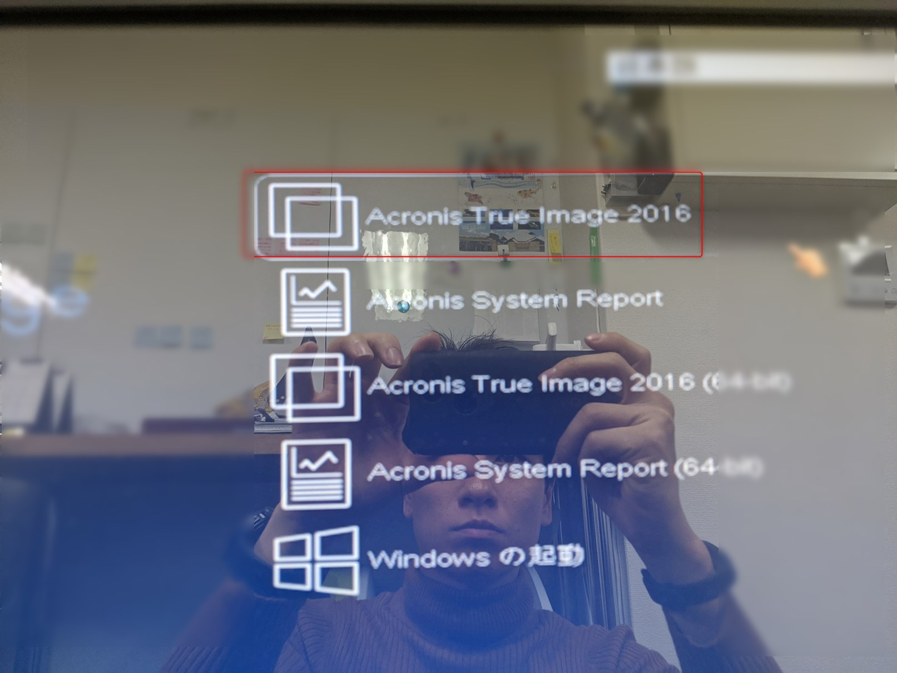
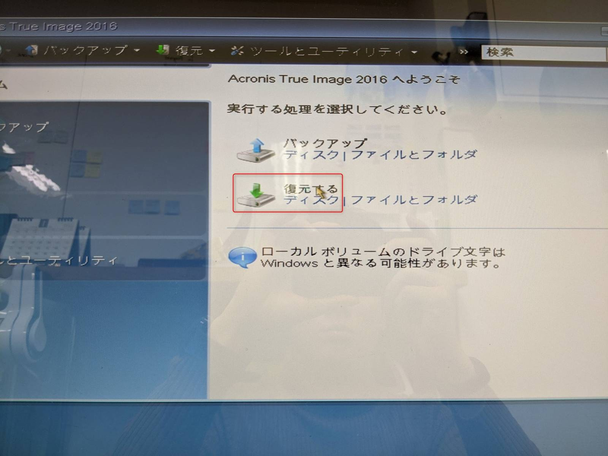
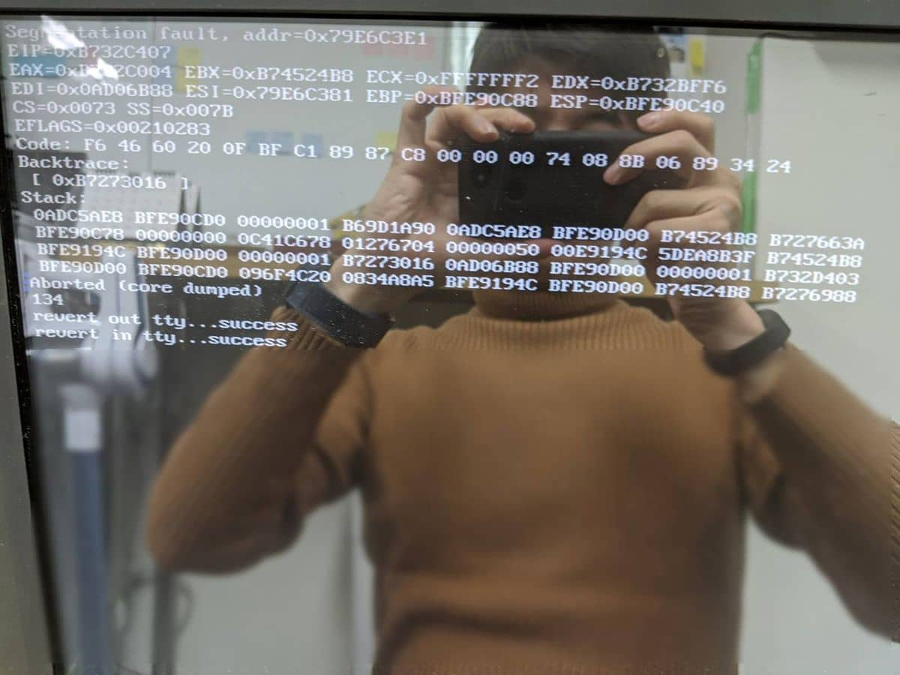
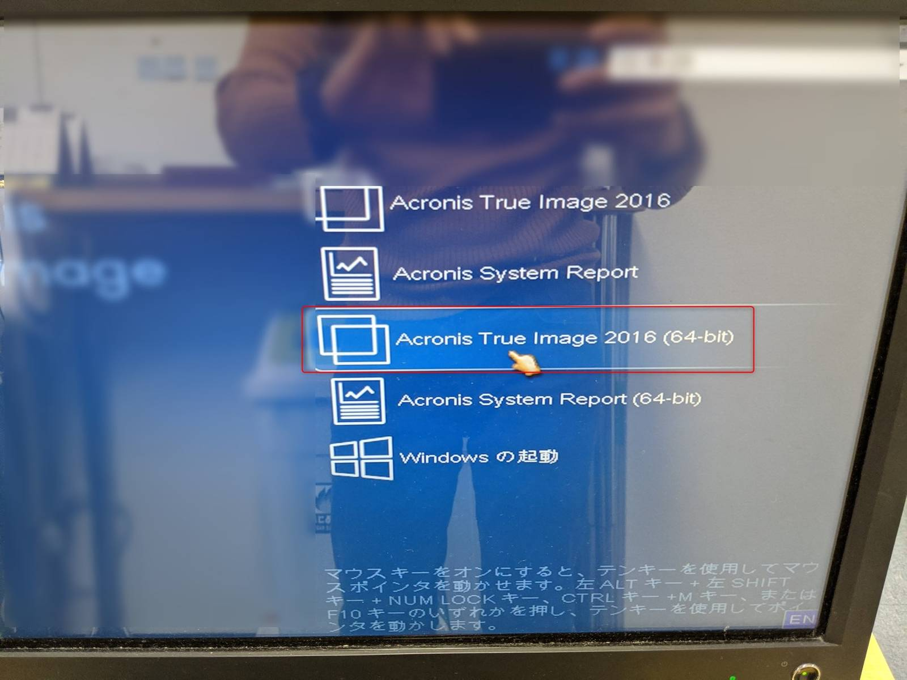
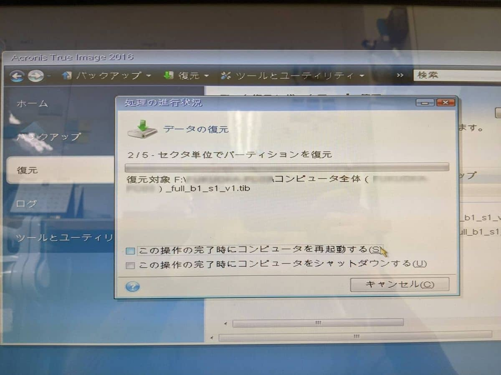

こんにちは。

以前、Acronisを利用して復元をしようとすると **Segmentation fault** が発生しました。

復元できないと路頭に迷っていたのですが、ブートディスクの起動メニューで **64ビット版を選んだら解決した** という記事です

復元方法は、Acronisの機能から作成したブートディスク(CD)から、復元する流れです。

発生したバージョンは少し古いですが　`Acronis True Image 2016` です。

## 発生までの流れ

1. 通常のブートメニューを選択します

1. 復元ボタンを押します
発生タイミングは、復元を進んで開始する直前や、この画像のボタンを押した瞬間に発生するなど複数のパターンが確認できました。

1. **Segmentation fault, addr=0x79E6C3E1** が発生

## 回避方法

方法といっても、ブートの選択で **64bit版を選択する** だけです。

無事、復元が開始されました。

## あとがき

当時、現象をAcronisのチャットサービスに問い合わせたのですが、事例がないということでした。

まさか、64ビットで解決するとは思っていなかったので意外に時間がかかりました。
1名でも同じ現象になった方が救われますように。

それでは次回の記事でお会いしましょう。
