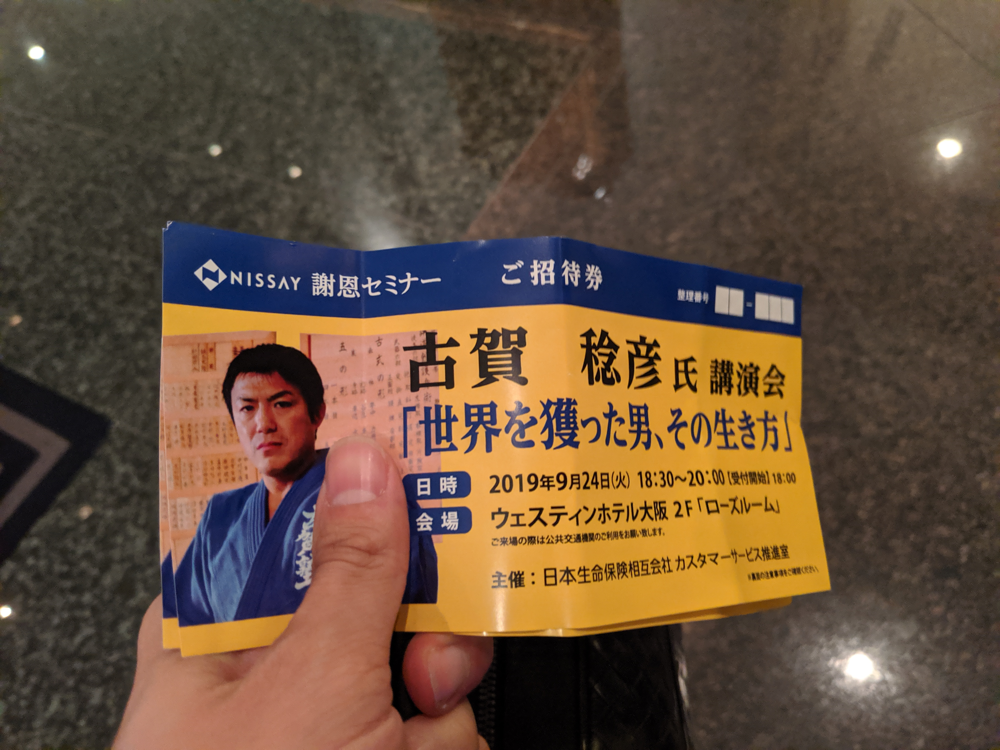

こんにちは。

記事タイトルがかっこいいですが、柔道家の古賀稔彦さんのセミナーに参加してきました。
セミナータイトルがこれでした。

[古賀稔彦 - Wikipedia](https://ja.wikipedia.org/wiki/%E5%8F%A4%E8%B3%80%E7%A8%94%E5%BD%A6)

場所はウェスティンホテル大阪、いいところです。

## 序盤
18:30開演でした。
日本生命の謝恩セミナーなこともあって、はじめは日本生命の方々が挨拶されていました。

日本生命の方々挨拶終わり、いよいよ、と思いましたが、まずは紹介VTRで古賀さんの栄光の紹介でした。

バルセロナオリンピックでは、左膝を負傷しながらの金メダルを獲られた映像には感動しました。
開催は1992年なのでさすがに記憶にはありませんでしたが。。

約30分のVTRが終わり、いよいよ古賀さんが登場です。

## 印象に残った話
話しはじめから、参加者に質問などを投げかけるなどですぐに一体感が出ていました。
何事もつかみは大切です。

印象に残った話を私なりに書きたいと思います。

### 挑戦する
* 人間は頭で考えるだけでは「努力が実感できない」、「仲間はできない」。
* 結果はどうあれ、挑戦した後に考えることが大切。

### 才能を後押しする性格は「欲」
* 努力は2とおりある。
    * 1つは「命令されてやる努力」。これはやってもやっても身につかない。
    * 1つは「望む努力」。やればやるだけ身につく。勝っても負けても頑張れる。
        * そうすると、人の2倍、3倍やることができ、チャンスを得ることができる。 

### 才能を後押しする性格は「欠点」
* 自分の欠点を素直に認めることのできる性格。
 
### 進化とは、長所を伸ばしながら短所を克服していくこと
* ふと思い浮かぶのは長所より短所ではないか。
    * その短所を1つ克服すれば1つ長所が増える。

### 恩返しの力はすごい
* 人は誰かのためとなるとすごい力を発揮する。

### 柔道の親「嘉納治五郎」
[嘉納治五郎 - Wikipedia](https://ja.wikipedia.org/wiki/%E5%98%89%E7%B4%8D%E6%B2%BB%E4%BA%94%E9%83%8E)

* 嘉納治五郎が残した偉大な言葉。「精力善用 自他共栄」。
    * 精力善用→自分のもっているエネルギーを日常生活で良い方向に使うこと。
    * 自他共栄→自分も周りも手をとりあって協力していくこと。

## 古賀塾 五訓

最後に、会場全体で古賀塾の五訓を唱和してお開きとなりました。

一、『はい』と言う素直な心
一、『ありがとうございます』と言う感謝の心
一、『私がします』と言う奉仕の心
一、『すみません』と言う反省の心
一、『おかげさま』と言う謙虚な心

[古賀稔彦公式ホームページ](http://www.kogatoshihiko.jp/kogajyuku.htm)

## あとがき
古賀先生は、「当たり前のことを当たり前にやることが大切。」と おっしゃっていました。

自分は出来ていないことを周りに求めたり、指示したりしてることはないか？には、はっとさせられました。

日常とは違うこういったセミナーに参加すると、色々感じるものがあってよかったです。

それでは次回の記事でお会いしましょう。

## 追記
古賀先生、ご冥福をお祈りします。
貴重はお話を聞けて記事に出来たことを嬉しく思います。