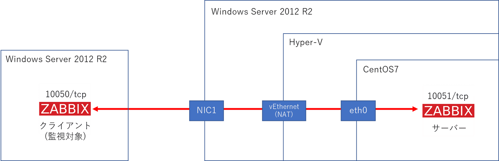
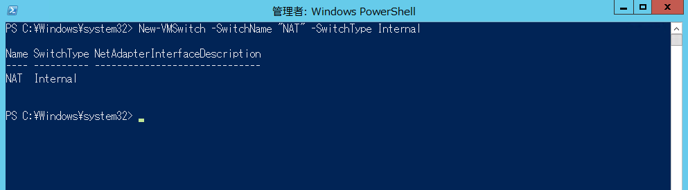
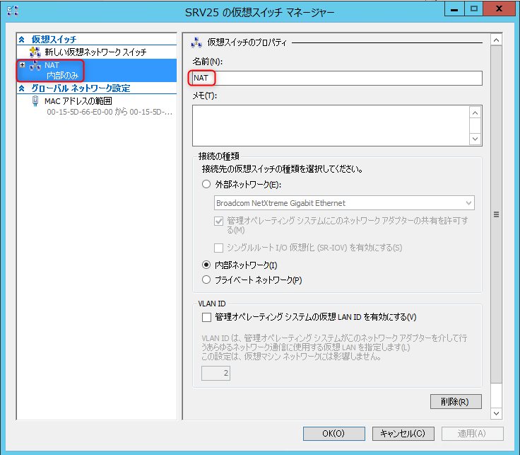
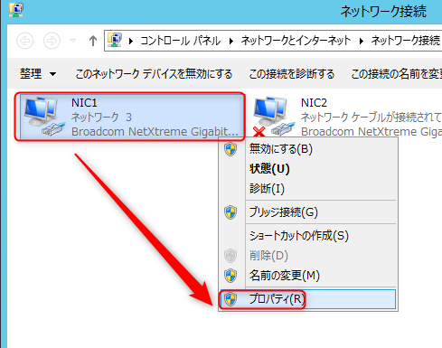
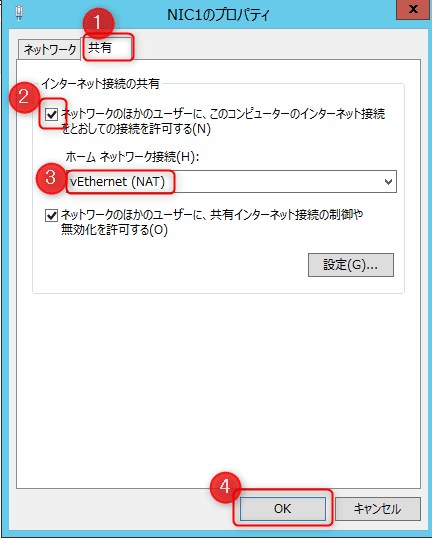
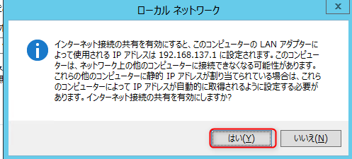
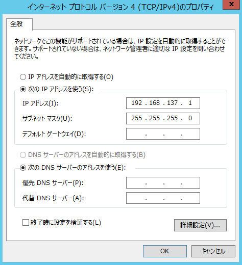
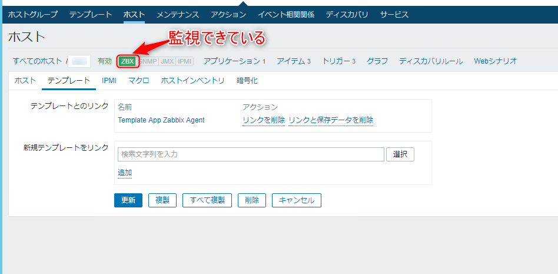

こんにちは。

今回は、 **Windows Server 2012 R2(以降:ホストマシンと表記)** 上の **Hyper-V で作成した仮想マシン(以降:仮想マシン)のネットワークをホストマシンのネットワークと共有** する手順について紹介します。

仮想マシンにZabbixサーバーをインストールし、Zabbixクライアント(監視対象) を監視することが目的です。
※Zabbixのインストール手順は割愛します。

Zabbixサーバー側 **10051/tcp** と Zabbixクライアント側　**10050/tcp**　の間を通します。

**イメージ図** は以下のような感じです。

<a href="images/share-host-network-to-hyper-v-virtual-machines-1.png"></a>

## ホストマシン側
1. PowerShellを管理者権限で起動し、以下のコマンドを実行し **仮想スイッチを作成** します
    `New-VMSwitch -SwitchName "NAT" -SwitchType Internal`
    <a href="images/share-host-network-to-hyper-v-virtual-machines-2.png"></a>
    
    上記のコマンドにより、 **NAT** という名前の仮想スイッチ(内部)が作成されます。
    <a href="images/share-host-network-to-hyper-v-virtual-machines-3.png"></a>

2. 物理インターフェース **(イメージ図 NIC1)** のプロパティから以下の流れで **共有設定** をします。
    <a href="images/share-host-network-to-hyper-v-virtual-machines-4.png"></a>
    
    <a href="images/share-host-network-to-hyper-v-virtual-machines-5.png"></a>
    
    <a href="images/share-host-network-to-hyper-v-virtual-machines-6.png"></a>

3. 仮想ネットワーク **(イメージ図中 vEthernet(NAT))** にIPアドレスが割り当てられます
    <a href="images/share-host-network-to-hyper-v-virtual-machines-7.png"></a>

## 仮想マシン側
1. 仮想マシンを作成し、CentOS7をセットアップします。

2. IPアドレス設定を手動(Manual) にし、自身のネットワークは　**前項の手順3** と同じネットワーク帯で重複しないIPアドレスを設定し、ゲートウェイには **前項の手順3** のIPアドレスを設定します。
    
    以下は仮想マシンのネットワーク情報です。
    ```
    $ netstat -rn
    Kernel IP routing table
    Destination     Gateway         Genmask         Flags   MSS Window  irtt Iface
    0.0.0.0         192.168.137.1   0.0.0.0         UG        0 0          0 eth0
    192.168.137.0   0.0.0.0         255.255.255.0   U         0 0          0 eth0
    ```
    
    ```
    $ ip a
    1: lo: <LOOPBACK,UP,LOWER_UP> mtu 65536 qdisc noqueue state UNKNOWN group default qlen 1000
        link/loopback 00:00:00:00:00:00 brd 00:00:00:00:00:00
        inet 127.0.0.1/8 scope host lo
           valid_lft forever preferred_lft forever
        inet6 ::1/128 scope host 
           valid_lft forever preferred_lft forever
    2: eth0: <BROADCAST,MULTICAST,UP,LOWER_UP> mtu 1500 qdisc mq state UP group default qlen 1000
        link/ether 00:15:5d:66:e0:04 brd ff:ff:ff:ff:ff:ff
        inet 192.168.137.10/24 brd 192.168.137.255 scope global noprefixroute eth0
           valid_lft forever preferred_lft forever
        inet6 fe80::215:5dff:fe66:e004/64 scope link 
           valid_lft forever preferred_lft forever
    ```

    この時点で仮想マシンからインターネットに出られるようになっています。

## 準備完了
あとは、仮想マシン側のファイアウォール(firewalld)の設定で 10051/tcp が通るように設定し、監視対象の準備を行えばOKです。
<a href="images/share-host-network-to-hyper-v-virtual-machines-8.png"></a>

**ホストマシン側のWindowsファイアウォールの設定は不要** でした。

参考になれば幸いです。
それでは次回の記事でお会いしましょう。