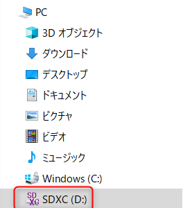

こんにちは。

今回は非常に短い記事です。

私はSDカードに日々のバックアップを暗号化して取得しているのですが、エクスプローラーからアクセスすると、以下のようなエラーに見舞われました。

**ファイルまたはディレクトリが壊れているため、読み取ることができません。**

Dドライブにアクセスすると・・・


このエラーが(涙)・・・


・・・ 焦りました・・・が、以下の方法で **簡単に復旧** できました。

1. コマンドプロンプトを管理者権限で開く
1. `chkdsk d: /f` を実行する
1. 解決！


実行結果は以下のような出力になります。

```
C:\WINDOWS\system32>chkdsk d: /f
ファイル システムの種類は exFAT です。
ボリューム シリアル番号は 5874-90BD です
ファイルとフォルダーを検査しています...
ディレクトリ \ (706) のファイルを検査中に破損が見つかりました。
ディレクトリ \ (707) のファイルを検査中に破損が見つかりました。
ディレクトリ \ (708) のファイルを検査中に破損が見つかりました。
ディレクトリ \ (709) のファイルを検査中に破損が見つかりました。
ディレクトリ \FOUND.002\ (0) のファイルを検査中に破損が見つかりました。
ファイルとディレクトリを検査中に破損が見つかりました。
ボリューム ビットマップを検査中に破損が見つかりました。
ファイルとフォルダーの検査を完了しました。

Windows でファイル システムが修正されました。
これ以上の操作は必要ありません。

 384573440 KB : 全ディスク領域
 155307776 KB : 21 個のファイル
      1536 KB : 6 個のインデックス
         0 KB : 不良セクター
       512 KB : システムで使用中
 229263616 KB : 使用可能領域

    262144 バイト : アロケーション ユニット サイズ
   1502240 個     : 全アロケーション ユニット
    895561 個     : 利用可能アロケーション ユニット
```

1枚でも多くのSDカードを救えますように・・・。
それでは次回の記事でお会いしましょう。
