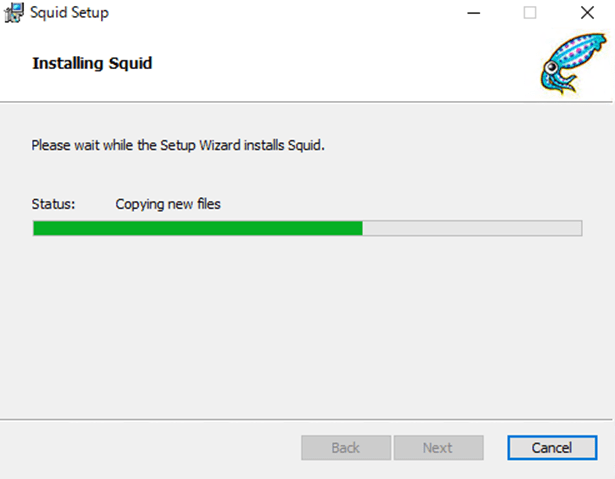
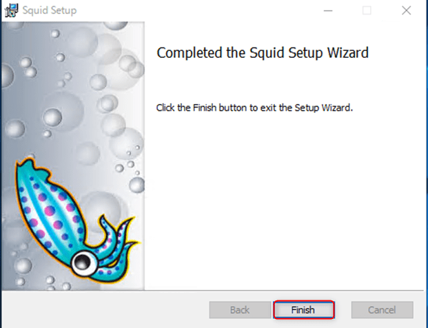

こんにちは。

**ASP.NETで構築したWebサービス** にCentOSに構築したSquid経由でうまく接続できない現象が発生し、 **Windows Server 2016** に **Squid for Windows** を構築して接続したら解決した、というお話です。

**Squid** といえば **Webプロキシ** として有名で主にCentOSなどのLinuxOSに構築されるケースがほとんどだと思います。

[Squid (ソフトウェア) - Wikipedia](https://ja.wikipedia.org/wiki/Squid_(%E3%82%BD%E3%83%95%E3%83%88%E3%82%A6%E3%82%A7%E3%82%A2))

今回、他社様が **ASP.NETで構築したWebサービス** で、あるリンクをクリックすると別ウィンドウで情報が表示されるページに、CentOSで構築したSquid経由の場合、クリック後2，3分応答なしになり最終的に **(104) Connection reset by peer** というSquidのエラーが発生し接続できない状態に陥りました。

プロキシサーバーを経由しない状態では問題なく接続できたため **プロキシサーバーが問題** であることは明らかな状態でした。

Squidの設定を変えたり、キャッシュをクリアしたり、Squidをソースからコンパイルしたり、色々行うも解消せず・・・

最後の切り分けとして、Squid for Windows　を稼働させ実施したところ無事接続できた、という結果になりました。

しかし、現時点で **原因は不明** で、記事としては少し不完全な状態で申し訳ございません。
今後判明すれば追記したいと思います。

同じような悩みの方がこの切り分けで解決すれば嬉しいです。

続いて、Squid for Windowsの構築手順を記載します。

## 構築手順

環境は、**Windows Server 2016** 上に、Squid for Windows を構築します。

1. Squid for Windowsのダウンロード
以下よりダウンロードします。
[Squid for Windows](http://squid.diladele.com/)
※クリックするとすぐに **squid.msi** がダウンロードされます。

1. ダウンロードされたインストーラーをダブルクリックし、以下の流れでインストールします。

以上でインストールは完了です。

## 設定関連

設定ファイルは `C:\Squid\etc\squid\squid.conf` にあり、記載方法はLinux版と同じです。

インストール完了後に **サービス登録** や **ファイアウォール登録** は自動で実施されます。
再起動しても自動で起動してきます。

ファイアウォールで2点注意があります。

1点目は、デフォルトの **3128ポート** はインストール直後から許可されていますが、異なるポートに変更した場合はファイアウォールの設定も変更する必要があります。

2点目は、デフォルトの状態だと 接続できるネットワークが **ローカルサブネット** になっています。
これでは、サーバーがもつ同じネットワーク帯からしか利用することが出来ないため、 **設定を削除** し、 **任意のアドレス** に変更します。

## あとがき

プロキシサーバーを構築した弊社と、Webサービスを構築した会社様が異なったためなかなか切り分けが進まず接続が成功するまで半年以上要しました。

粘り強く対応できたことで、再構築の発注もいただけた、という結末でした。

それでは次回の記事でお会いしましょう。