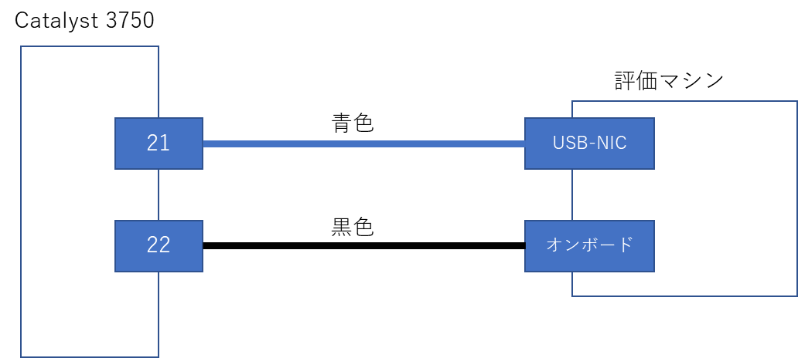
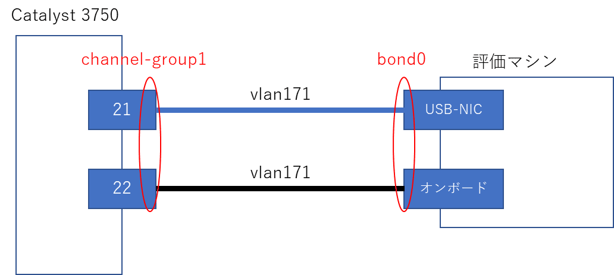
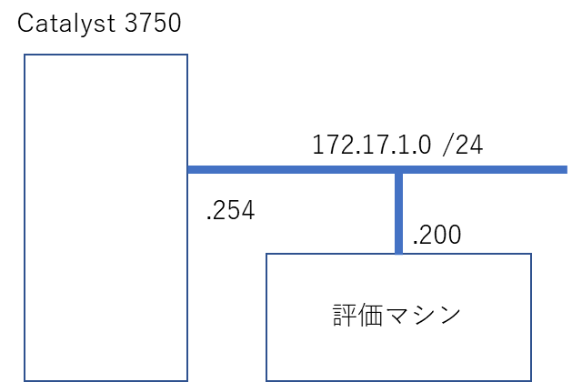
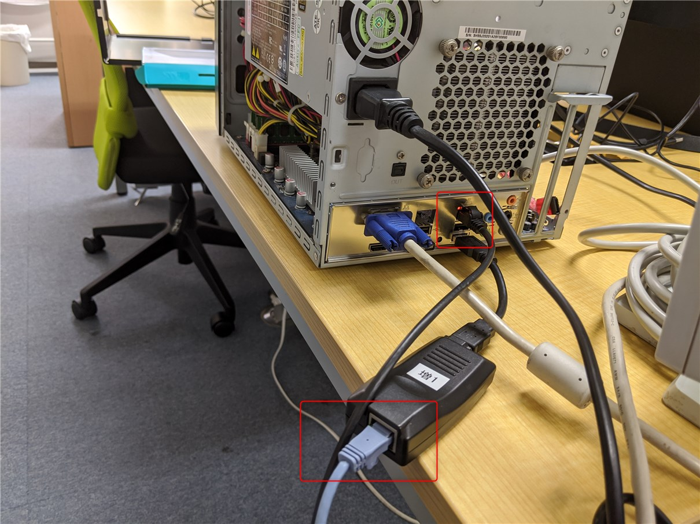
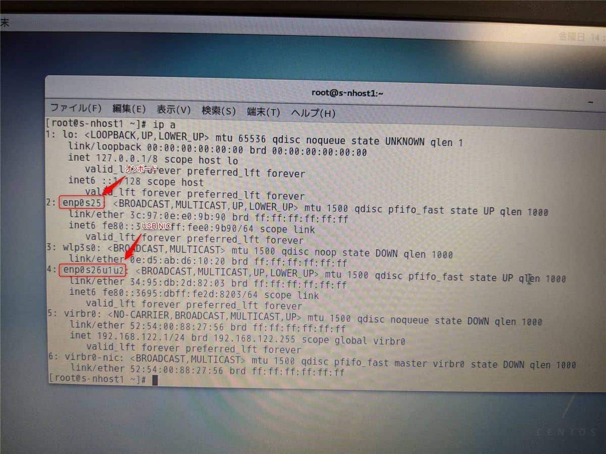

こんにちは。

今回は、古いCatalyst(Version 12.1(14r)) と CentOS7 を使ってLACPでチーミングしてみたので紹介します。

接続イメージはこのような感じです。


スイッチ側は `channel-group1` CentOS7側は `bond0` というチーミングインターフェースを構築します。


論理的には以下のような形となります。


## Catalyst側の設定

物理ポートに設定が入っていないことを確認します。
**show config 抜粋**
```
interface GigabitEthernet1/0/21
!
interface GigabitEthernet1/0/22
!
```

以下のコマンドを投入して **チーミングインターフェースを作成** をします。
`mode active` の部分がLACP指定になります。

```
#conf t
(config)#interface range gigabitEthernet 1/0/21 -22
(config-if-range)#switchport mode access
(config-if-range)#switchport access vlan 171
(config-if-range)#channel-group 1 mode active
Creating a port-channel interface Port-channel 1
```

これで、 **channel-group1 が作成** されました。

**show config 抜粋**
```
!
interface Port-channel1
!
interface GigabitEthernet1/0/21
 switchport access vlan 171
 switchport mode access
 channel-group 1 mode active
!
interface GigabitEthernet1/0/22
 switchport access vlan 171
 switchport mode access
 channel-group 1 mode active
!
```

## CentOS7側の設定

Catalyst側の準備ができたので、次はCentOS7の準備を進めます。

以下のように接続されている状態です。


今回は、 **nmcli (NetworkManager)を使って設定** します

まず、認識している2ポートのインターフェース名を `ip a` コマンドで確認します。


`enp0s25` と `enp0s26u1u2` と確認できました。
これが **チーミングする2つのポート** となります。

チーミング用のインターフェースを `bond0` 、 設定するモードは `802.3ad` として以下のコマンドを投入します。

```
# nmcli con add type bond ifname bond0 con-name bond0 mode "mode=802.3ad,miimon=100,updelay=100,downdelay=100,xmit_hash_policy=layer3+4"
# nmcli con mod bond0 ipv4.method manual ipv4.address "172.17.1.200/24" ipv4.gateway "172.17.1.254" ipv4.dns "8.8.8.8"
# nmcli con add type bond-slave ifname enp0s25 con-name bond-slave-enp0s25 master bond0
# nmcli con add type bond-slave ifname enp0s26u1u2 con-name bond-slave-enp0s26u1u2 master bond0
# nmcli con up bond-slave-enp0s25
# nmcli con up bond-slave-enp0s26u1u2
# nmcli con up bond-bond0
```

これで、完成です。


## 冗長テスト

実際に片系を抜いて、チーミングが機能しているか確認します。
[video width="1920" height="1080" mp4="/wp-content/uploads/2019/12/VID_20191205_130744.mp4"][/video]

少し再形成に時間がかかりましたが、無事Pingが再度届いたことが確認できました。

## 参考ページ

- [LACPとは何？Weblio辞書](https://www.weblio.jp/content/LACP)
- [CentOS 7.3 で nmcli でボンディング、ブリッジの設定をする](https://lab.unicast.ne.jp/2017/03/10/centos-7-3-nmcli-bonding-and-bridge-setting/)
- [RHEL7 Bondingによる冗長化 - Qiita](https://qiita.com/legitwhiz/items/4e43b8cf6ea0a7f4b977)
- [7.6. チャンネルボンディングの使用 Red Hat Enterprise Linux 7 | Red Hat Customer Portal](https://access.redhat.com/documentation/ja-jp/red_hat_enterprise_linux/7/html/networking_guide/sec-using_channel_bonding)

それでは次回の記事でお会いしましょう。