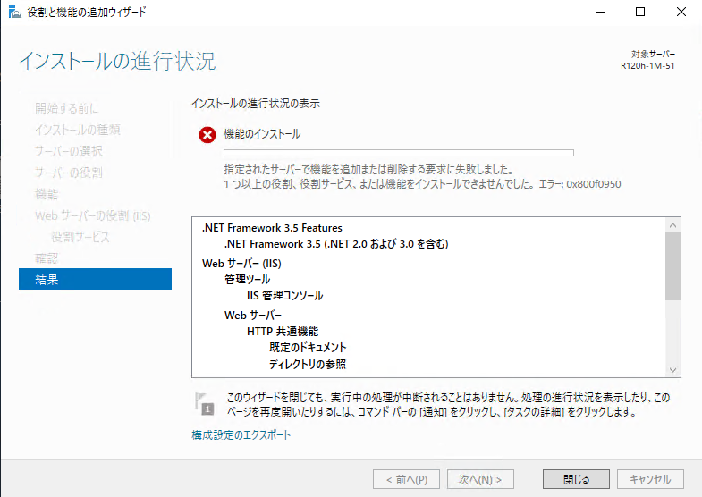
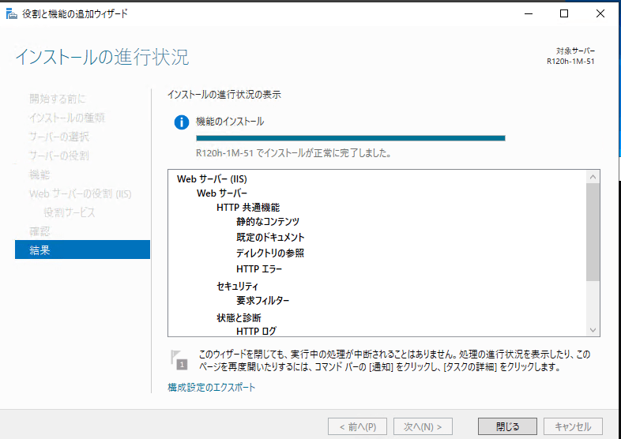

ある評価で **IIS と.NET Framework 3.5 をインストール** する必要があったので **役割と機能の追加ウィザード** から進めたところ、以下のエラーに見舞われました。

OS環境は、 **Windows Server 2019** です。

> 指定されたサーバーで機能を追加または削除する要求に失敗しました。1つ以上の役割、役割サービス、または機能をインストールできませんでした。 エラー：0x800f0950

<a href="images/0x800f0950-error-in-add-roles-and-features-wizard-1.png"></a>

エラーから、以下のサイトにたどり着き、 `Dism /Online /Cleanup-Image /RestoreHealth` を実行したところ無事解決しました。
[エラーコード:0x800f0950 - マイクロソフト コミュニティ](https://answers.microsoft.com/ja-jp/windows/forum/all/%E3%82%A8%E3%83%A9%E3%83%BC%E3%82%B3%E3%83%BC/207c5dc2-ce1b-43f1-a6fa-0461e95f435e)

```
C:\Users\Administrator>Dism /Online /Cleanup-Image /RestoreHealth

展開イメージのサービスと管理ツール
バージョン: 10.0.17763.1

イメージのバージョン: 10.0.17763.107

[==========================100.0%==========================] 復元操作は正常に完了しました。
```

<a href="images/0x800f0950-error-in-add-roles-and-features-wizard-2.png"></a>

「Dism」は、Windowsのシステムファイルが破損していないかチェックを行うツールですが、このコマンドで修復されて改善したもようです。

この評価環境が問題ないのか少し心配ではありますが・・・。

それでは次回の記事でお会いしましょう。