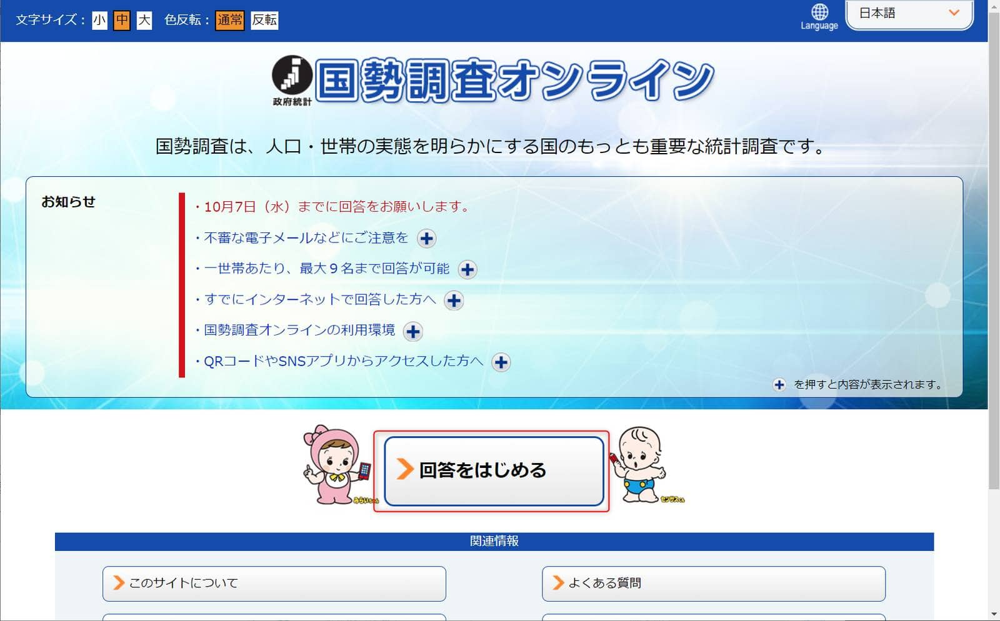
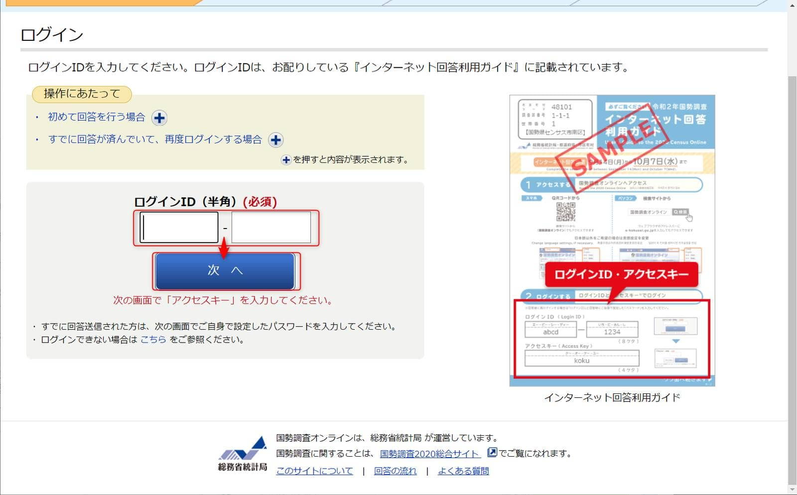

本日(9/14)に帰宅すると、ポストに国勢調査の封書が届いていました。

芦田愛菜さんが出ているCMを思い出しました。
[芦田愛菜、国勢調査を呼びかけ　CMキャラクターに　国勢調査2020新CM - YouTube](https://www.youtube.com/watch?v=RdIjaw1uFV4)

## 国勢調査とは

>国勢調査（こくせいちょうさ）は、統計法（平成19年5月23日法律第53号）に基づき、総務大臣が国勢統計を作成するために、「日本に居住している全ての人及び世帯」を対象として実施される、国の最も重要かつ基本的な統計調査（全数調査）である。国勢調査では、国内の人口、世帯、産業構造等などについて調査が行われる。国勢調査は統計法第5条を根拠とする「基幹統計調査」と位置付けられており、基本的には5年ごとに、なおかつ「西暦が5の倍数の年」に実施される（後述）が、総務大臣が必要があると認めるときは臨時の国勢調査を行うこともできると規定されている（第5条第3項）。
>
>第1回国勢調査は1920年（大正9年）10月1日に実施され、2020年（令和2年）に実施された令和2年国勢調査で、第21回目（100周年）の調査となった。
>
>しばしば「こくぜいちょうさ」と読まれることがあるが、これは誤りである。
>
> [Wikipedia抜粋](https://ja.wikipedia.org/wiki/%E5%9B%BD%E5%8B%A2%E8%AA%BF%E6%9F%BB_(%E6%97%A5%E6%9C%AC))

## 期限

**9/14(月)～10/7(水) まで** です。**インターネットから24時間回答ができる** ので早めに回答しましょう。

**回答にかかった時間は約13分** でした。

それでは、さっそくやってみたいと思います。

## 入力開始までの流れ

**ブラウザは Chrome 85.0.4183.102** で行いました。

1. [https://e-kokusei.go.jp](https://e-kokusei.go.jp) にアクセスします
1. **回答をはじめる** をクリックします

1. **インターネット回答利用ガイド** にかかれている **ログインIDを入力し次へ** をクリックします

1. 続けて **アクセスキーを入力しログイン** をクリックします

1. **入力をはじめる** をクリックします

## アンケート内容

**アンケートは以下の14問** でした。
※個人情報が含まれるため回答内容の記載は省略します。

**教育 は アンケート番号が 9** でした。(以降も記事に記載している番号より+1でした)
私の回答内容では 8問目がなかったのだと推測します。

1. 世帯員の数及び世帯の種類
1. 氏名及び男女の別
1. 世帯主との続き柄
1. 出生の年月
1. 配偶者の有無
1. 国籍
1. 現在の場所に住んでいる期間
1. 教育
1. 1週間の仕事
1. 従業地又は通学地
1. 利用交通手段
1. 勤めか自営かの別
1. 勤め先・業主などの名称及び事業の内容、本人の仕事の内容
1. 住居について

以上で完了です。

続けて、**電話番号・住所の入力** →**入力内容の確認** → **次へ** と進み、 **パスワード設定後に送信** して完了となります。

## 感想

アンケートは、難しいものではなく **世帯の現状についてが中心** の内容でした。

毎年やっていたかな？と思って再度Wikipediaを見ると、**基本的には5年ごとに、なおかつ「西暦が5の倍数の年」** となっていました。

アンケートは本日(9/14)もしくは近日中に到着すると思いますのでポストを確認してみてください。

それでは次回の記事で会いましょう。