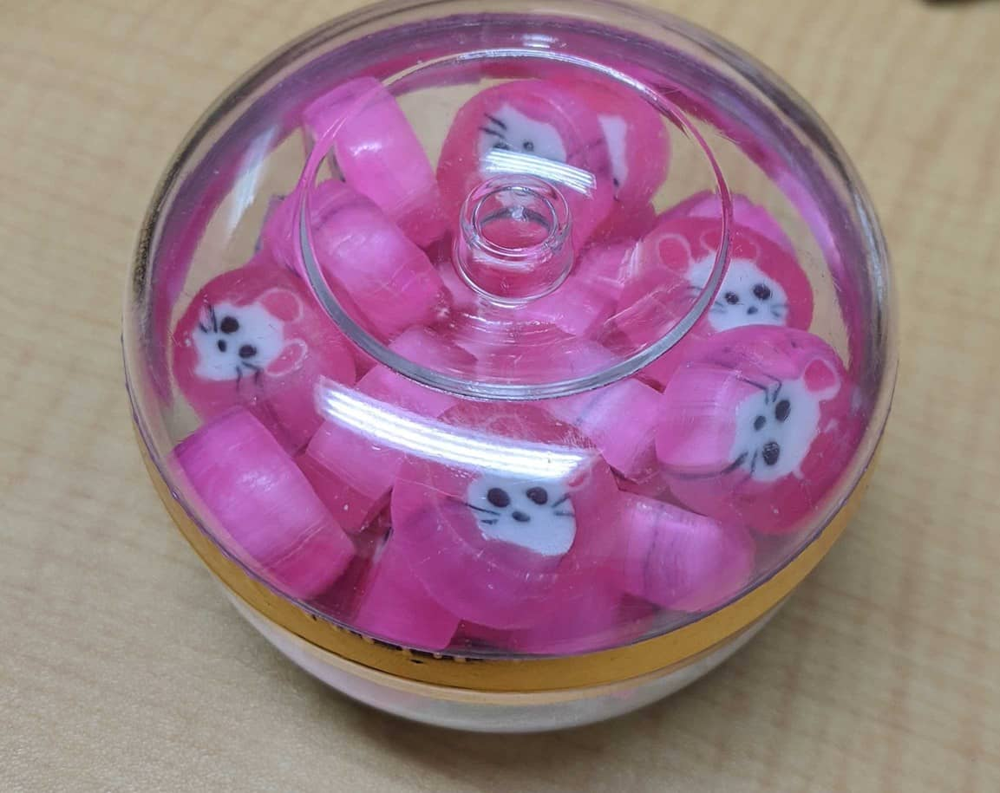

新年あけましておめでとうございます。
本年もよろしくお願いいたします。

1/9(木) 朝9時から十日戎（今宮戎神社）に参拝にいってきました。

毎年のことですが「 **商売繁盛で笹もってこい** 」のアナウンスを聞くと1年が始まったな、と思います。

## 参拝・福笹
午前中にいきましたが、去年同様に混雑はありませんでした。


返納した去年の福笹です。
1年間ありがとうございました。


そして、今年の福笹です。


毎年この時期は期末となっていて、次の期に向けて飾りを1つずつ増やしています。

今年の追加は、「 **お札** 」にしました。

お札への祈願は、以下2つです。

* 健康で1年過ごせるように！
* 新しいことにチャレンジ！

6期目にむけてなので今年で合計 **6つ** になりました。

```
()は、飾りをつけた時期です。
1.2. 「熊手」→福や運をかき集める、「箕」→かき集めた福や運をすくい取る(2016年2期目に向けて)
3.   「俵」　→金運や財運の豊作を願う(2017年3期目に向けて)
4.   「打ち出の小槌」→打てばなんでも好きなものが出てくるといわれる(2018年4期目にむけて)
5.   「絵馬」→祈願や祈願した願いが叶ったことへの謝礼をする(2019年5期目にむけて)
6.   「お札」→神さまのお力を戴く(2020年6期目にむけて)
```

来年(2021年)も7つ目の飾り付けの投稿に向けて頑張っていきたいと思います！

## 初みくじ
末吉でした！
微妙。。


良い一年でありますように。


## あとがき

恒例のベビーカステラと、干支の飴(笑)




福笹は **1月9日から11日まで終夜** いただけるようです。

[今宮戎神社ホームページ](http://www.imamiya-ebisu.jp/r2-gyouz)

2020年もスタッフ一同頑張って参りますのでどうぞよろしくお願いいたします！


