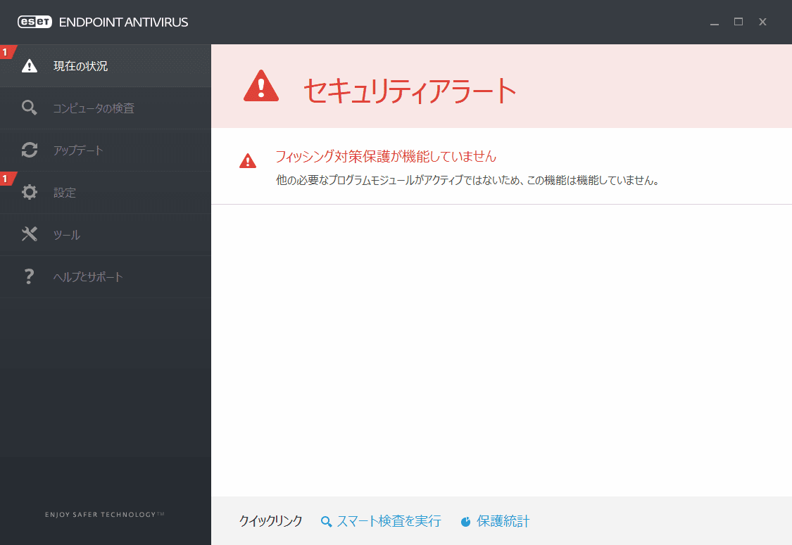
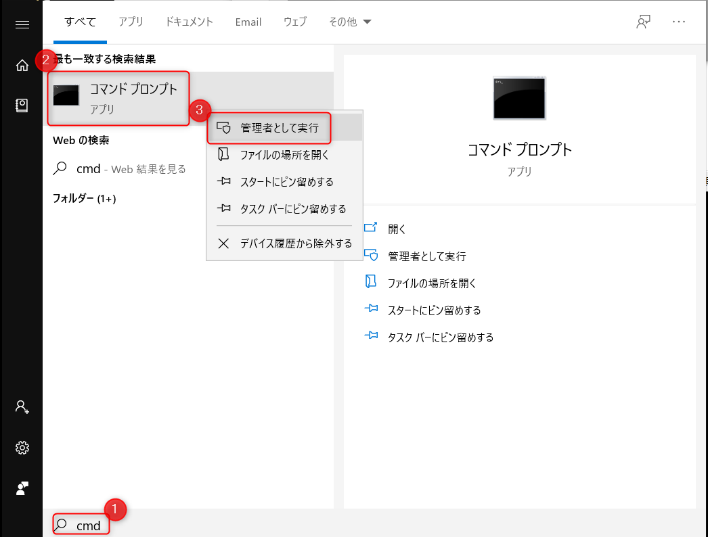
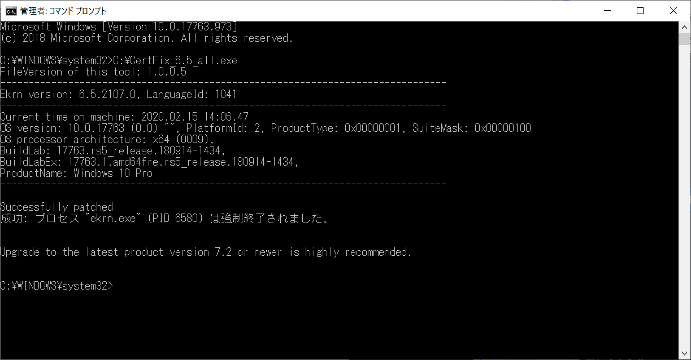
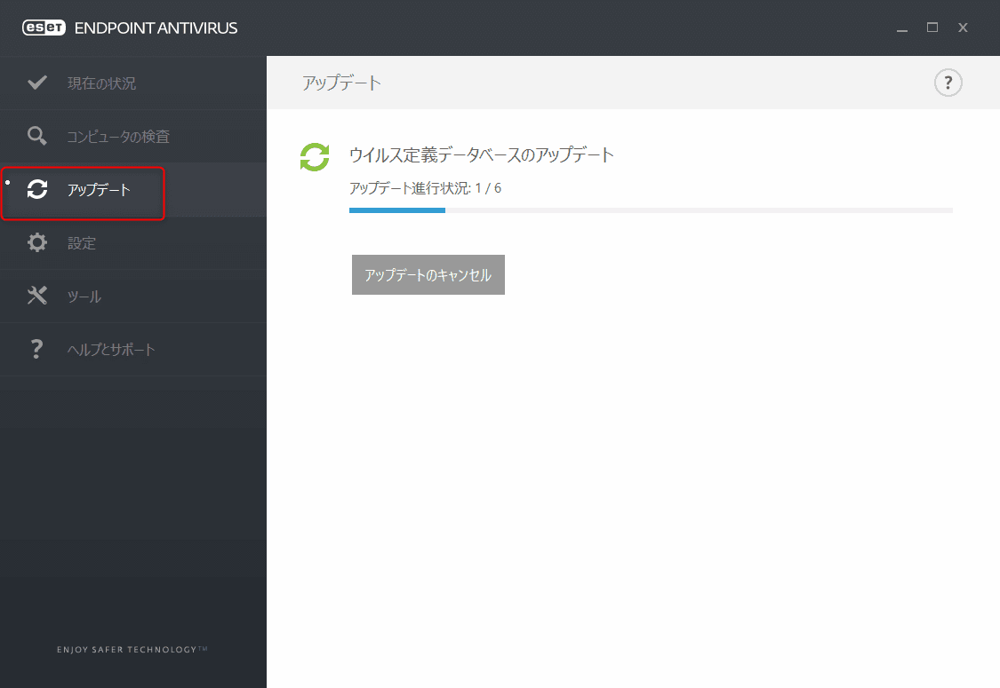
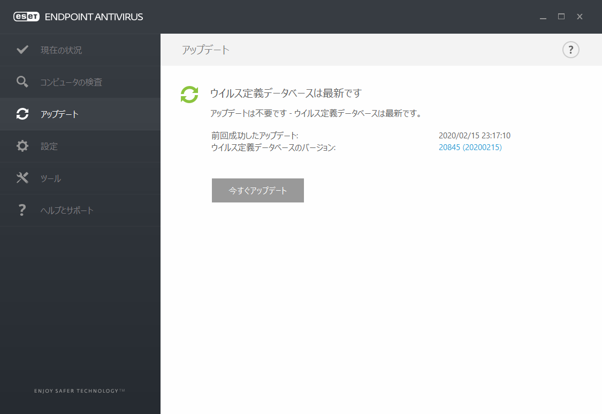
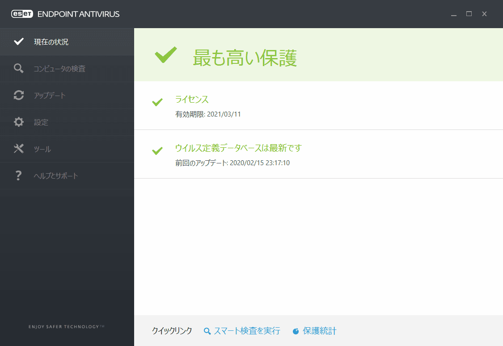

こんにちは。

弊社はESETを利用しておりますが、先日通知があり **2020/2/8以降に動作不良があった** とのことでした。

[2月8日以降における一部のESET製品の動作不良について | ESETサポート情報 | 法人向けサーバー ・ クライアント用製品 | キヤノンITソリューションズ](https://eset-support.canon-its.jp/faq/show/16148?site_domain=business)

影響は以下のとおり公開されています。

```
■V6.5プログラムの場合
　・「フィッシング対策保護が機能していません」のエラーが表示される
　・アクティベーションに失敗する（ECP.4097）
　・検出エンジンのアップデートができない
　・ウイルス検査が正常にできない
```

```
■V5.0プログラムの場合
　・ESETの画面が英語表示になる
　・検出エンジンのアップデートができない
　・ウイルス検査が正常にできない
```

私のPCにインストールされていたバージョンは `6.5.2107.1` ですが記事と同じ状態が確認できました。


公式で紹介されている対応策を実施してみました。
**手順は至って簡単** です。

1. 対策ツールを任意の場所に[ダウンロード](https://download2.canon-its.jp/eset/tool/CertFix_6.5_all.zip)します
1. 解凍した中にある `CertFix_6.5_all.exe` をC直下に移動します(C直下の指定は一例です)
1. コマンドプロンプトを管理者で実行します

1. コマンドプロンプトに `C:\CertFix_6.5_all.exe` とタイプしEnterで実行します
`Successfully patched` とでていればOKです

1. 再起動します
1. 再起動直後はすぐにアップデートされないので手動で実行します

↓
無事最新になりました


この対応で正常に戻りました。


**検出エンジンのアップデートが出来ない** という致命的なエラーが続きますので該当するかたは **1日でも早く対応** をお願いします。

それでは次回の記事でお会いしましょう。