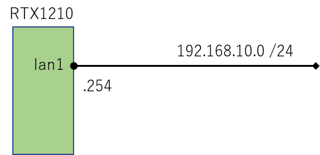
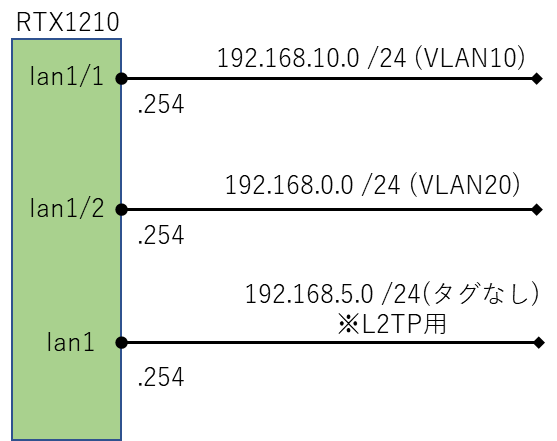

こんにちは。

今回は、弊社でも利用しているルーターであるYAMAHA RTX1210で **タグVLANのネットワークを構築** してみます。

RTX1210固有の機能ではなく、他機種でも対応していれば同様に設定可能です。
詳しくは、公式ページを参考にしてください。
[タグVLANを設定する](https://network.yamaha.com/setting/switch_swx/simple_smart/switch_swx-command/tag_vlan)

## 想定しているユーザー
- CIDR表記が分かるかた
- YAMAHAライクなポートの表現が分かるかた
- VLANの基本を理解されているかた

## 環境
- YAMAHA RTX1210
- ファームバージョン Rev.14.01.35

## 注意点
3. L2TP/IPsec接続を行う場合、タグなしVLANしか使えない
    - **L2TP/IPsecのゲートウェイとして使用できるのはLAN1インターフェースのタグなしセグメント**（ip lan1 addressコマンドで設定したセグメント）のみがYAMAHA動作保証範囲であることが問合せで判明した。

## タグVLAN前のネットワーク

このような感じです。(とてもシンプル！)


このときのコンフィグは以下のようになります。
```
ip lan1 address 192.168.10.254/24
```

## タグVLAN後のネットワーク

このような感じに変更します。


このときのコンフィグは以下のようになります。
```
ip lan1 address 192.168.5.254/24
vlan lan1/1 802.1q vid=10 name=VLAN10
ip lan1/1 address 192.168.10.254/24
vlan lan1/2 802.1q vid=20 name=VLAN20
ip lan1/2 address 192.168.0.254/24
```

## あとがき

LAN1 で タグなしとタグ付きを使い分ける設定を例として記載します。

下記の設定の場合であれば、192.168.100.0/24はタグなし、
192.168.101.0/24はVLAN ID 101のタグ付きとして通信を行います。

```
vlan lan1/1 802.1q vid=101 name=VLAN101
ip lan1 address 192.168.100.1/24
ip lan1/1 address 192.168.101.1/24
```

それでは次回の記事でお会いしましょう。

