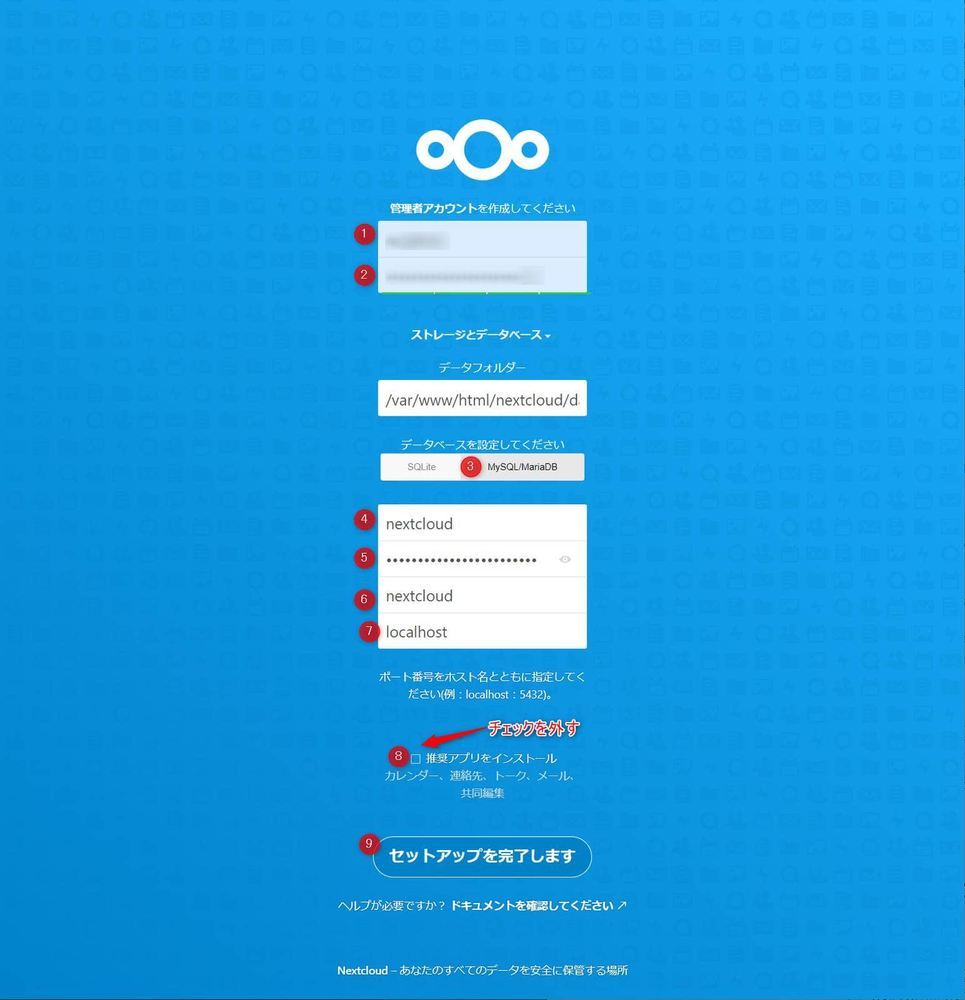

こんにちは。

今回は **Amazon Linux 2にNextcloudを構築** してみたいと思います。
Nextcloud はOSSのオンラインストレージです。

説明はWikipediaを抜粋しました。

>Nextcloudは、オンラインストレージの作成と使用のためのクライアント・サーバ型のソフトウェアである。機能的にはDropboxに似ているが、オフプレミスのオンラインストレージサービスは提供しない。Nextcloudはフリーかつオープンソースなので、誰でも自分のプライベートサーバ（英語版）にインストールして利用することができる。
[Nextcloud - Wikipedia](https://ja.wikipedia.org/wiki/Nextcloud) 抜粋

## 環境
2020/10/17 構築時点の最新

- Amazon Linux2 ( 4.14.198-152.320.amzn2.x86_64 )
- httpd 2.4.46-1
    - HTTPSで待ち受けする
- PHP 7.4.11-1
- mariadb server 5.5.64
- nextcloud 20.0.0

## 構築手順
全て `rootユーザー` で実施します

### Amazon Linux2 セットアップ

以下を実施します

- 全体のアップデート
- ロケール設定
- SWAP作成
- 必要なパッケージインストール

```
yum -y update
rm -f /etc/localtime
ln -fs /usr/share/zoneinfo/Asia/Tokyo /etc/localtime
dd if=/dev/zero of=/swap bs=1M count=1024
chmod 600 /swap
mkswap /swap
swapon /swap
yum -y install unzip curl wget
reboot
```

### Webサーバー のインストール

#### Apacheのインストール

Apacheをインストールし、設定ファイルをバックアップします

```
yum -y install httpd mod_ssl
systemctl enable httpd
systemctl start httpd
cp -p /etc/httpd/conf.d/ssl.conf{,.org}
```

#### ssl.conf の設定

以下のDiffを参考に設定します

`# diff -u /etc/httpd/conf.d/ssl.conf.org /etc/httpd/conf.d/ssl.conf` の結果

```
+++ /etc/httpd/conf.d/ssl.conf  2020-10-17 17:22:17.240112217 +0900
@@ -56,7 +56,7 @@
 <VirtualHost _default_:443>

 # General setup for the virtual host, inherited from global configuration
-#DocumentRoot "/var/www/html"
+DocumentRoot "/var/www/html/nextcloud"
 #ServerName www.example.com:443

 # Use separate log files for the SSL virtual host; note that LogLevel
@@ -72,12 +72,13 @@
 #   SSL Protocol support:
 # List the enable protocol levels with which clients will be able to
 # connect.  Disable SSLv2 access by default:
-SSLProtocol all -SSLv3
+SSLProtocol -all +TLSv1.2

 #   SSL Cipher Suite:
 #   List the ciphers that the client is permitted to negotiate.
 #   See the mod_ssl documentation for a complete list.
-SSLCipherSuite HIGH:MEDIUM:!aNULL:!MD5:!SEED:!IDEA
+SSLCipherSuite HIGH:MEDIUM:!aNULL:!MD5:!SEED:!IDEA:!3DES:!RC4:!DH
+Header set Strict-Transport-Security "max-age=315360000;"

 #   Speed-optimized SSL Cipher configuration:
 #   If speed is your main concern (on busy HTTPS servers e.g.),
@@ -90,7 +91,7 @@
 #   compromised, captures of past or future traffic must be
 #   considered compromised, too.
 #SSLCipherSuite RC4-SHA:AES128-SHA:HIGH:MEDIUM:!aNULL:!MD5
-#SSLHonorCipherOrder on
+SSLHonorCipherOrder on

 #   Server Certificate:
 # Point SSLCertificateFile at a PEM encoded certificate.  If
@@ -113,7 +114,7 @@
 #   the referenced file can be the same as SSLCertificateFile
 #   when the CA certificates are directly appended to the server
 #   certificate for convinience.
-#SSLCertificateChainFile /etc/pki/tls/certs/server-chain.crt
+SSLCertificateChainFile /etc/pki/tls/certs/server-chain.crt

 #   Certificate Authority (CA):
 #   Set the CA certificate verification path where to find CA
@@ -213,5 +214,16 @@
 CustomLog logs/ssl_request_log \
           "%t %h %{SSL_PROTOCOL}x %{SSL_CIPHER}x \"%r\" %b"

+<Directory "/var/www/html/nextcloud">
+  Require all granted
+  AllowOverride All
+  Options FollowSymLinks MultiViews
+
+  <IfModule mod_dav.c>
+    Dav off
+  </IfModule>
+
+</Directory>
+
 </VirtualHost>
```

**TLS1.0とTLS1.1を無効化** することで[SSL Server Test](https://www.ssllabs.com/ssltest/)で **A+判定** を確認しています。
<a href="images/build-nextcloud-20-on-amazon-linux2-1.png"></a>

#### 証明書の配置

証明書のバックアップを取得し、有効な証明書を作成します

- バックアップ
```
cp /etc/pki/tls/certs/localhost.crt{,.org}
cp /etc/pki/tls/private/localhost.key{,.org}
```

- 証明書の配置（内容は自身の証明書をご確認ください）
```
vi /etc/pki/tls/certs/localhost.crt
vi /etc/pki/tls/private/localhost.key
vi /etc/pki/tls/certs/server-chain.crt
```

### redis インストール

redis をインストールし、有効化します

```
yum -y install redis
systemctl enable redis
```

### PHPのインストール

PHPをインストールします

```
amazon-linux-extras install epel -y
yum -y install epel-release
rpm -Uvh http://rpms.famillecollet.com/enterprise/remi-release-7.rpm
yum -y install php74 php74-php php74-php-fpm php74-php-gd php74-php-mysqlnd php74-php-process php74-php-opcache php74-php-pecl-apcu php74-php-intl php74-php-pecl-redis php74-php-pecl-zip php74-php-pear php74-php-intl php74-php-mbstring
ln -s /usr/bin/php74 /usr/bin/php
```

### データベースサーバーインストール

MariaDBをインストールします

```
yum -y install mariadb-server
systemctl enable mariadb
systemctl start mariadb
```

#### データベースサーバーの初期化

MariaDBを初期化します

`mysql_secure_installation`

結果は以下を参考にしてください
root のパスワードは複雑にしましょう

```
NOTE: RUNNING ALL PARTS OF THIS SCRIPT IS RECOMMENDED FOR ALL MariaDB
      SERVERS IN PRODUCTION USE!  PLEASE READ EACH STEP CAREFULLY!

In order to log into MariaDB to secure it, we'll need the current
password for the root user.  If you've just installed MariaDB, and
you haven't set the root password yet, the password will be blank,
so you should just press enter here.

Enter current password for root (enter for none):
OK, successfully used password, moving on...

Setting the root password ensures that nobody can log into the MariaDB
root user without the proper authorisation.

Set root password? [Y/n] Y
New password:
Re-enter new password:
Password updated successfully!
Reloading privilege tables..
 ... Success!


By default, a MariaDB installation has an anonymous user, allowing anyone
to log into MariaDB without having to have a user account created for
them.  This is intended only for testing, and to make the installation
go a bit smoother.  You should remove them before moving into a
production environment.

Remove anonymous users? [Y/n] Y
 ... Success!

Normally, root should only be allowed to connect from 'localhost'.  This
ensures that someone cannot guess at the root password from the network.

Disallow root login remotely? [Y/n] Y
 ... Success!

By default, MariaDB comes with a database named 'test' that anyone can
access.  This is also intended only for testing, and should be removed
before moving into a production environment.

Remove test database and access to it? [Y/n] Y
 - Dropping test database...
 ... Success!
 - Removing privileges on test database...
 ... Success!

Reloading the privilege tables will ensure that all changes made so far
will take effect immediately.

Reload privilege tables now? [Y/n] Y
 ... Success!

Cleaning up...

All done!  If you've completed all of the above steps, your MariaDB
installation should now be secure.

Thanks for using MariaDB!
```

#### 設定ファイル修正

MariaDB の設定ファイルを作成します

`vi /etc/my.cnf.d/mariadb-server.cnf`

```
[mariadb]
character-set-server = utf8mb4

[client-mariadb]
default-character-set = utf8mb4
```

`systemctl restart mariadb`


#### Nextcloud用データベースとユーザーの作成

**CREATE USER の *** の部分は任意のパスワードを入力** してください

`mysql -u root -p`

```
CREATE DATABASE nextcloud DEFAULT CHARACTER SET utf8mb4;
CREATE USER 'nextcloud'@'localhost' IDENTIFIED BY '***';
GRANT ALL ON nextcloud.* TO "nextcloud"@"localhost";
quit;
```

### Nextcloudのセットアップ

#### Nextcloud本体の設置

```
wget https://download.nextcloud.com/server/releases/nextcloud-20.0.0.zip
unzip nextcloud-20.0.0.zip
cp -R nextcloud /var/www/html/
mkdir /var/www/html/nextcloud/data
chown -R apache:apache /var/www/html/nextcloud
```

### Apacheの再起動

Apacheの再起動を実施します

`systemctl restart httpd`


#### Nextcloudのセットアップ

以下の画像を参考に設定します

1. 任意の管理者ユーザー名
1. 任意の管理者パスワード
1. MariaDBを選択
1. 作成したユーザー名を入力
1. 作成したユーザーのパスワードを入力
1. 作成したデータベース名を入力
1. データベースサーバーのホスト名を入力（デフォルトのlocalhostでOK）
1. 最小構成でインストールするためチェックを外す
1. セットアップを完了します をクリック

<a href="images/build-nextcloud-20-on-amazon-linux2-2.png"></a>


無事セットアップが完了しました！

<a href="images/build-nextcloud-20-on-amazon-linux2-3.png"></a>

それでは次回の記事でお会いしましょう。