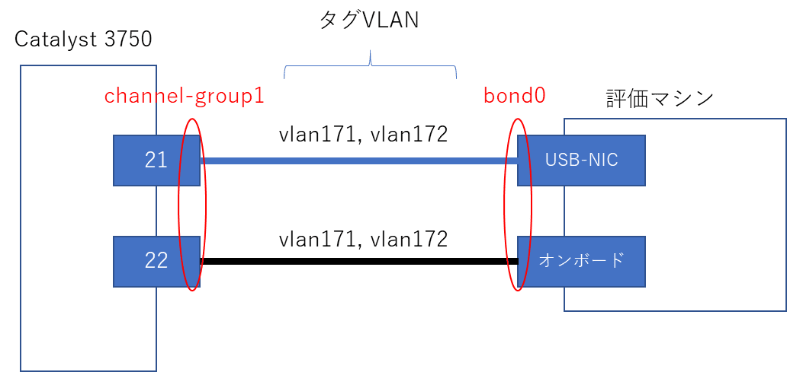
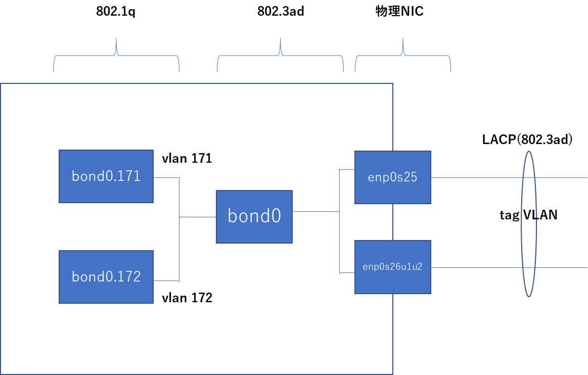

こんにちは。

今回は **CentOS7** で **チーミング+VLANタグ** のインターフェースを作成してみます。

過去記事もご参考ください。
[\[CentOS7\] Catalyst3750とCentOS7でチーミング(LACP)する](/teaming-lacp-with-catalyst3750-and-centos7/)

過去記事では、 `nmcli` ベースで設定しましたが今回は設定ファイルを編集する方法で実施しています。

環境としてはこのような感じで、 **VLAN171とVLAN172をタグ** で流します。


論理的には以下のような環境を目指します。


各レイヤのイメージは以下のとおりです。
こちらのほうが分かりやすいかもしれません。


## Catalyst の設定
Catalyst3750のコンフィグは `show run` が以下のよう(抜粋)になっている状態とします。

```
!
interface Port-channel1
!
interface GigabitEthernet1/0/21
 channel-group 1 mode active
!
interface GigabitEthernet1/0/22
 channel-group 1 mode active
!
```

以下を投入します。
```
Switch#conf t
Switch(config)#interface Port-channel1
Switch(config-if)#switchport trunk encapsulation dot1q
Switch(config-if)#switchport mode trunk
Switch(config-if)#switchport trunk allowed vlan 171,172
```

`show run` は以下のようになります。
```
!
interface Port-channel1
 switchport trunk encapsulation dot1q
 switchport trunk allowed vlan 171,172
 switchport mode trunk
!
interface GigabitEthernet1/0/21
 switchport trunk encapsulation dot1q
 switchport trunk allowed vlan 171,172
 switchport mode trunk
 channel-group 1 mode active
!
interface GigabitEthernet1/0/22
 switchport trunk encapsulation dot1q
 switchport trunk allowed vlan 171,172
 switchport mode trunk
 channel-group 1 mode active
!
```

以上でCatalyst側は完了です。

## CentOS 7 の設定

チーミングインターフェースを以下の設定で作成します。

### チーミングインターフェース bond0
1. `/etc/sysconfig/network-scripts/ifcfg-bond0` の設定内容
    ```
    TYPE=Bond
    NAME=bond0
    DEVICE=bond0
    ONBOOT=yes
    BONDING_MASTER=yes
    BOOTPROTO=none
    BONDING_OPTS="downdelay=0 miimon=100 mode=802.3ad updelay=0 xmit_hash_policy=layer3+4"
    PROXY_METHOD=none
    BROWSER_ONLY=no
    IPV6INIT=no
    DEFROUTE=yes
    IPV4_FAILURE_FATAL=no
    ```

1. `/etc/sysconfig/network-scripts/ifcfg-enp0s25` の設定内容
    ```
    TYPE=Ethernet
    PROXY_METHOD=none
    BROWSER_ONLY=no
    DEFROUTE=yes
    IPV4_FAILURE_FATAL=no
    NAME=enp0s25
    DEVICE=enp0s25
    ONBOOT=yes
    BOOTPROTO=none
    MASTER=bond0
    SLAVE=yes
    ```

1. `/etc/sysconfig/network-scripts/ifcfg-enp0s26u1u2` の設定内容
    ```
    TYPE=Ethernet
    PROXY_METHOD=none
    BROWSER_ONLY=no
    DEFROUTE=yes
    IPV4_FAILURE_FATAL=no
    NAME=enp0s26u1u2
    DEVICE=enp0s26u1u2
    ONBOOT=yes
    BOOTPROTO=none
    MASTER=bond0
    SLAVE=yes
    ```

以上で **チーミングインターフェースの作成は完了** です。

### VLANタグインターフェース

1. `/etc/sysconfig/network` の設定内容
    ```
    NETWORKING=yes
    VLAN=yes
    VLAN_NAME_TYPE=DEV_PLUS_VID_NO_PAD
    ```

1. `/etc/sysconfig/network-scripts/ifcfg-bond0.171` の設定内容
    ```
    DEVICE=bond0.171
    BOOTPROTO=none
    ONBOOT=yes
    VLAN=yes
    TYPE=Vlan
    PHYSDEV=bond0
    VLAN_ID=171
    REORDER_HDR=yes
    GVRP=no
    MVRP=no
    PROXY_METHOD=none
    BROWSER_ONLY=no
    BOOTPROTO=none
    DEFROUTE=yes
    IPV4_FAILURE_FATAL=no
    IPV6INIT=no
    NAME="Vlan bond0.171:"
    IPADDR="172.17.1.200"
    PREFIX=24
    ```

1. `/etc/sysconfig/network-scripts/ifcfg-bond0.172` の設定内容
    ```
    DEVICE=bond0.172
    BOOTPROTO=none
    ONBOOT=yes
    VLAN=yes
    TYPE=Vlan
    PHYSDEV=bond0
    VLAN_ID=172
    REORDER_HDR=yes
    GVRP=no
    MVRP=no
    PROXY_METHOD=none
    BROWSER_ONLY=no
    BOOTPROTO=none
    DEFROUTE=yes
    IPV4_FAILURE_FATAL=no
    IPV6INIT=no
    NAME="Vlan bond0.172:"
    IPADDR="172.17.2.200"
    PREFIX=24
    ```

以上で **VLANタグインターフェースの作成が完了** です。

ネットワーク設定を反映するためにネットワークを再起動してください。

### 設定確認

上記までで、チーミングインターフェースにVLANタグインターフェースを作成できました。

以下は `ip a` コマンドの抜粋です。
```
3: bond0.171@eth0: <BROADCAST,MULTICAST,UP,LOWER_UP> mtu 1500 qdisc noqueue state UP group default qlen 1000
    link/ether 00:15:5d:0b:78:0d brd ff:ff:ff:ff:ff:ff
    inet 172.17.1.200/24 brd 172.17.1.255 scope global noprefixroute eth0.171
       valid_lft forever preferred_lft forever
    inet6 fe80::215:5dff:fe0b:780d/64 scope link
       valid_lft forever preferred_lft forever
4: bond00.172@eth0: <BROADCAST,MULTICAST,UP,LOWER_UP> mtu 1500 qdisc noqueue state UP group default qlen 1000
    link/ether 00:15:5d:0b:78:0d brd ff:ff:ff:ff:ff:ff
    inet 172.17.2.200/24 brd 172.17.2.255 scope global noprefixroute eth0.172
       valid_lft forever preferred_lft forever
    inet6 fe80::215:5dff:fe0b:780d/64 scope link
       valid_lft forever preferred_lft forever
```


## あとがき
`bond0` の部分は `eth0` など別のインターフェース名の場合は書き換えることで対応できます。
色々と応用が可能な技術なので、是非お試しください。
※本番への適用には十分評価をしてから行ってください。