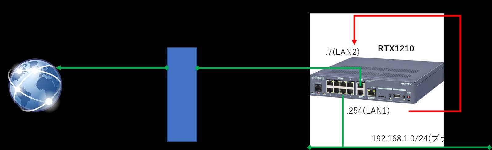

こんにちは。

今回は、YAMAHAの企業向けルータであるRTX1210を使ってシンプルなNATネットワークを作ってみます。
[RTX1210 特長](https://network.yamaha.com/products/routers/rtx1210/index)

このようなネットワークイメージです。
※IPアドレスは架空のものです。


## コンフィグファイル
以下の設定でイメージ図とおりのネットワークが構築できます。

```
console character ja.utf8
ip route default gateway 10.10.10.1
ip lan1 address 192.168.1.254/24
switch control use lan1 on
ip lan2 address 10.10.10.7/24
ip lan2 mtu 1454
ip lan2 secure filter in 1 2000
ip lan2 secure filter out 1010 1011 1012 1013 1014 1015 3000 dynamic 100 101 102 103 104 105 106 107
ip lan2 nat descriptor 1000
switch control use lan2 on
ip filter 1 pass * * established
ip filter 1010 reject * * udp,tcp 135 *
ip filter 1011 reject * * udp,tcp * 135
ip filter 1012 reject * * udp,tcp netbios_ns-netbios_ssn *
ip filter 1013 reject * * udp,tcp * netbios_ns-netbios_ssn
ip filter 1014 reject * * udp,tcp 445 *
ip filter 1015 reject * * udp,tcp * 445
ip filter 2000 reject * *
ip filter 3000 pass * *
ip filter dynamic 100 * * ftp
ip filter dynamic 101 * * www
ip filter dynamic 102 * * domain
ip filter dynamic 103 * * smtp
ip filter dynamic 104 * * pop3
ip filter dynamic 105 * * submission
ip filter dynamic 106 * * tcp
ip filter dynamic 107 * * udp
nat descriptor type 1000 masquerade
nat descriptor address outer 1000 primary
nat descriptor address inner 1000 auto
nat descriptor masquerade incoming 1000 reject
dns host any
dns service recursive
dns server 8.8.8.8
dns private address spoof on
```

以下の記事を参考に設定しています。
[高速回線（光ファイバー）を利用する : コマンド設定](https://network.yamaha.com/setting/router_firewall/internet/internet_connect/opticalfiber_command)

パケットフィルタの概要は以下のとおりです。

* 上位ルーターからRTX1210に向かう **in通信** は RTX1210から確立した **established通信以外は全て拒否** 
* RTX1210から上位ルーターに向かう **out通信** は **RPCの135/TCP** , **netbios** , **Windows ファイル共有の 445/TCP** を **拒否** し、**その他は全て許可**

## 上位ルーターにPingを飛ばすためには
上述の設定では、上位ルーター 10.10.10.1 へのPing通信がブロックされてしまいます。
ケースによると思いますが、Pingが通ったほうがいい、という場合は以下の設定を追加します。

```
ip filter 2 pass * * icmp
ip lan2 secure filter in 1 2 2000
save
```
※fileter 2が追加分です。

## YAMAHA機器

個人的にYAMAHA機器が好きなのですが、Ciscoなどのメジャーな機器に慣れている方にはちょっと癖のある機種ではないかなと思います。(個人的感想です)

YAMAHAは情報が豊富で、自分で調べて頑張ればだいたいのことは出来てしまいます。
[このような設定例が豊富](https://network.yamaha.com/setting)

また、メーカーサポート期間中の機器であれば機器の購入費用以上に払うことなく問合せができます。
[ネットワーク機器お問い合わせ](https://network.yamaha.com/support/contact)

経験上、1日(営業日内)1通程度のやりとりになりますが、費用が発生せず問合せできるのはありがたいですよね。

## あとがき
YAMAHAの設定例を参考に進めていましたが、一部 `nat descriptor` 設定を変更した経緯があります。

当初、 `nat descriptor address outer 1000 ipcp` と設定していたのですが通信できず、

問合せをしたところ、 **IPマスカレードの外側IPアドレスをLAN2のプライマリアドレスに設定する必要がある。** という回答でした。
[26.4 NAT 処理の外側 IP アドレスの設定](http://www.rtpro.yamaha.co.jp/RT/manual/rt-common/nat/nat_descriptor_address_outer.html)

この設定を `ipcp` から `primary` に変更することで解決しました。
`nat descriptor address outer 1000 primary`

プロバイダなどのPPPoE接続では `ipcp` , 今回のようなグローバルIPアドレスが提供されているケースなどは `primary` となるということです。

それでは次回の記事でお会いしましょう。
