こんにちは。

**2020年12月3日に** 得意先のお客様から、 **「メールが送信できるが受信ができない」と問合せ** がありました。
お客様は、**ThunderbirdでX Serverで作成したメールアカウントを利用** されています。

**結論からですが、ESETプロトコルフィルタリングでThunderbirdを除外すると解決** しました。

調査すると、**メーカーページでも公表** されていました。
執筆時点では、 **原因は、調査中です** となっており、発生日時は、 **2020年11月30日 18時40分頃～** となっていました。

[Thunderbirdでメールの送信や受信ができない | ESETサポート情報](https://eset-support.canon-its.jp/faq/show/18092?back=front%2Fcategory%3Ashow&category_id=35&page=1&site_domain=default&sort=sort_access&sort_order=desc)

現象が発生したPCには、 **ESET Internet Secrurity 14.0.22.0** がインストールされていました。
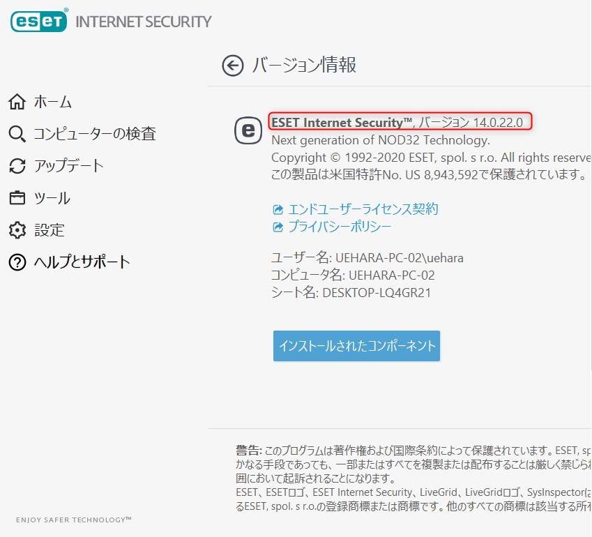

ESET のサポートページには記述されていますが、この現象が発生する対象の環境は Windows の模様です。

## 現状確認
- 受信トレイを見ると **11月26日からメールが受信できていません** でした
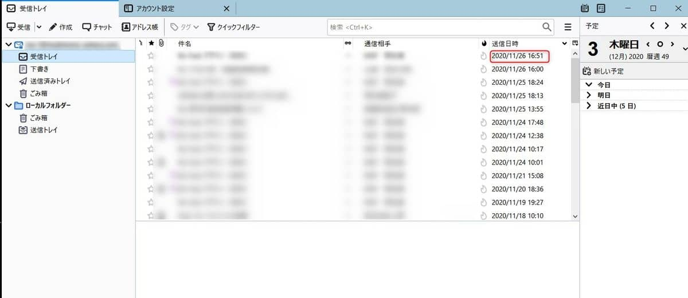

## ESET の設定を変更する
1. **ESET Internet Securityを開く** をクリックします
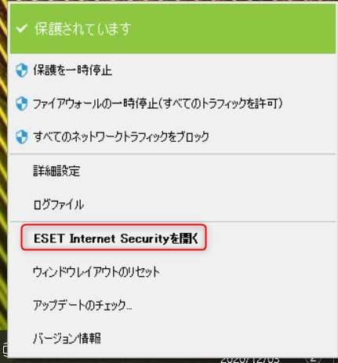

1. **設定** を開きます
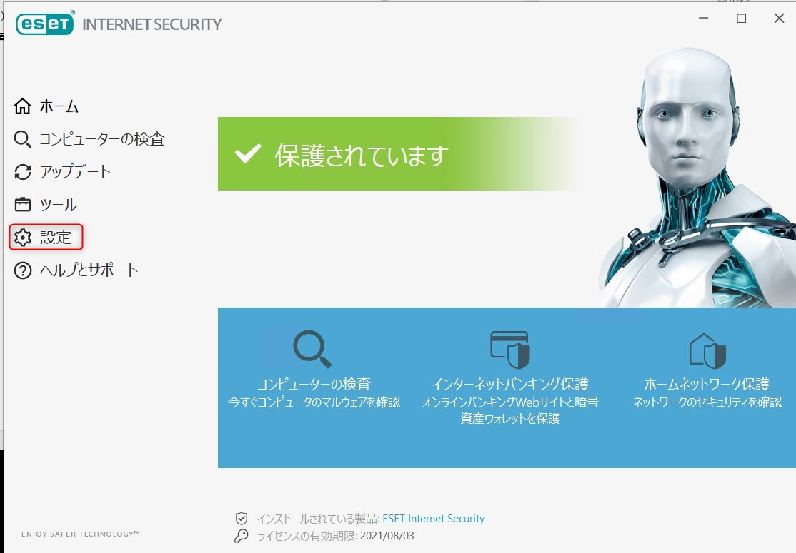

1. **ネットワーク保護** をクリックします 
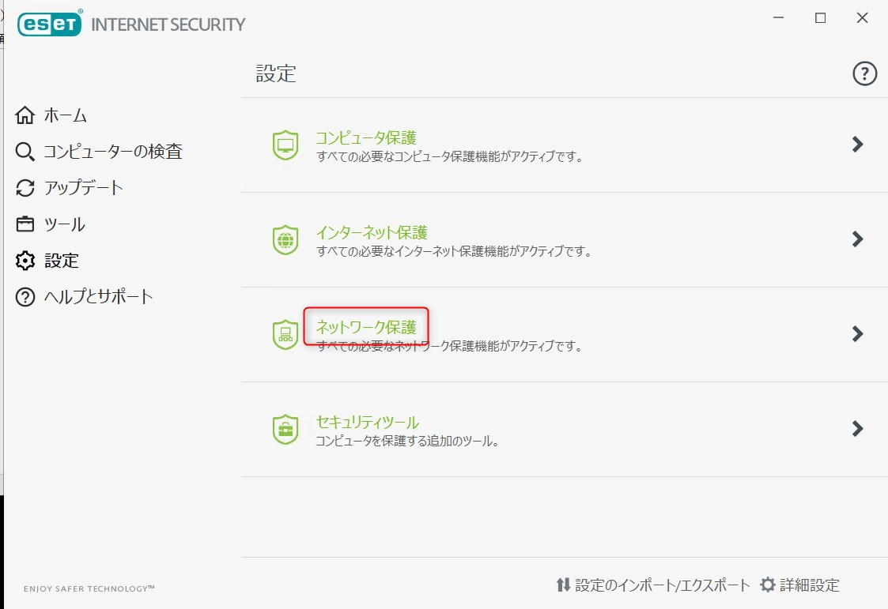

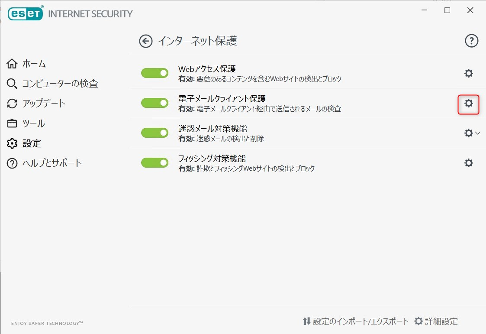

1. **WEBとメール から 対象外のアプリケーションの編集** をクリックします
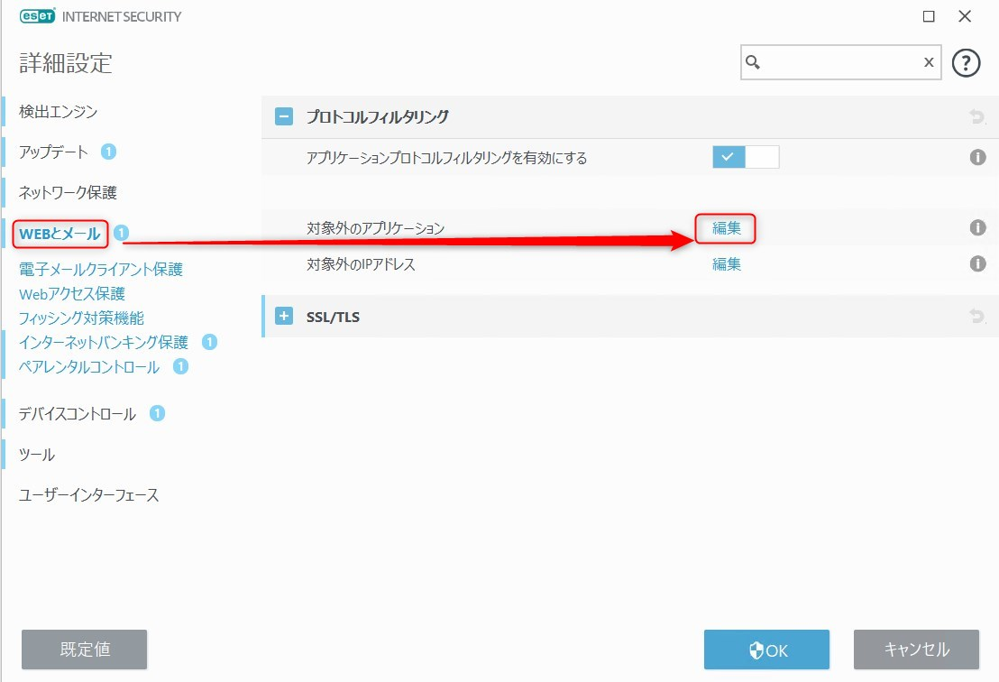

1. **対象外のアプリケーションを追加** します
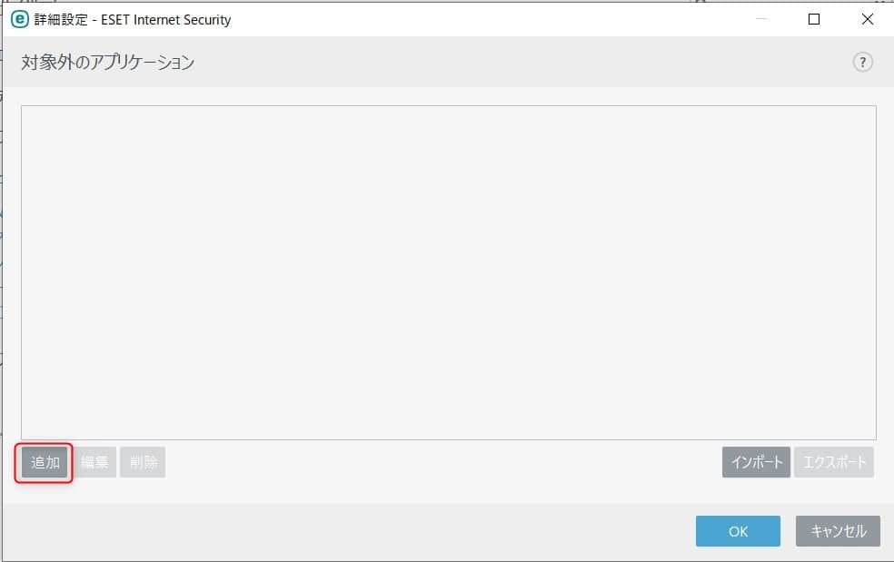

1. **Thnderbird のパス** を `C:\Program Files (x86)\Mozilla Thunderbird\thunderbird.exe` と入力しOKをクリックします
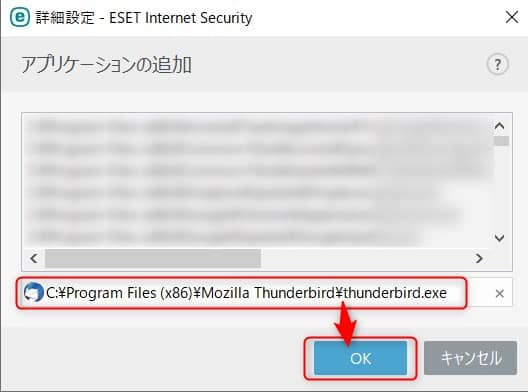

1. **OKをクリックし設定を確定** します
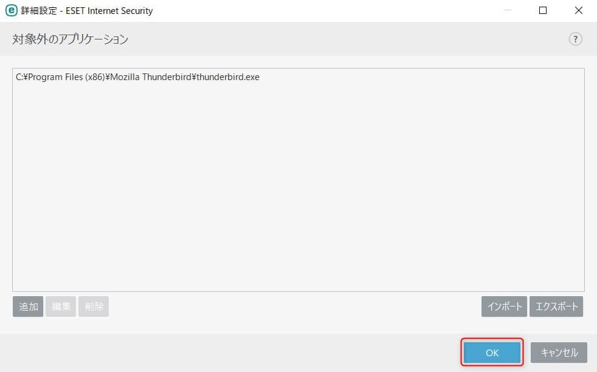

1. **Thunderbird を再起動すると無事受信**できました
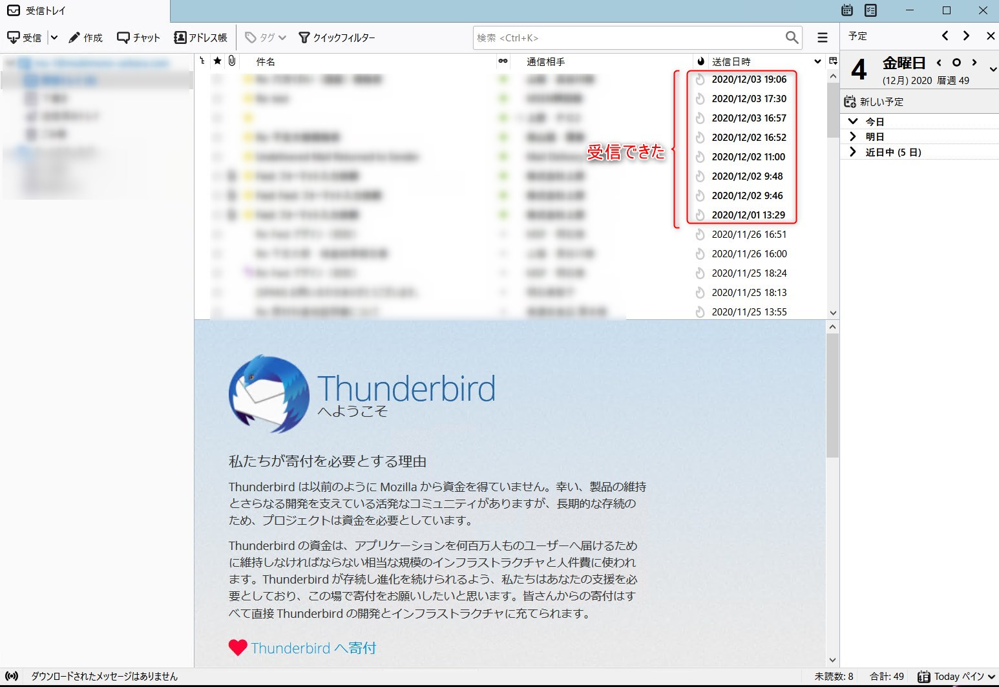

## 事例多数
調べていると、同現象に見舞われている方が多数おられました。
メーカーの公表が待たれますね。

[2020年12月1日からThunderbird + ESETのパソコンでメールが受信できない！ | ブルーオーブのブログ](https://ameblo.jp/redsun2100/entry-12641627747.html)

[Thunderbirdで急にメールが受信できなくなったのですが以下情報で原因わ... - Yahoo!知恵袋](https://detail.chiebukuro.yahoo.co.jp/qa/question_detail/q14235234289)

