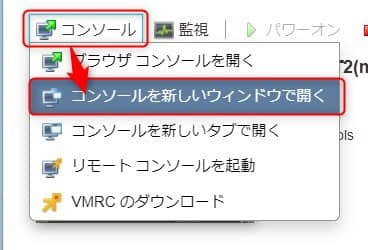
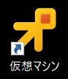
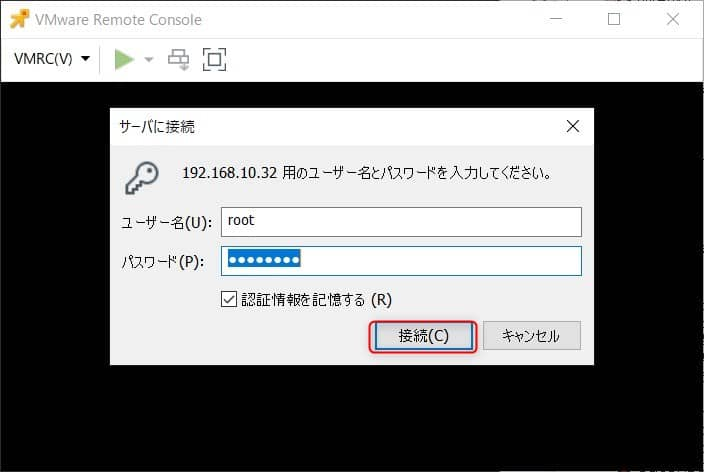

こんにちは。

今回は、**VMwareで作成した仮想マシンへ簡単にショートカットでアクセスする方法** を方法を紹介します。

通常であれば、ESXi や vCenter にログインし、コンソールを開いて利用する流れになりますが、ブラウザを開いて、ログインして・・・と手間がかかります。

この操作を **ショートカットで一発接続** できるようにします。

## 環境
- Windows 10 (1909)
  - 事前に [VMware Remote Console](https://my.vmware.com/jp/web/vmware/downloads/details?downloadGroup=VMRC1120&productId=974) をインストールします
- VMware ESXi, 6.7.0, 15160138
  - IPアドレスを 192.168.10.32 とします

## 接続テスト
1. ショートカットを作りたい **仮想マシンのIDを調べます**
  - **仮想マシンが動作しているESXiにログインし、コンソールを起動** します
  
  ↓
  
  - ID が **376** であることが分かりました

1. ブラウザで接続
  - **Chrome などのブラウザを開き** 、URL に `vmrc://root@192.168.10.32/?moid=376` と入力します
  
  - **VMware Remote Console を開きますか？** と確認を求められるので **開きます**
  
  - **認証情報を入力して接続をクリック** します 次回のために認証情報の記憶にチェックをいれましょう
  
  - **証明書を信頼** し **接続する** をクリックします
  
1. 接続完了
  - **接続することができました**
  

## ショートカットの作成
ここからはWindowsの操作ですが、ショートカットを作成していきます

1. デスクトップ上などで **右クリック→ショートカットをクリック** します

1. 前項でテストした `vmrc://root@192.168.10.32/?moid=376` を入力し 次へ をクリックします

1. **任意の名前を入力し完了をクリック** します

ショートカットができます

1. **ショートカットをダブルクリックし、接続をクリック** します

**無事接続** できました

接続頻度の多い仮想マシンの利用には便利だと思いますので参考にしていただけましたら幸いです。
それでは次回の記事でお会いしましょう。