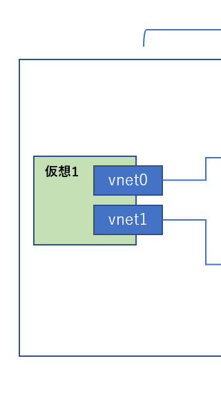

こんにちは。

今回は、 **KVM** (Kernel-based Virtual Machine) で作成した仮想マシンに **タグVLANで作成したネットワークインターフェースを割り当てる** 方法を紹介します。

イメージは以下のような感じです。


ベース記事は以下になります。
[\[CentOS7\] CentOS7でコマンドラインを利用してVLANタグインターフェースを作成する](/create-vlan-tag-interface-using-command-line-in-centos7)

## ブリッジインターフェースを作成する
**KVMで利用するためにブリッジインターフェースを新規作成** します。

この部分です。


1. `/etc/sysconfig/network-scripts/ifcfg-br0-171` を作成
    ```
    DEVICE=br0-171
    TYPE=BRIDGE
    ONBOOT=yes
    IPADDR=172.17.1.200
    PRREFIX=24
    ```

1. `/etc/sysconfig/network-scripts/ifcfg-br0-172` を作成
    ```
    DEVICE=br0-172
    TYPE=BRIDGE
    ONBOOT=yes
    IPADDR=172.17.2.200
    PRREFIX=24
    ```

## VLANタグインターフェースを変更する
前項で **作成したブリッジインターフェースにVLANタグインターフェースを紐付け** ます。

この部分です。


1. `/etc/sysconfig/network-scripts/ifcfg-bond0.171` を修正
    ```
    DEVICE=bond0.171
    BOOTPROTO=none
    ONBOOT=yes
    VLAN=yes
    TYPE=Vlan
    PHYSDEV=bond0
    VLAN_ID=171
    REORDER_HDR=yes
    GVRP=no
    MVRP=no
    PROXY_METHOD=none
    BROWSER_ONLY=no
    BOOTPROTO=none
    DEFROUTE=yes
    IPV4_FAILURE_FATAL=no
    IPV6INIT=no
    NAME="Vlan bond0.171:"
    BRIDGE=br0-171
    ```

1. `/etc/sysconfig/network-scripts/ifcfg-bond0.172` を修正
    ```
    DEVICE=bond0.172
    BOOTPROTO=none
    ONBOOT=yes
    VLAN=yes
    TYPE=Vlan
    PHYSDEV=bond0
    VLAN_ID=172
    REORDER_HDR=yes
    GVRP=no
    MVRP=no
    PROXY_METHOD=none
    BROWSER_ONLY=no
    BOOTPROTO=none
    DEFROUTE=yes
    IPV4_FAILURE_FATAL=no
    IPV6INIT=no
    NAME="Vlan bond0.172:"
    BRIDGE=br0-172
    ```

ネットワーク設定を反映するためにネットワークを再起動してください。

`ip a`の結果は以下のとおりです。
```
3: bond0.171@eth0: <BROADCAST,MULTICAST,UP,LOWER_UP> mtu 1500 qdisc noqueue master br0-171 state UP group default qlen 1000
    link/ether 00:15:5d:0b:78:0d brd ff:ff:ff:ff:ff:ff
4: bond0.172@eth0: <BROADCAST,MULTICAST,UP,LOWER_UP> mtu 1500 qdisc noqueue master br0-172 state UP group default qlen 1000
    link/ether 00:15:5d:0b:78:0d brd ff:ff:ff:ff:ff:ff
5: br0-172: <BROADCAST,MULTICAST,UP,LOWER_UP> mtu 1500 qdisc noqueue state UP group default qlen 1000
    link/ether 00:15:5d:0b:78:0d brd ff:ff:ff:ff:ff:ff
    inet 172.17.2.200/16 brd 172.17.255.255 scope global noprefixroute br0-172
       valid_lft forever preferred_lft forever
    inet6 fe80::215:5dff:fe0b:780d/64 scope link
       valid_lft forever preferred_lft forever
6: br0-171: <BROADCAST,MULTICAST,UP,LOWER_UP> mtu 1500 qdisc noqueue state UP group default qlen 1000
    link/ether 00:15:5d:0b:78:0d brd ff:ff:ff:ff:ff:ff
    inet 172.17.1.200/16 brd 172.17.255.255 scope global noprefixroute br0-171
       valid_lft forever preferred_lft forever
    inet6 fe80::215:5dff:fe0b:780d/64 scope link
       valid_lft forever preferred_lft forever
```

ここまでの環境ができれば、KVM側で `br0-171` などのブリッジインターフェースを指定することで、KVM側の `vnet` と紐付けが自動で行われます。

この部分です。


## あとがき
この方法を応用することで、KVMのネットワークを効率的に作成することができます。
※本番への適用には十分評価をしてから行ってください。
