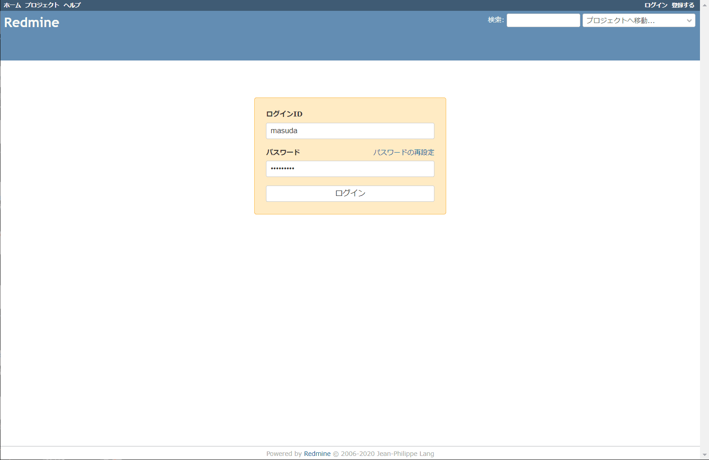

こんにちは。

今回は、**Redmine と ActiveDirectory を連携し、ActiveDirectory のユーザーでログイン & ユーザー自動作成を実現** したいと思います。

## 前提
- ActiveDirectory を運用していること
- Redmine を運用していること

## 環境
- ActiveDirectory
    - Windows Server 2016

- Redmine
    - CentOS 8
    - Redmine 4.1.1.stable

## 手順
1. 管理者でログインし、 **管理 → LDAP認証 → 新しい認証方式** をクリックします

2. 以下を参考に設定を入力し、保存ボタンをクリックします

ドメイン名が、`example.com` として記載
  1. 任意名
  2. ActiveDirectoryのIPアドレス or DNS名
  3. LDAP
  4. 389
  5. administrator@example.com
  6. 5 のパスワード
  7. DC=example,DC=com
  8. チェックを入れる (ユーザーが存在しないとき自動作成してくれる)
  9. sAMAccountName
  10. givenName
  11. sn
  12. mail

1. テストボタンをクリックし、接続できることを確認します

以上で設定完了です。

## テスト

ユーザーは admin のみ存在することを確認します。

ログアウトし、ActiveDirectoryに登録されているユーザーでログインします。

ログインできました！

ユーザーが自動生成され、 名前・メールアドレスもActiveDirectoryで設定している値が自動で設定されています。

簡単に ActiveDirectory と連携することができました。

試しに、ActiveDirectory のアカウントを無効にしてみると、

ログイン出来なくなりました。

ユーザー認証を ActiveDirectory に統合できるのでお勧めです。

それでは次回の記事でお会いしましょう。
