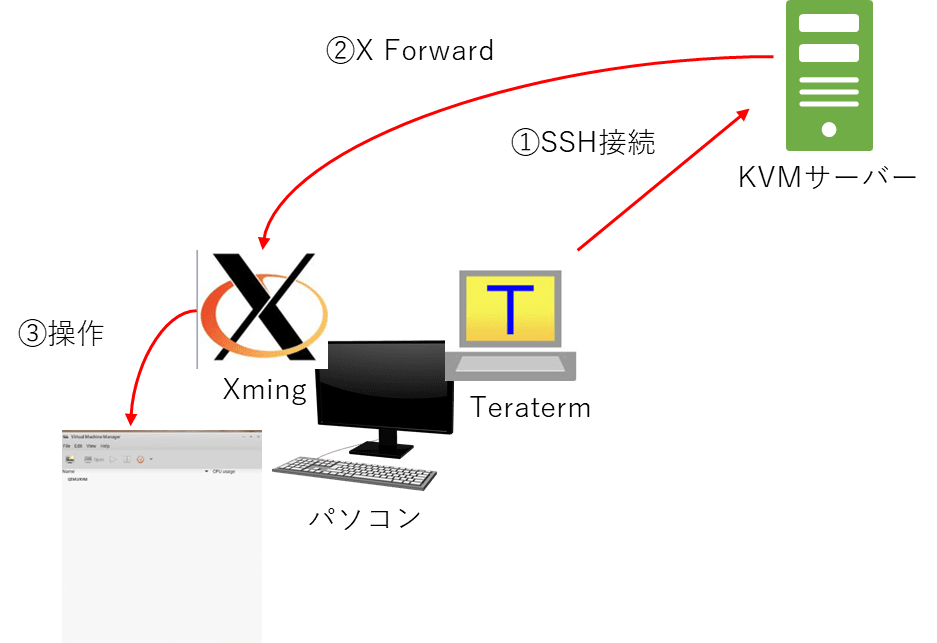
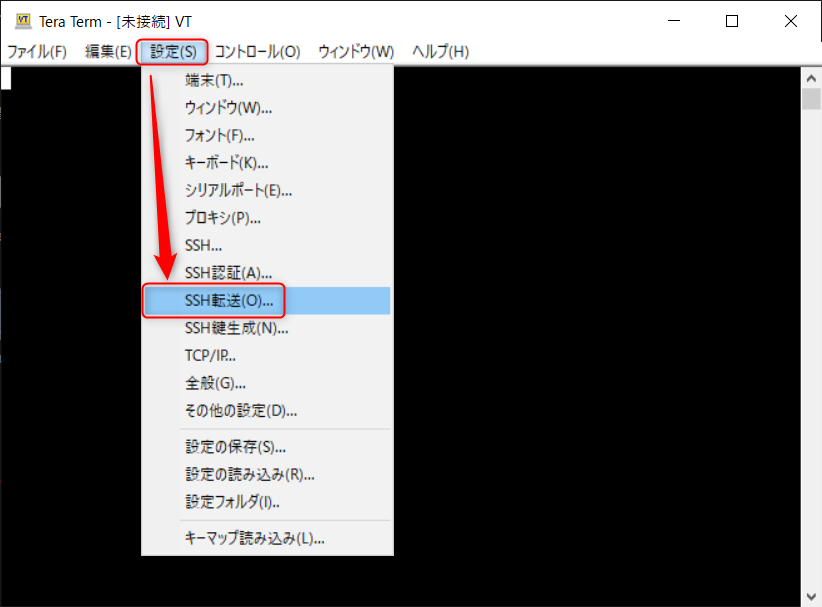
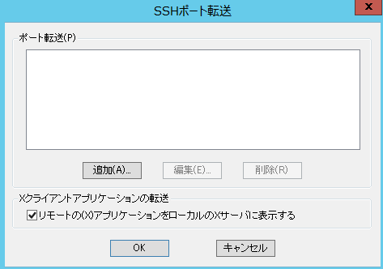
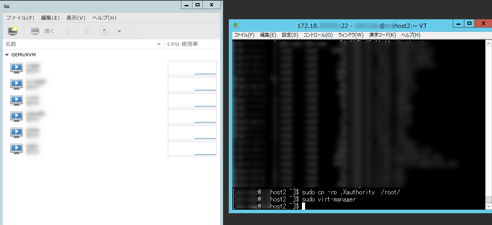
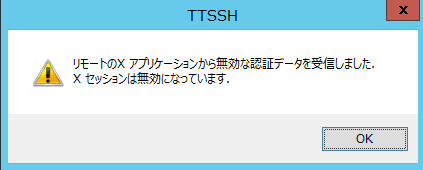
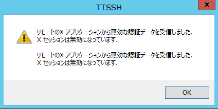

こんにちは。

今回は、 **KVM の管理コンソールにリモートで接続する** 方法を紹介します。

KVMの概要は以下を参考に。
[Kernel-based Virtual Machine - Wikipedia](https://ja.wikipedia.org/wiki/Kernel-based_Virtual_Machine)

それでは早速やってみましょう。

## 使うもの
1. Teraterm
[Tera Term (テラターム) プロジェクト日本語トップページ - OSDN](https://ja.osdn.net/projects/ttssh2/)
1. Xming
[Xming X Server for Windows 日本語情報トップページ - OSDN](https://ja.osdn.net/projects/sfnet_xming/)

## 概要図

概要図は以下のとおりです。


**ログインするユーザーがsudoを実行できる** ことが前提となります。
※rootの直ログインは想定外です。

ログインユーザー名は `masuda` とします。

## 手順
1. **Teratermを起動** し、**リモートの(X)アプリケーションをローカルのXサーバに表示する** にチェックを入れます

↓

1. **KVMサーバーにSSH接続** します
1. **Xmingを起動** します(タスクトレイにひっそりと常駐します)

1. `sudo cp /home/masuda/.Xauthority /root/` を実行します
1. `sudo virt-manager` を実行します
1. これでWARNINGが出るものの **KVM管理コンソールが表示** されます
```
$(virt-manager:27148): dbind-WARNING **: 22:03:36.734: Couldn't connect to accessibility bus: Failed to connect to socket /tmp/dbus-7GWd4x8Rhi: 接続を拒否されました
```


この手順は **切断の都度実施する必要** があります。


## あとがき

**手順4** で、`sudo cp /home/masuda/.Xauthority /root/` を実行するように記載しましたが、実はこれがないと、以下のようなエラーが出て　**KVM管理コンソールが表示されません** 。


↓


というエラーウィンドウが出て、

```
(virt-manager:6746): Gtk-WARNING **: 21:59:23.354: cannot open display: localhost:10.0
```

上記の**エラーがターミナルに表示**され、期待動作になりません。

それでは次回の記事でお会いしましょう。
