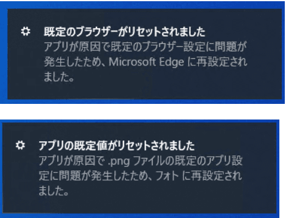
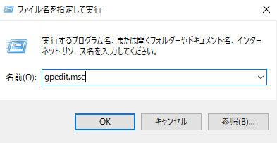
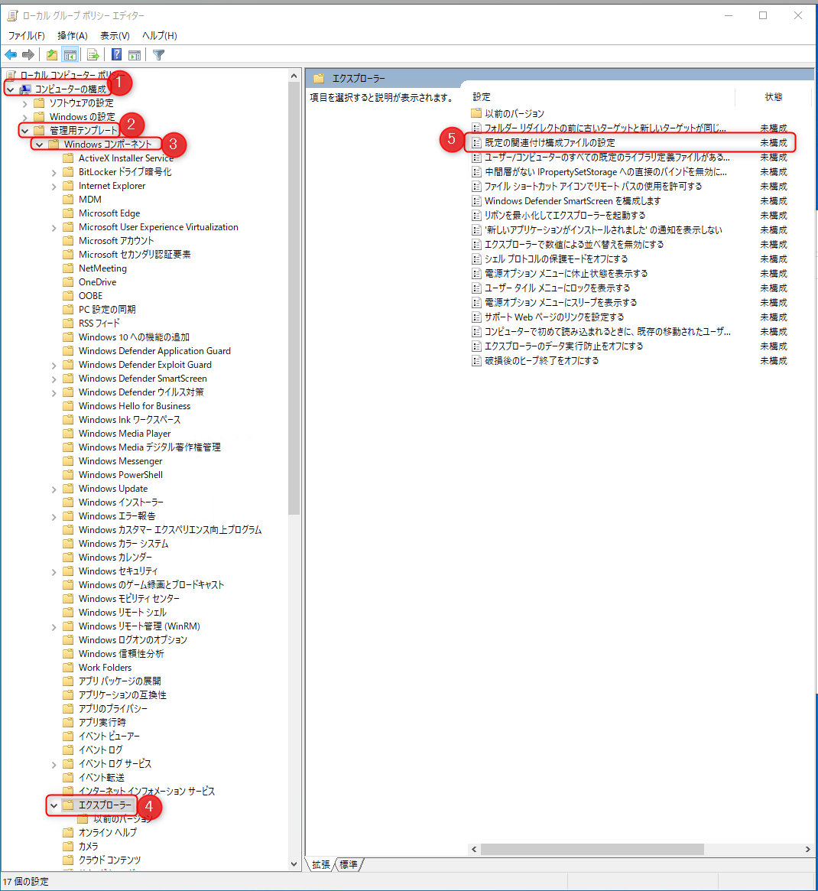
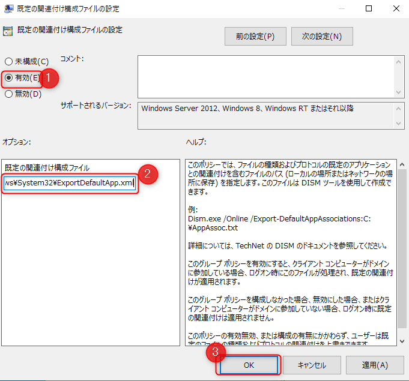

こんにちは。

[前回の記事](/update-the-default-profile-without-using-sysprep/)で、**sysprepを使わずデフォルトプロファイルをカスタムする** を公開しましたが、
このとき、 プロファイルのカスタムでは **既定のアプリ設定が引き継げない問題が発生** しました。



この **解消方法を紹介** させていただきます。

以下の記事を参考にさせていただきました。
[「既定のアプリの選択」をグループポリシーで制御する方法【Windows】│Soy Pocket](https://soypocket.com/it/windows-server/grouppolicy-default-program-change/)

本記事は、[前回記事](/update-the-default-profile-without-using-sysprep/)の延長として記載させていただきます。

## 既定のアプリ設定を出力
※profile ユーザーでPDFの既定設定などを事前に済ませておきます

1. **profile ユーザーでログイン** します (プロファイルのひな形ユーザーでログイン)

1. **コマンドプロンプトを管理者権限で開き** ます

1. 以下のコマンドを実行し、**既定のアプリ設定を出力** します
    ```
    Dism.exe /Online /Export-DefaultAppAssociations:C:\Windows\System32\ExportDefaultApp.xml
    ``` 

    以下のようになります。

    ```
    C:\Windows\system32>Dism.exe /Online /Export- 
   DefaultAppAssociations:C:\Windows\System32\ExportDefaultApp.xml
   
    展開イメージのサービスと管理ツール
    バージョン: 10.0.18362.1
    
    イメージのバージョン: 10.0.18363.836

    操作は正常に完了しました。
    ```
    ※C:\Windows\system32\ExportDefaultApp.xml に設定を出力します

## ローカルグループポリシーを設定
1. **ファイル名を指定して実行** から `gpedit.msc` を実行します

1. **コンピューザーの構成→管理用テンプレート→Windowsコンポーネント→エクスプローラー** と開き、 **既定の関連付け構成ファイルの設定** を開きます

1. **未構成から有効に変更** し、 **構成ファイルに C:\Windows\System32\ExportDefaultApp.xml を指定** し OKをクリックします


これで、既定のアプリ設定がひな形ユーザーで設定したものと同様になります。

## あとがき
今回紹介した方法では、40台の端末があれば全台設定する必要があり大変なので、
ドメイン環境であればグループポリシーから設定するのが現実的だと思います。

それでは次回の記事でお会いしましょう。