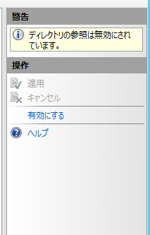

こんにちは。

以前、公開しているWebサーバーの **ディレクトリ参照が有効** になっていると 脆弱性の指摘を受け修正したのでその手順を記事にしました。

接続すると、以下のようにディレクトリが表示されてしあいます。

## 環境
IIS 6.2 ビルド 9200

## 設定

設定は非常に簡単でした。

1. **IISマネージャーを開き、Default Web Site** に進みます。
1. **ディレクトリの参照** をダブルクリックします。

1. **右ペインの無効にする** をクリックします。

1. 無効になりました。

**IISの再起動は不要** で、即時適用されました。

## 動作確認
再度接続すると、以下のようにアクセスを拒否してくれました。

## Apache や nginx の場合

Webサーバーとしてメジャーな、Apacheやnginx の場合は、以下のようにして設定することができます。

### Apache の場合
`/etc/httpd/conf/httpd.conf` で、 `Options Indexes` という設定の `Indexes` の記述を削除します。

こちらが参考になります。
[Apache2.4セキュリティ「ディレクトリ一覧表示対策」](https://www.ritolab.com/entry/2)

### nginx の場合
nginx はデフォルトで非表示となっているため、特に設定は不要ですが、
`/etc/nginx/default.conf` に `autoindex off;` と記載することで制御できます。

こちらが参考になります。
[Nginxセキュリティ設定 - Qiita](https://qiita.com/hideji2/items/1421f9bff2a97a5e5794)

## 参考
以下を記事を参考にしました。(この記事は逆に有効にしています)
["HTTP エラー 403.14 - 許可されていません" エラーが、IIS 7.0 Web ページを開くと表示される](https://support.microsoft.com/ja-jp/help/942062/http-error-403-14-forbidden-error-when-you-open-an-iis-7-0-webpage)

それでは次回の記事でお会いしましょう。
