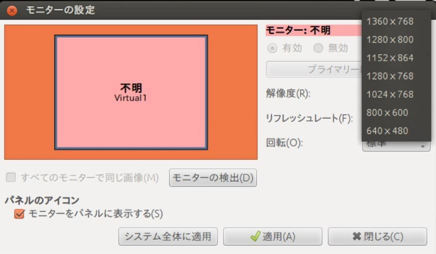
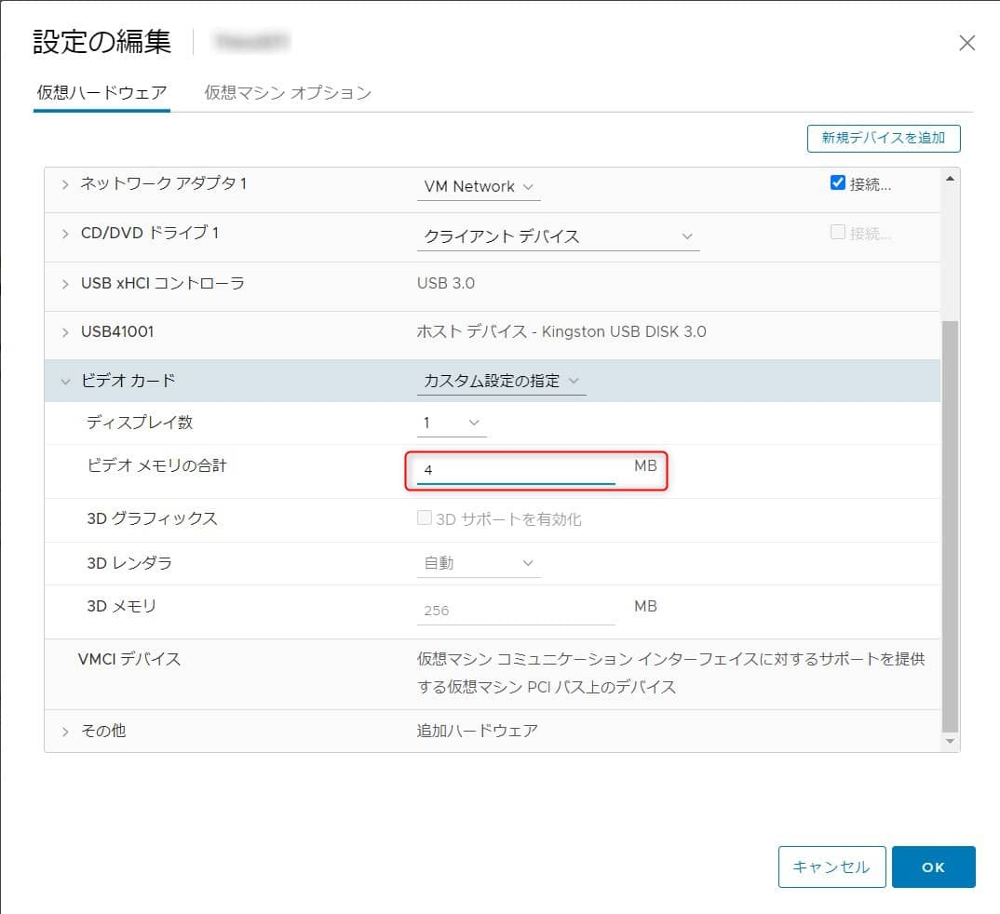
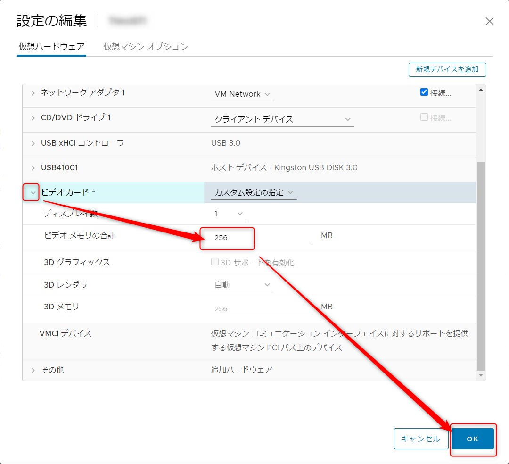
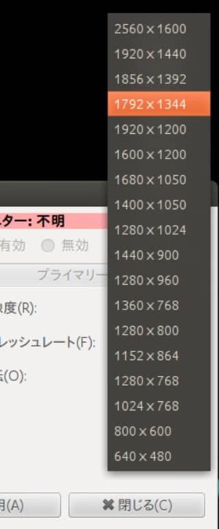

こんにちは。

業務で利用しようとした **ある仮想マシン** の解像度がすごく低くて困っていて、「**仮想マシンのVRAM設定を変更することで可能**ですよ」、という [じんない](https://mseeeen.msen.jp/category/articles-jinnai-wrote/) の一声で解決したので紹介します。

## 環境
- VMware ESXi, 6.7.0, 15160138

## 選択できる解像度が低い
- 起動した状態で、 **選択出来る解像度が 1360 x 768 まで** しかありませんでした

早速 **仮想マシンの VRAM 設定を変更** してみます。

デフォルトは 4MB でした。

## 仮想マシンの設定を変更する

1. 仮想マシンを停止します
1. 仮想マシンの **設定の編集** から **ビデオカード設定のビデオメモリの合計を 256MB に変更** します

**256MB が最大値** のようです。

**変更後に起動し確認すると、高解像度の選択が可能** になりました。

## VRAMの計算

[kenzauros](https://mseeeen.msen.jp/category/articles-kenken-wrote/) にも教えてもらい、**必要なVRAMサイズの計算は以下の式で算出** できるようです。

**VRAM (Byte) = 横ドット数 × 縦ドット数 × 色数（ビット） / 8**

**色数は RGB 各 8 bit の 24 bit で考えれば OK** とのことでした。

- [RGBA（Red Green Blue Alpha）とは - IT用語辞典 e-Words](http://e-words.jp/w/RGBA.html)

以下も参考になりました。

[ビデオメモリと解像度 | PCブレンド](https://www.pcblend.com/archives/46)

基本情報でも問題になっているんですね。
この記事を書いたあとにやってみると無事正解しました(笑)

[平成28年春期問12 最低限必要なビデオメモリ容量｜基本情報技術者試験.com](https://www.fe-siken.com/kakomon/28_haru/q12.html)

それでは次回の記事でお会いしましょう。