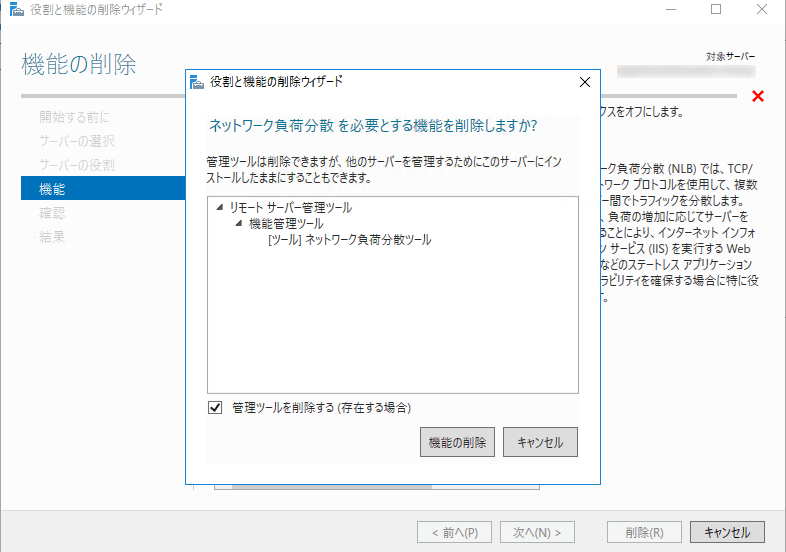

こんにちは。

無料で気軽に使える Windows Server バックアップは重宝されると思います。

今回は、**Windows Server 2016の環境** で、 **Windows Serverバックアップの機能をインストールしているのに** も関わらず、 **メニューに表示されず利用できない** 現象が発生したので解決までの経緯を記事にします。

## 現象

このとおりインストールは完了しているのですが、

サーバーマネージャーのツール一覧にありません。

## 解決

この記事が、解決への道しるべでした。
[Windows Server バックアップのGUIが起動できない](https://social.technet.microsoft.com/Forums/ja-JP/9e145dcf-66fa-470c-b8b0-2be626c75918/windows-server-gui?forum=winserver8)

なんと、 **ネットワーク負荷分散をインストールすれば解決** するというものでした。
まさか・・・

騙されたと思って、インストールします。

↓

解決してしまいました・・・

起動も問題なし。

## あとがき

ネットワーク負荷分散は運用上不要なので、 **削除しても問題ないか確認** しました。

↓

**削除後も問題なく利用** できました。

利用できるようになり安心です。
原因について進展があれば追記します。コメントもいただけましたら幸いです。
