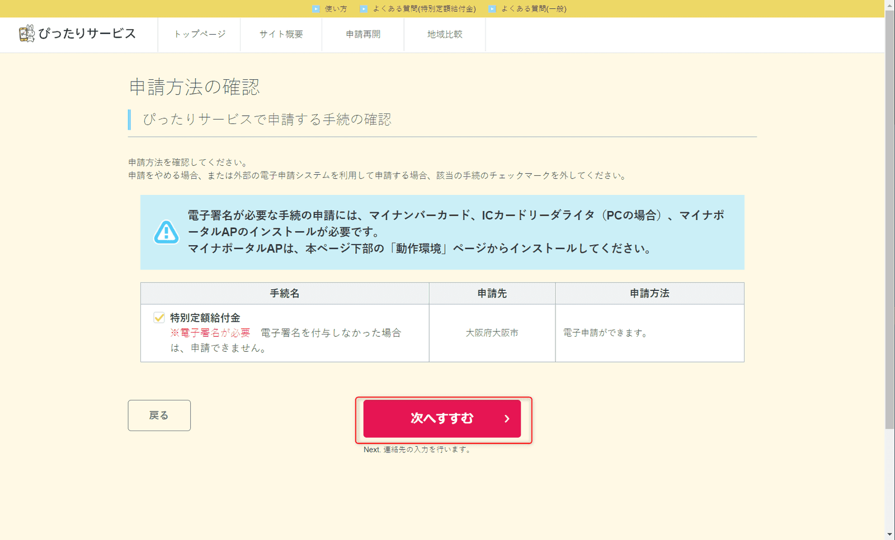
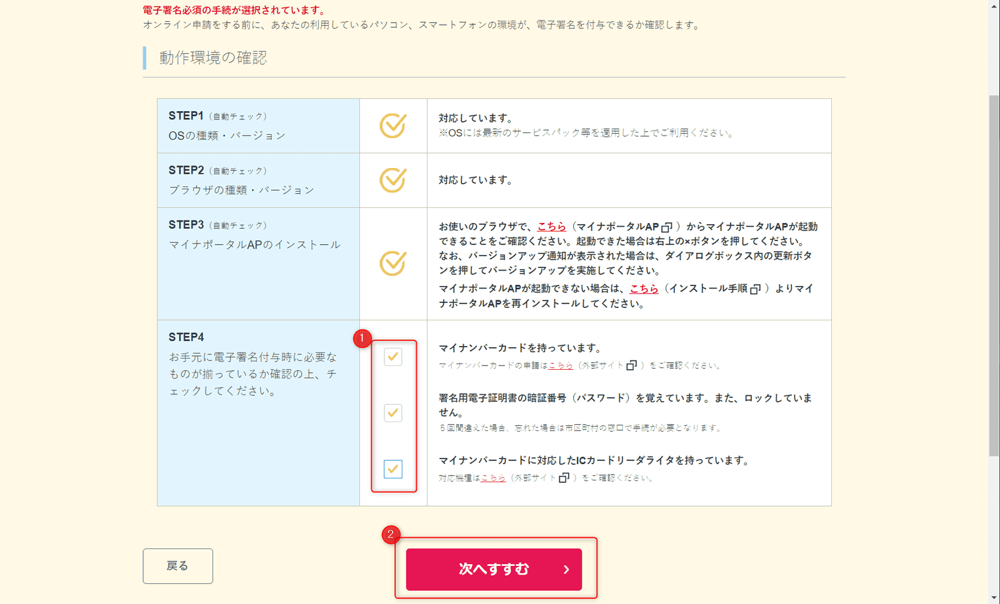
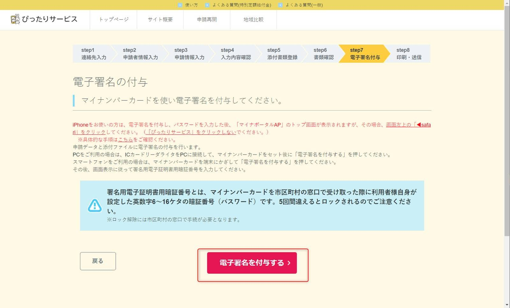

こんにちは。

受付が始まった、 **特別定額給付金** (1人10万円給付) のオンライン申請をしてみました。

大阪市のスケジュールは以下のように公表されています。

[大阪市：特別定額給付金について （…>生活にお困りの方へ>生活支援）](https://www.city.osaka.lg.jp/shimin/page/0000502306.html)

## 環境
1. パソコンでマイナンバーカードが読みと取れる環境が必要
1. 本手順ではChromeを利用(バージョン 81.0.4044.138)

## 事前準備
以下よりマイポータルAPをインストールします

1. **インストーラーをダウンロード** します
[Google Chrome用マイナポータルAPのインストール手順 ｜ ぴったりサービス](https://app.oss.myna.go.jp/Application/resources/dousakankyou/chrome.html)

1. ダウンロードされた **MPASetup_Chrome.exe を実行** します

1. インストールを完了します

1. Chromeに **拡張機能を追加** します

↓

1. Chromeを終了します

## 申請

以下のURLより申請を進めます
[サービストップ ｜ ぴったりサービス](https://app.oss.myna.go.jp/Application/search)

1. **マイナンバーカードを装着** します

1. **郵便番号を入力し地域を検索** します

1. 自動で地区情報が入力されますので、**特別定額給付金にチェック** を入れ、 **この条件でさがす** をクリックします

1. **特定定額給付金にチェック** をいれ、**申請する** をクリックします

1. ポップアップで確認されますので **OK** をクリックします

1. **次へすすむ** をクリックします

1. **画像の①のとおりチェック** をいれて **次へすすむ** をクリックします

1. **メールアドレスと電話番号を入力** し、**次へすすむ** をクリックします

1. **マイナンバーカードを読み取り** をクリックします

1. 遷移した次の画面で **カードを読み取る** をクリックします

1. ポップアップでカードリーダーの準備を確認されますので **OK** をクリックします

1. 続けて **マイナンバーカードのパスワードを入力** して **OK** をクリックします

1. 元の画面に戻るので、 **フリガナ・郵便番号・申請者電話番号の入力** し **次へすすむ** をクリックします

1. **給付対象者の追加（あれば）** と **入金先口座を入力** し **次へすすむ** をクリックします

1. 入力内容を確認し、**次へすすむ** をクリックします

1. **振込口座の確認資料をアップロード** し **次へすすむ** をクリックします

1. **以上を確認・同意し次へ** をクリックします

1. **電子署名を付与する** をクリックします

1. ポップアップで署名用パスワードを求められますので **パスワードを入力しOK** をクリックします

1. **送信する** をクリックします

1. 以上で **手続きが完了** です

**登録アドレスに送信** をクリックすると以下のようなメールを受信しました

## あとがき
各自治体のスケジュールを確認し、スムーズに申請することをお勧めします。

私は事前にマイナンバーカードを作成していたのでWeb申請が出来ましたが、これからマイナンバーカードを作成しようとしても窓口も混んでいるなど申請特需でこれまで以上に時間がかかりそうですね・・・。

マイナンバーカードがない場合は、各世帯に対して申請書が送付されるようなのでそれをまって郵送での申請が良いですね。

それでは次回の記事でお会いしましょう。