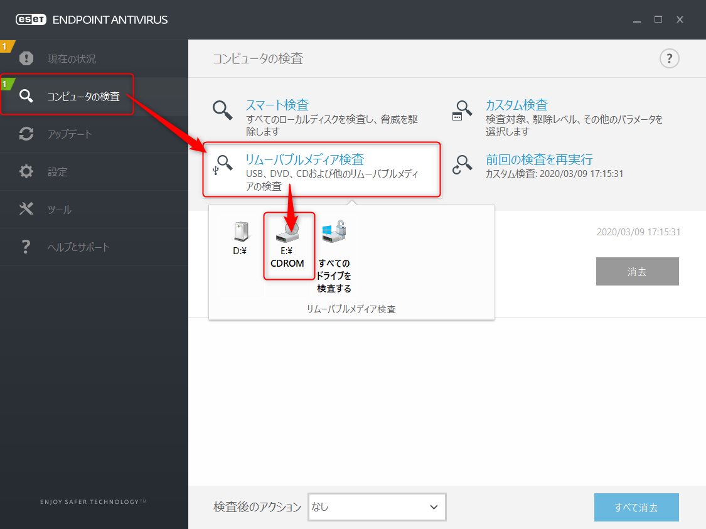
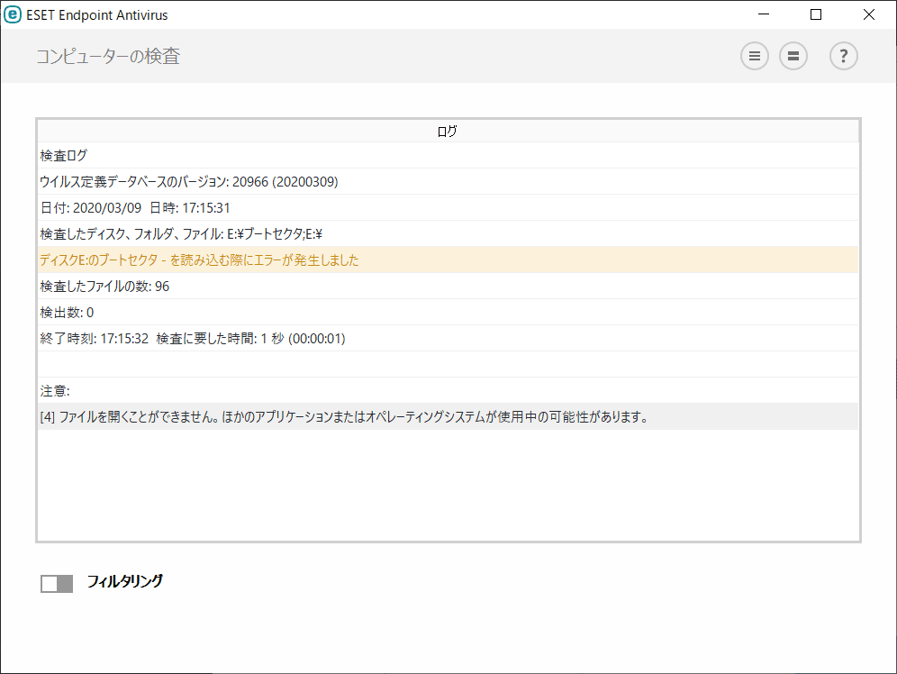

こんにちは。

CDやDVDにデータを収録し、納品することがあるのですが出来上がったCD/DVDを **ESETを利用してウィルスチェックを実行** するのですが、チェックをすると **以下のようなエラー** が出ました。

## 検査の流れ
以下が検査の流れになります。


## エラー内容
`ディスクE:のブートセクタ - を読み込む際にエラーが発生しました`

`[4] ファイルを開くことができません。ほかのアプリケーションまたはオペレーティングシステムが使用中の可能性があります。`

このような画面です。


以下のリンクページも参考にしていたのですが、ピンポイントで同じではなかったで **サポート窓口に問合せ** を行いました。
[「- を開けません」「- を開く際にエラーが発生しました」の意味は？ | ESETサポート情報 | 個人向け製品 | キヤノンITソリューションズ](https://eset-support.canon-its.jp/faq/show/191?category_id=34&site_domain=private)

## 問合せの結果
問合せの結果、以下の回答があり **問題ない** ことが分かりました。

```
検出数が0ということであれば、感染しているファイルはないため、
問題ないと判断していただければと存じます。

なお、パスワード付きのzipファイルや、ESET が開くことができない領域などについては、
検査がエラーになる場合があり、お問い合わせいただいたログ情報が表示されるケースがございます。

そのような場合、一部ファイルに対して、検査ができていない状況とはなりますが、
実際にそのファイルが動作した場合には、リアルタイムファイルシステム保護などの機能で、
検査されますので、ご安心いただければと存じます。
```

これで、安心して納品することができます。
それでは次回の記事でお会いしましょう。