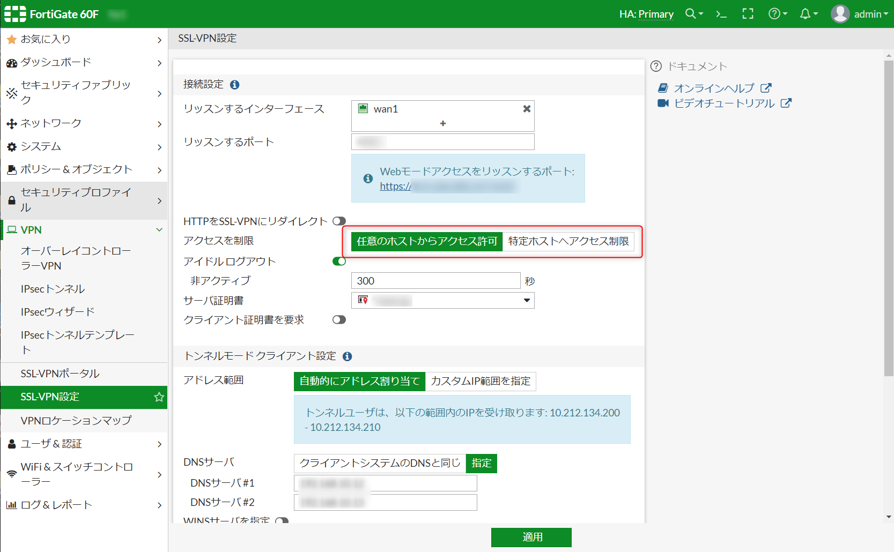
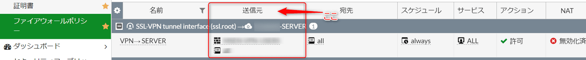
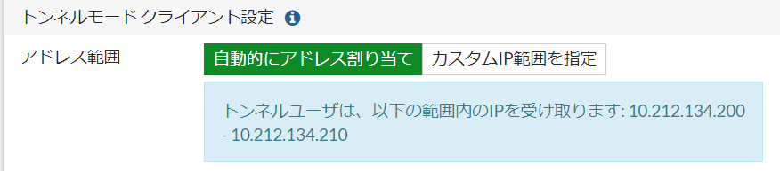

こんにちは。

今回は、**FortigateのSSL-VPN設定のアクセス元制限について解釈の間違い** をしてしまっていたことについての記事です。

## 対象の読者
- Fortigate を利用してSSL-VPN環境を構築したことがあるかた、もしくは運用しているかた

## 概要
**SSL-VPN設定(VPN->SSL-VPN設定)** で アクセス元を制限する項目がありますが この部分は画像のとおり **任意のホストからアクセス許可** と **特定ホストへアクセス制限** の2択があります。

**インターネットからVPN接続するために任意のホストからアクセス許可** を選択するケースが多いと思います。

**任意のホストからアクセス許可** を設定した上で、**ファイアウォールポリシーのSSL-VPN tunnel inteface設定で送信元を指定** することで **指定したグローバルIPからしか接続をさせないように** 設定できる と思っていたのですが　**これが勘違い** でした。

この設定は、 **SSL-VPN接続後に払いだされるIPアドレスで制限が出来るというもの** で、 **接続元のグローバルIPアドレスを制限したければ**、大元の設定である **SSL-VPN設定で特定ホストへアクセス制限を選択するしか方法はない** ということでした。

## サポートからの回答
この調査時にサポートから回答を参考までに掲載します。

>SSL-VPN接続後の、クライアントに払い出した仮想IPによる制御であれば任意のホストからアクセス許可としている状態でもポリシごとに可能と考えます。接続元の実IPによるSSL-VPN接続そのものの制限につきましては、ポリシごとに制御はできず[参照URL](https://help.fortinet.com/fos60hlp/60/Content/FortiOS/fortigate-sslvpn/SSLVPN_Basic_Configuration/Configuring_SSL_VPN_Web_Portals.htm)
の設定を実施いただけますようお願いいたします。

- SSL connection configuration
    - Restrict Access
        - Restrict accessibility to either Allow access from any host or to Limit access to specific 
        - hosts as desired. If selecting the latter, you must specify the hosts.

私と同様に勘違いされている方の助けとなれば幸いです。
それでは次回の記事でお会いしましょう。