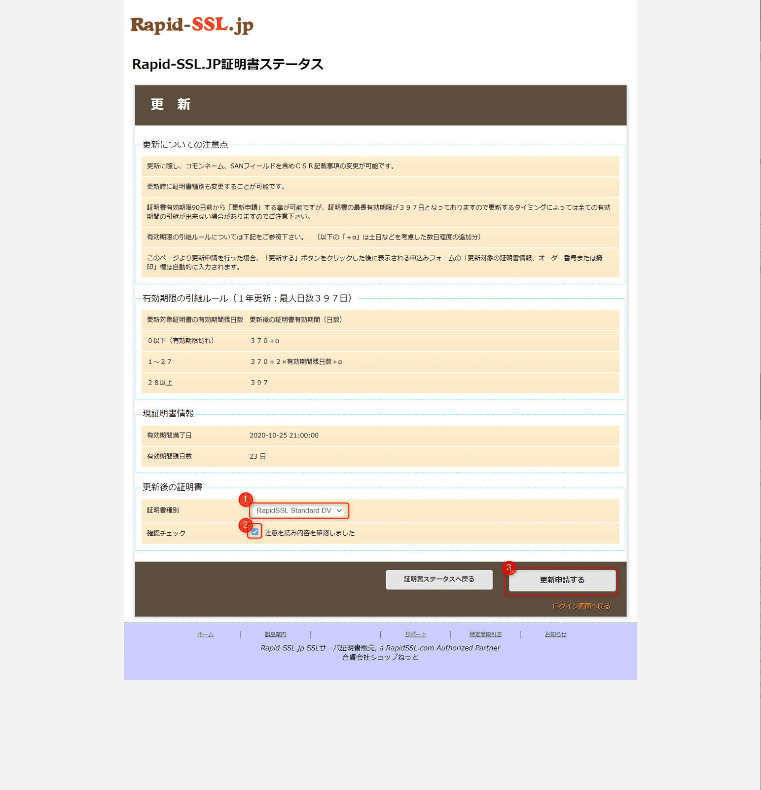

こんにちは。

お客様のWebサイトでRapid-SSLを使っているものがありますが、証明書の更新を実施したところ以前と手順が変わっていましたのでメモとして記事にしました。
[SSL サーバ証明書 RapidSSL 更新お申込](https://www.rapid-ssl.jp/rapidssl-order/ssl-renew.htm?product=rapidssl&act.x=48&act.y=18)

## 準備
1. 運用中(更新対象)の証明書を手続きしたときに送られてくるメールに書かれている **お申込番号**
1. 上記手続きの際に **自身で設定したパスワード** 
    - すっかり忘れていてパスワード再通知したら恥ずかしいPWを設定してました・・・。

1. 更新する証明書のCSR

## 手順
1. [ここ](https://securitycenter.rapid-ssl.jp/order/status/?)にアクセスして **お申込番号** と **パスワード** を入力し **検索** をクリックします

1. **更新** を選択し、 **説明・必要事項入力へ** をクリックします

1. **証明書種別** を選択し、 **確認チェック** を入れ、 **更新申請をする** をクリックします

1. **CSRの文字列を入力** し、**CSR内容確認** をクリックします

1. CSRの内容を確認し、**お客様情報入力へ** をクリックします (無償SANのチェックは必須ではありません)

1. **申請者手続き担当者情報を入力** し、**ドメイン認証の方法** を選択後、 **申込内容の最終確認へ** をクリックします

1. **支払い方法を選択** し、規約に **同意する** チェックボックスにチェックを入れ  **上記内容で申込む** ボタンをクリックします

1. 決済を実行します
1. これで申込完了です

## 指定ファイル設置によるドメイン認証の方法
Rapid-SSLから**【重要】[Rapid-SSL] ファイル承認手順について** というタイトルのメールが到着しますので、送られてきたメールに記載されている文字列をルート配下の `.well-known/pki-validation/fileauth.txt` に配置します。

例えば、 `https://exsample.com` というサイトであれば、 `https://exsample.com/.well-known/pki-validation/fileauth.txt` で認証ファイルが閲覧できればOKです。

ファイルを配置して1時間以内に、 **【通知】 SSL サーバ証明書発行完了のお知らせ** というタイトルのメールが到着し、**証明書がメール本文** で発行されます。

新しい証明書情報に更新し、無事期間が延長されました。

### Before

### After

それでは次回の記事でお会いしましょう。