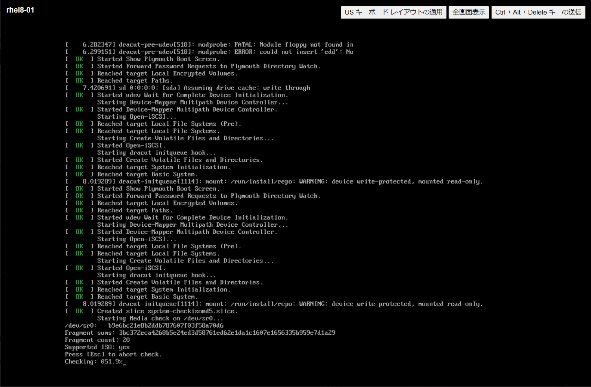
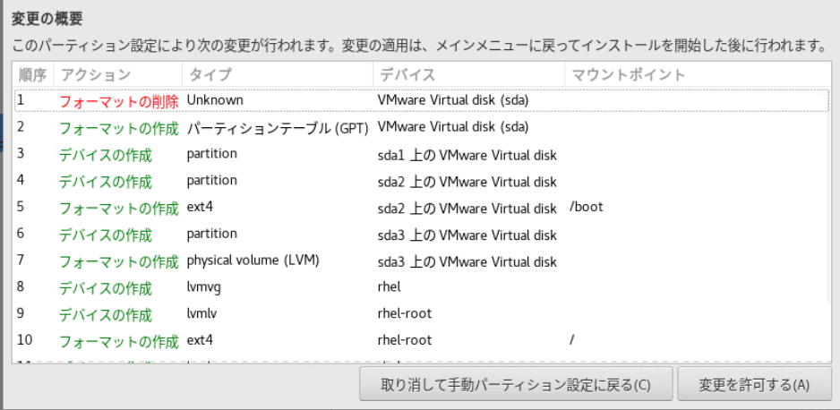
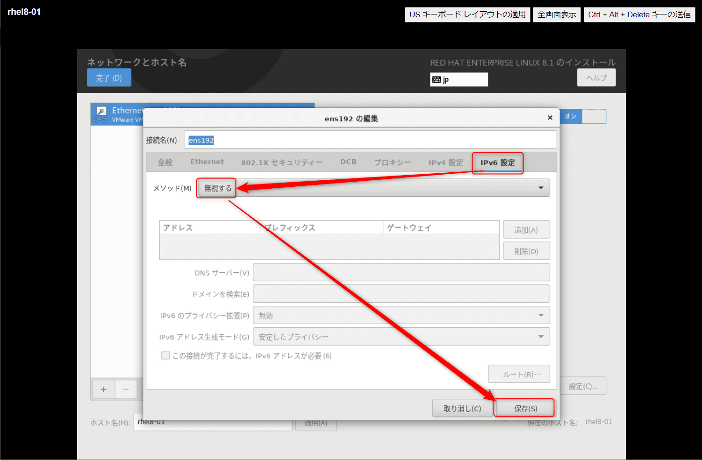
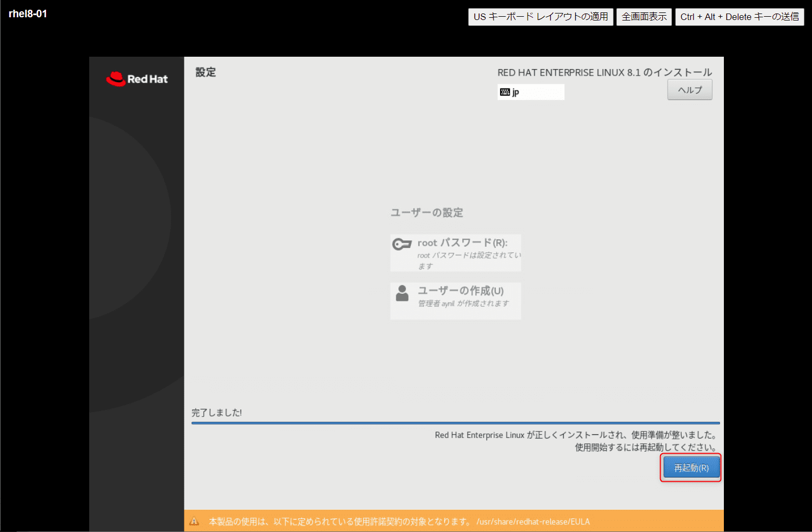
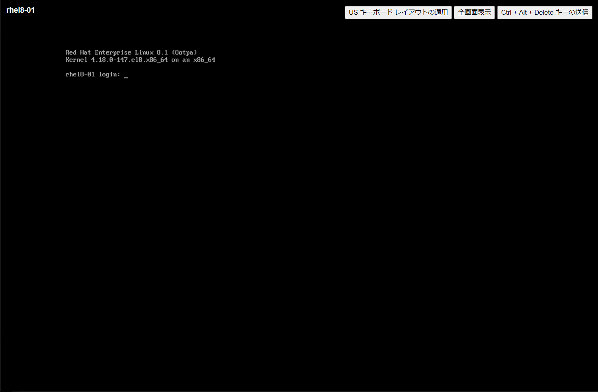
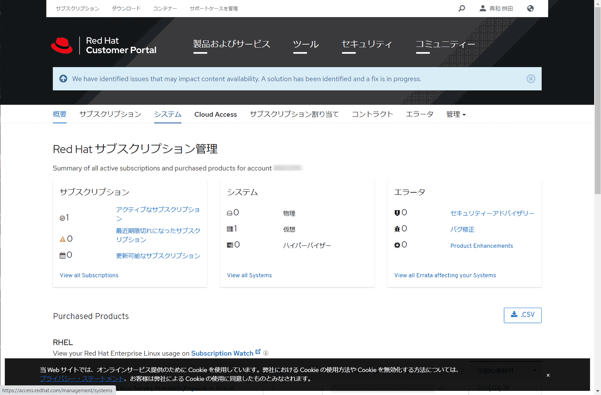
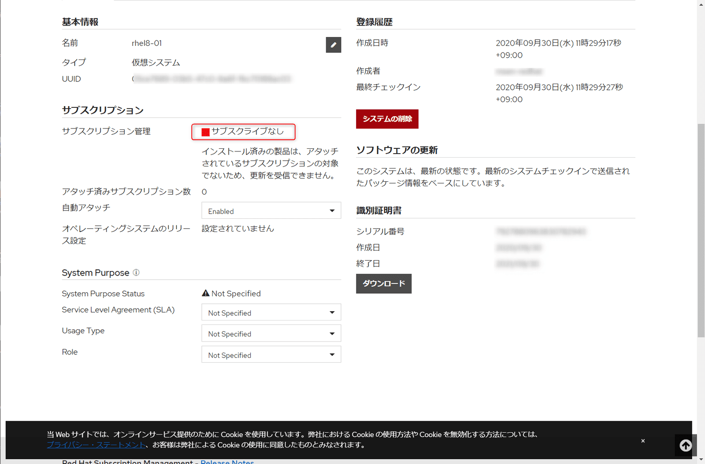

こんにちは。

今回はVMware ESXi 上にRed Hat Enterprise Linux 8.1 をインストールしてみます。
※執筆時の最新は8.2ですが、諸事情で8.1をインストールしています。

## 環境
- VMware ESXi, 6.7.0, 15160138

## 準備
- Red Hat 企業アカウントの作成
- Red Hatサブスクリプションの購入
    - 購入した製品番号は `RH00004` です。1つの購入で仮想マシン2つまで構築できます。
- Red Hat アカウントからISOのダウンロード（契約後から可能）
[ダウンロードページ](https://access.redhat.com/downloads/content/479/ver=/rhel---8/8.1/x86_64/product-software)

## 仮想マシンの作成
以下の手順で仮想マシンを作成します(特別な手順はありません)

1. vCenterにログインし、 **仮想ホスト→右クリックから新規仮想マシン** をクリック


1. **新規仮想マシンの作成** を選択しNEXTをクリック


1. **動作させる仮想ホストを選択** しNEXTをクリック


1. **仮想マシンを格納するストレージを選択** しNEXTをクリック


1. **ESXi 6.7 以降** を選択しNEXTをクリック


1. **Linux→Red Hat Enterprise Linux8(64ビット)** を選択しNEXTをクリック


1. **ハードウェアをカスタマイズ(①～③)し、準備でダウンロードしたISOを指定(④)** し、NEXTをクリック


1. 設定を確認しFINISHをクリック


無事作成できました


## Red Hat Enterprise Linux 8のインストール
仮想マシンを起動し、Webコンソールを起動します。


以下の流れでインストールを実施しました

1. ISOからブートされので、 **2行目の(デフォルトで選択されている) Test this media & install Red Hat Enterprise Linux 8.1.0 が選ばれた状態でEnter** を押します


1. ブート後、checkが走るので待ちます


1. **日本語を選択** し続行をクリック


1. **最小構成に変更** します

↓


1. **パーティションを変更** します

    システム | マウントポイント | 容量 | デバイスタイプ | ファイルシステム
    -- | -- | -- | -- | --
    /boot/efi | /boot/efi | 600MiB | 標準パーティション | EFI System Partition
    /boot | /boot | 1024MiB | 標準パーティション | ext4
    / | / | 94.43GiB | LVM | ext4
    swap | - | 3.97GiB | LVM | swap

    [C.4. 推奨されるパーティション設定スキーム Red Hat Enterprise Linux 8 | Red Hat Customer Portal](https://access.redhat.com/documentation/ja-jp/red_hat_enterprise_linux/8/html/performing_an_advanced_rhel_installation/recommended-partitioning-scheme_partitioning-reference)


    ↓

↓

↓


1. **ネットワークとホスト名を変更** します

↓

↓

↓

↓

↓


1. **インストールの開始** をクリック


1. **rootのパスワード設定** と **管理ユーザーの設定** を行い完了を待機します


1. 完了しました


無事起動できました。


## アクティベーションとサブスクライブ
インストール直後は、 **ライセンスのアクティベーションと製品が登録されておらずシステムのアップグレードやパッケージのインストールができません** 。

そのため、以下の流れで **アクティベーションと製品登録(サブスクライブ)を実施** します。

### アクティベーション
以下のコマンドを実行して対話式でアクティベーションします。

`subscription-manager register`

以下の出力になります。(ユーザー名とIDは * でマスクしています)
```
[root@rhel8-01 ~]# subscription-manager register
登録中: subscription.rhsm.redhat.com:443/subscription
ユーザー名: *****
パスワード:
このシステムは、次の ID で登録されました: *****-*****-*****-*****
登録したシステム名: rhel8-01
```

カスタマーポータルを確認すると、**仮想マシンが1登録されている**ことが確認できます。
[Red Hat Customer Portal-サブスクリプションの管理](https://access.redhat.com/management)



システム登録も確認できました。
[Red Hat Customer Portal-システム](https://access.redhat.com/management/systems)


### サブスクライブ

アクティベーションだけでは、 **製品が割り当たっていないため** 例えば、`open-vm-tools` をインストールしようとすると以下のようなエラーになります。

```
[root@rhel8-01 ~]# yum install open-vm-tools
Updating Subscription Management repositories.
This system is registered to Red Hat Subscription Management, but is not receiving updates. You can use subscription-manager to assign subscriptions.
エラー: "/etc/yum.repos.d", "/etc/yum/repos.d", "/etc/distro.repos.d" には有効化されたリポジトリーがありません。
```

`subscription-manager subscribe` のコマンドを実行し、サブスクライブを実行します。

```
[root@rhel8-01 ~]# subscription-manager subscribe
インストール済み製品の現在の状態:
製品名: Red Hat Enterprise Linux for x86_64
状態:   サブスクライブ済み
```

- 実行前のシステム詳細画面


- 実行後システム詳細画面


##  VMware Tools のインストール
アクティベーションとサブスクライブが完了したので、これでパッケージのインストールが実行できます。

まずは、VMware Tools をインストールします。

`yum -y install open-vm-tools` を実行してインストールします。

出力結果は以下のよになります。
```
(抜粋)
合計                                                                               69 MB/s | 703 kB     00:00
トランザクションの確認を実行中
トランザクションの確認に成功しました。
トランザクションのテストを実行中
トランザクションのテストに成功しました。
トランザクションを実行中
  準備             :                                                                                          1/1
  scriptletの実行中: open-vm-tools-11.0.5-3.el8.x86_64                                                        1/1
  アップグレード中 : open-vm-tools-11.0.5-3.el8.x86_64                                                        1/2
  scriptletの実行中: open-vm-tools-11.0.5-3.el8.x86_64                                                        1/2
  scriptletの実行中: open-vm-tools-10.3.10-3.el8.x86_64                                                       2/2
  整理             : open-vm-tools-10.3.10-3.el8.x86_64                                                       2/2
  scriptletの実行中: open-vm-tools-10.3.10-3.el8.x86_64                                                       2/2
  検証             : open-vm-tools-11.0.5-3.el8.x86_64                                                        1/2
  検証             : open-vm-tools-10.3.10-3.el8.x86_64                                                       2/2
Installed products updated.

アップグレード済み:
  open-vm-tools-11.0.5-3.el8.x86_64
```

## システムのアップデート
システム全体もアップデートしておきます。

`dnf -y upgrade` を実行してアップデートします。

445のパッケージがアップグレードされました。

```
(抜粋)
  検証             : python3-syspurpose-1.25.17-1.el8.x86_64                                              445/445
Installed products updated.
(抜粋)
完了しました!
```

ここまでの状態で再起動し、スナップショットを取得して構築完了です。

## あとがき
CentOS8の構築経験は多くなっていますが、Red Hat Enterprise Linux 8はまだまだ少ないのでこの評価機で色々と実施してみたいと思います。

それでは次回の記事でお会いしましょう。
