こんにちは。

今回は、Fortigateに **オンライン更新のCRLを登録** する方法を紹介します。

**CRLは** 以下を参考にしていただければと思いますが、
**失効された証明書の一覧** のことで接続しようとしているサイトなどの **証明書の有効性を確認する** 大事なリストです。
[JPRS用語辞典｜CRL（Certificate Revocation List：証明書失効リスト）](https://jprs.jp/glossary/index.php?ID=0241)

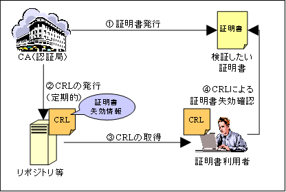
[PKI関連技術に関するコンテンツ](https://www.ipa.go.jp/security/pki/042.html)
※IPA抜粋

**CRLは定期的に更新** されるため、最新のリストを取得しておく必要があり、
公開されているリポジトリにアクセスして **自動で更新** されることが理想です。

今回の記事では、 **UPKI** と **Windows証明書サービス** のCRLをFortigateにインポートする方法を紹介します。

# 環境
* Fortigate 60E
* ファームウェア v6.0.9 

## 共通設定

**証明書メニューは標準で非表示** になっているため、 **システム→表示機能設定** から **表示を有効** にします。
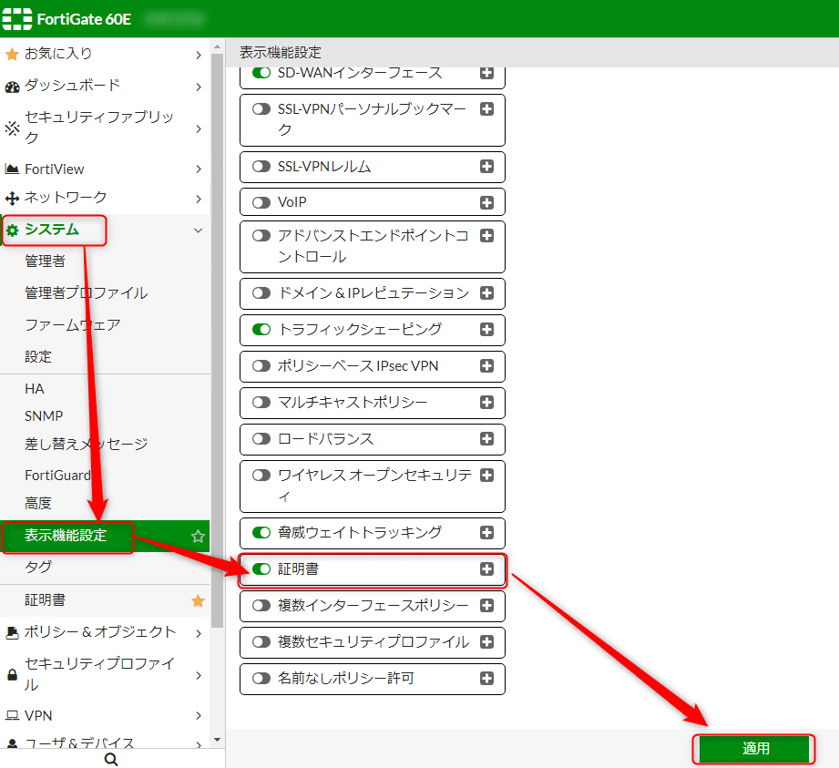

**管理者でログイン** し、 **システム→証明書→インポート→CRL** と進みます。
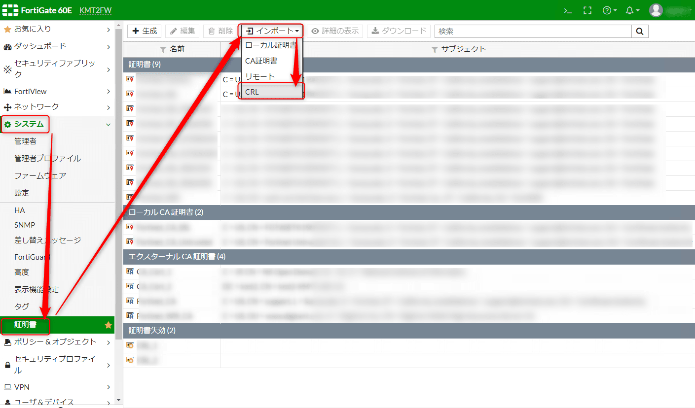
**↓**
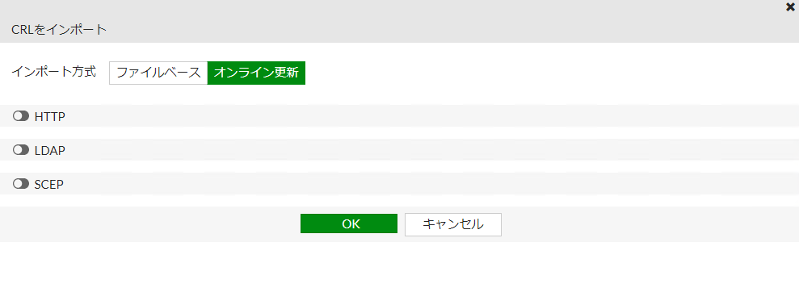

この画面までを共通設定とします。

## UPKI の場合

### URLの確認
リポジトリのURLを以下から確認します。
[国立情報学研究所 オープンドメイン認証局 リポジトリ](https://repo1.secomtrust.net/sppca/nii/odca3/)

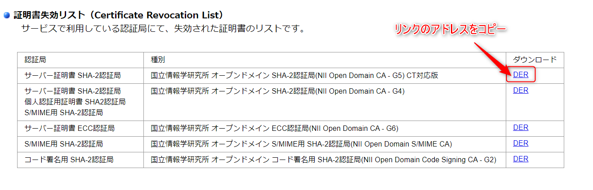

もしくは、 UPKIで発行された **証明書を開き詳細タブのCRL配布ポイント** からも確認できます。

URLは、 `http://repo1.secomtrust.net/sppca/nii/odca3/fullcrlg5.crl`  であることが分かりました。

### 設定
前項の共通設定から、 **HTTPボタンをON** にし、 **URLを貼り付けます。**
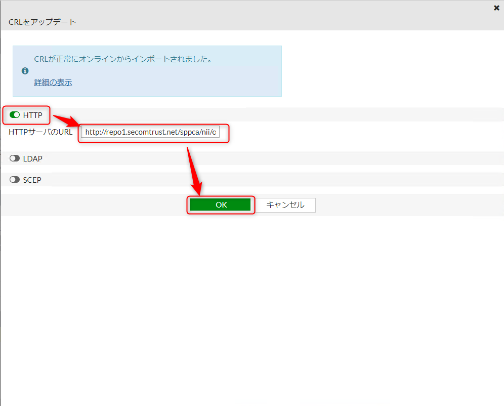

少し時間が経つと、ステータスがOKになります。
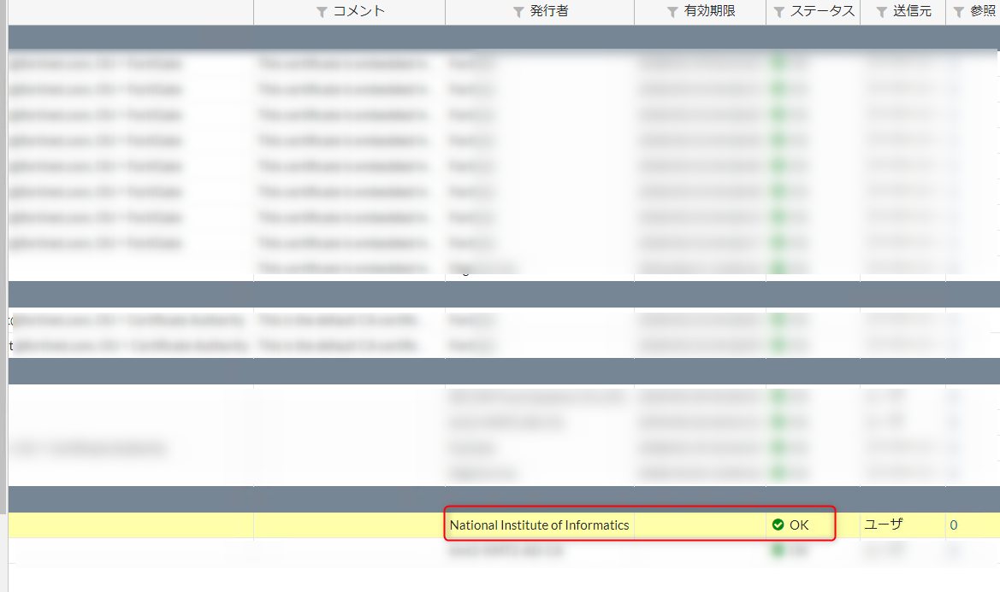

設定できたCRLをダブルクリックし有効期限を確認すると最新になっていることが分かります。
更新日以降に再度確認すると更新することが分かります。
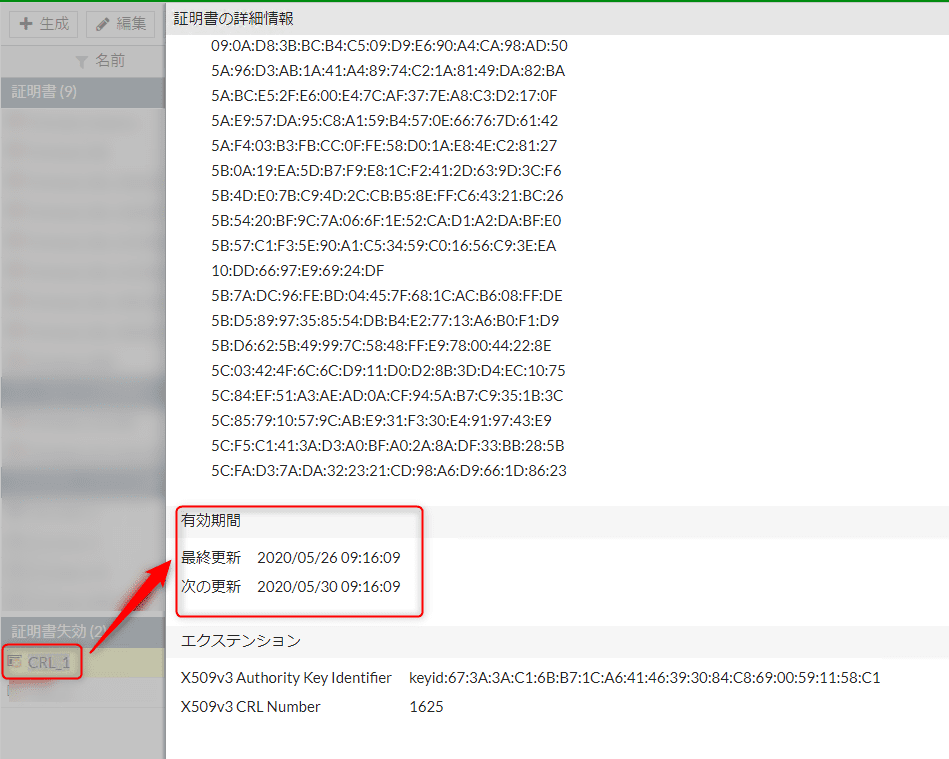

これで **自動的にUPKIのCRLが更新** されます。

## Windows証明書サービス の場合

### URLの確認
今回紹介の方法は、**証明書サービスが動作しているサーバーがADであること** を前提としています。

証明書サービスから **発行された証明書ファイルを開き**、 **詳細タブのCRL配布ポイント** を確認します。

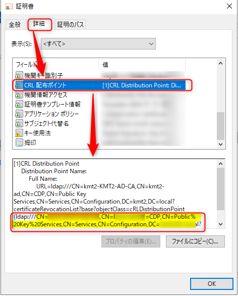

黄色く塗っている部分の、 **?の手前** までのアドレスをコピーします。

以下が参考になります。
[Technical Note: Using LDAP for CRL updates](https://kb.fortinet.com/kb/viewContent.do?externalId=FD35052)

### LDAPサーバの登録

**ユーザー&デバイス→LDAPサーバー→新規登録** と進みます。
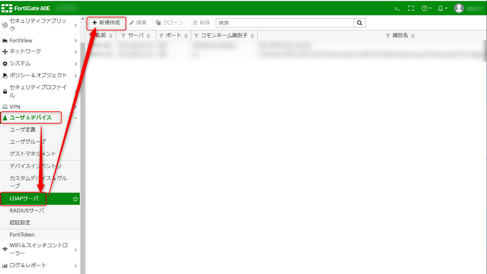

以下の画像を参考に登録します。

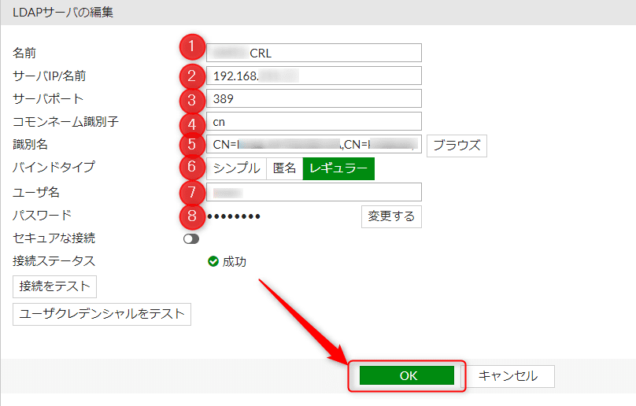
①任意名
②ADのIPアドレス
③LDAPポート番号
④デフォルトのまま
⑤前項で確認したアドレスを貼付
⑥レギュラー
⑦ADに接続するユーザー
⑧⑦のパスワード

## 設定
前項の共通設定から、 **LDAPボタンをON** にし、 **LDAPサーバーに前項で登録したサーバーを選択** し、 **ユーザー名・パスワード** は **LDAPサーバー登録と同じもの** を入力します。

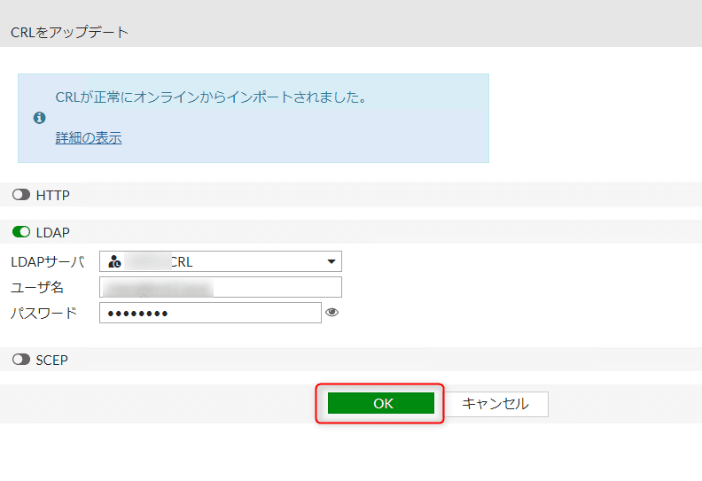

少し時間が経つと、ステータスがOKになります。
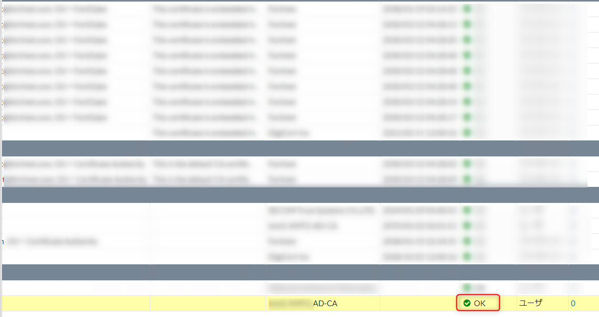

設定できたCRLをダブルクリックし有効期限を確認すると最新になっていることが分かります。
更新日以降に再度確認すると更新することが分かります。
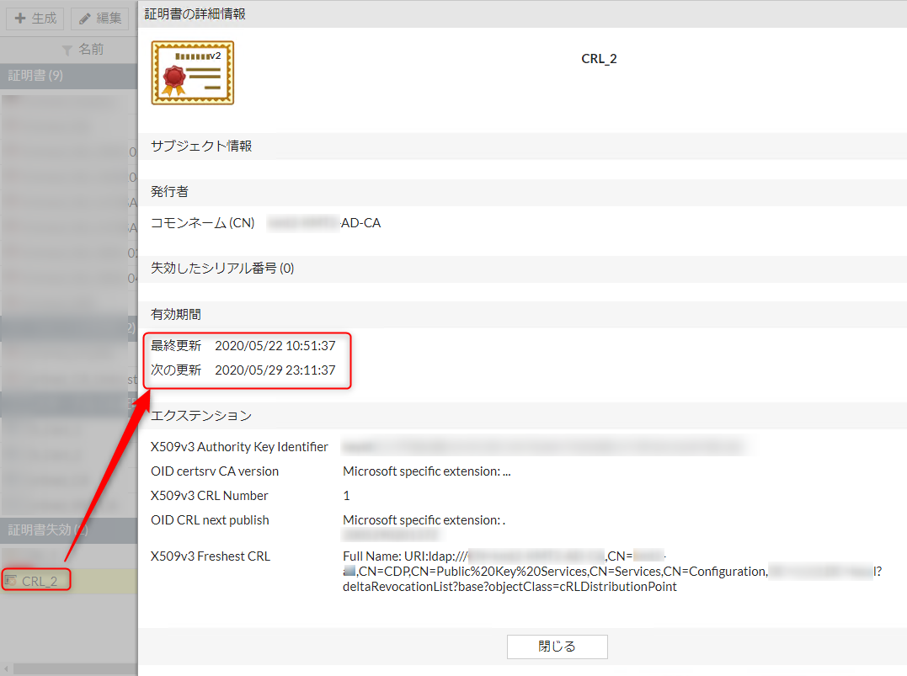

これで  **自動的にWindows証明書サービスのCRLが更新** されます。

Windows証明書サービスの設定に少しはまりました。
参考になれば幸いです。

それでは次回の記事でお会いしましょう。
