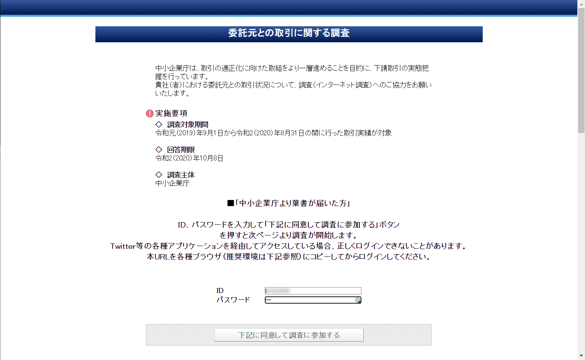
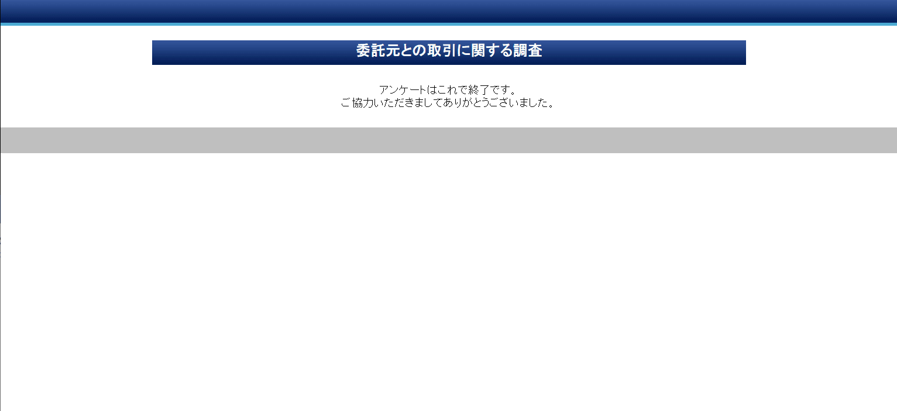

こんにちは。

連休明けの2020年9月23日に出社すると、 **「委託元との取引に関する調査」へのご協力のお願い** のハガキが届いていました。

中小企業庁が主体となっている調査のようです。 

>中小企業庁では、取引の適正化に向けた取組をより一層進めることを目的に、下請取引の実態把握を行っています。
このたび、事業者に業務を委託する取引先(以下「委託元」といいます。)との取引の実態を把握し、下請事業者や中小企業の保護等に役立たせることを目的として、「委託元との取引に関する調査」をオンラインにより実施します。
本調査についてご回答を依頼するはがきが送付された事業者に加え、中企庁のSNS、団体等からの通知などで本調査にお気づきの方は、委託元との取引状況について、調査(インターネット調査)へのご協力をお願いいたします。
※上記、中小企業庁のページから抜粋
> [中小企業庁のページ](https://www.chusho.meti.go.jp/keiei/torihiki/2020/200911ShitaukeSearch.html)

## 実施要項
- 調査対象期間　2019年9月1日から2020年8月31日の間に行った取引実績が対象
- 回答期限　2020年10月8日
- 調査主体　中小企業庁

## 回答の流れ

回答に利用したブラウザは **Chrome バージョン: 85.0.4183.121** です。

1. 以下のURLにアクセスします
[委託元との取引に関する調査](https://rsch.jp/646065aa7a17e752/login.php)
1. ハガキに書かれている **IDとパスワードを入力** し **同意して調査に参加する** をクリックします

1. **SQ1～SQ10までを回答します**
    - SQ1　　会社名(必須)
    - SQ2　　郵便番号(必須)
    - SQ3　　住所(任意)
    - SQ4　　部署名(任意)
    - SQ5　　回答者氏名
    - SQ6　　回答者電話番号(SQ7かどちらか必須)
    - SQ7　　回答者メールアドレス(SQ6かどちらか必須)
    - SQ8　　資本金(必須)
    - SQ8_1　従業員数(任意)
    - SQ9　　業種(任意)
    - SQ9_1　事業内容(任意)
    - SQ10　 委託元から[不当な行為](https://rsch.jp/646065aa7a17e752/winpop.php?imgName=top.jpg)(協力金の減額、買いたたき、返品等)を行われたことはありますか？(必須)
1. SQ10 を **ない** と選択し、**次へ** をクリックすると入力内容の確認となりさらに **次へ** をクリックすると回答が送信され **あっという間に終了** しました。

## あとがき
SQ10の質問が重要で、それ以外は会社情報を入力でした。
非常に簡単であっという間に終了するので調査の協力をお勧めします。

それでは次回の記事でお会いしましょう。