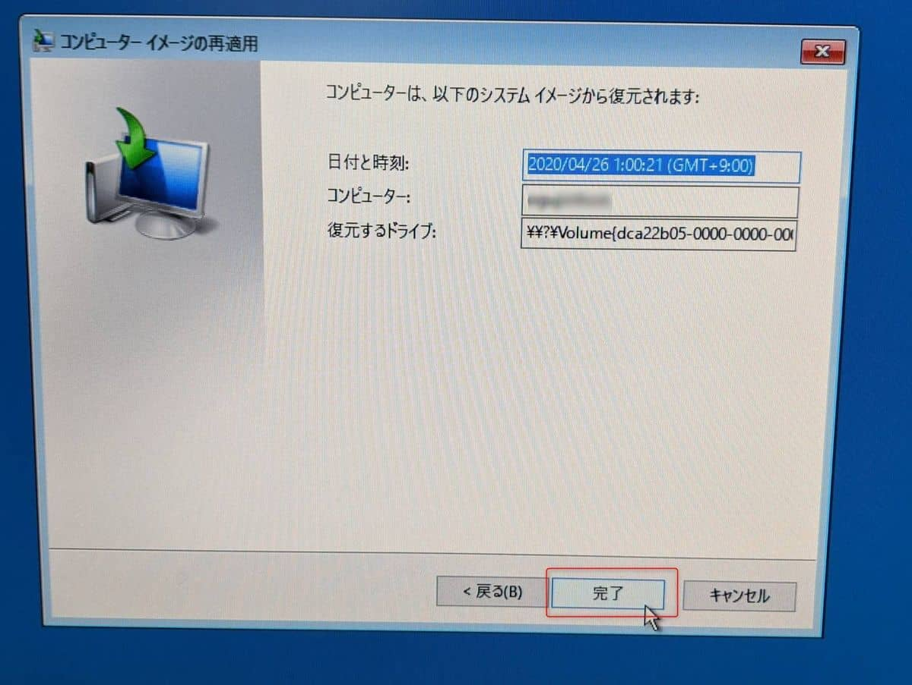

こんにちは。

今回は、 **Windows Server バックアップで取得しているバックアップデータを利用して、OSまるごと復元** (**ベアメタル回復**) をしてみたいと思います。

利用しているOSは、 **Windows Server 2016** です。
搭載されているハードディスクをSSDに交換した際の手順を記事にしました。

環境は以下のようなイメージです。

**ベアメタル回復を行う場合はフルバックアップを取得しておく必要があります** 

## Windows Server バックアップ

Windows Server バックアップは、 毎日同じ時間に、外付けハードディスクに取得しているものとします。

取得先は推奨の **専用ハードディスク** を選択。

## 復元の流れ

1. 取り付けていた、ハードディスクをSSDに換装します。
1. 動作させているOSと同じ、ブートUSBを作成しブートします。(ブートDVDでも問題ありません)

1. ブートした画面から、 **次へ → コンピューターを修復する** と進みます。

↓

1. 続けて、 **トラブルシューティング → イメージでシステムを回復** と進みます。

↓

1. 外付けハードディスクに取得されているバックアップデータを自動で認識しますので、 **利用可能なシステムイメージのうち最新のものを使用する** を選択します。(任意の日付を指定する場合は **システムイメージを選択する** を指定してください)

1. **次へ → 完了** と進みます。

↓

1. ディスクが消去される確認に対し **はい** で応答します。

以上までの流れで復元が開始されます。

## あとがき
今回は、 **1TBディスクに対して復元** を実施しましたが **約70分** かかりました。

完了後、再起動され無事ログイン画面が表示されました。

トラブルがあったときの利用以外にも、ハードディスク換装にも利用することができます。
Windows Server バックアップは標準機能なので是非ご活用ください。

それでは次回の記事でお会いしましょう。