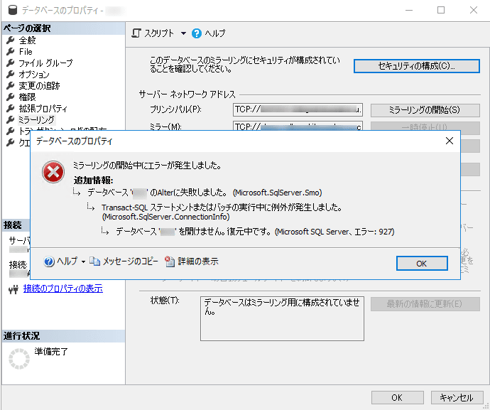

こんにちは。

今回は、SQL Server 2019 で構築した **データベースをミラー設定すると、927 エラーで失敗** したが、 **ミラー設定する SQL Server Manegement Studio のバージョンが原因** だった、という記事です。

## エラー内容
エラー内容は以下のとおりです。

```
ミラーリングの開始中にエラーが発生しました。
追加情報：
　データベース '○○' のAlterに失敗しました。 (Microsoft.SqlServer.Smo)
　　　Transact.SQL ステートメントまたはバッチの実行中に例外が発生しました。
　　　(Microsoft.SqlServer.ConnectionInfo)
　　　　　データベース '○○' を開けません。復元中です。(Microsoft.SQL.Server, エラー:927)
```

<a href="images/sql-server-mirror-configuration-fails-with-error-927-depending-on-version-of-sql-server-management-studio-1.png"></a>

**手順は、過去に じんない が書いてくれた記事を参考** にしているので間違いはありません。
[SQL Server 2014 でデータベースミラーリングを構成する](https://mseeeen.msen.jp/sqlserver-database-mirroring/)

## 解決
何日かはまりましたが、**この記事のお陰で解決** しました！
[SQL Server 2016 ミラーリング時にエラー：927 | Just another memorandum](https://linkgear.jp/sql-server/20170712232849.html)

**SQL Server Management Studio のバージョンが原因**・・・

早速、古いSQL Server Management Studio でやってみました。
すると・・・

<a href="images/sql-server-mirror-configuration-fails-with-error-927-depending-on-version-of-sql-server-management-studio-2.png"></a>

<a href="images/sql-server-mirror-configuration-fails-with-error-927-depending-on-version-of-sql-server-management-studio-3.png"></a>

**成功** してしまいました。。

参考記事の方もおっしゃっている、
> こんなことって有るの？

という状態になりました。。

## あとがき
ちなみに、失敗したバージョンは執筆時の最新 `15.0.18206.0` で、
<a href="images/sql-server-mirror-configuration-fails-with-error-927-depending-on-version-of-sql-server-management-studio-4.png"></a>

成功したバージョンは `12.0.2000.8` でした。
<a href="images/sql-server-mirror-configuration-fails-with-error-927-depending-on-version-of-sql-server-management-studio-5.png"></a>

原因はまだ不明ですが、何か分かれば記事にしたいと思います。
ご存じの方おられましたら是非コメントいただけましたら幸いです。

それでは次回の記事でお会いしましょう。