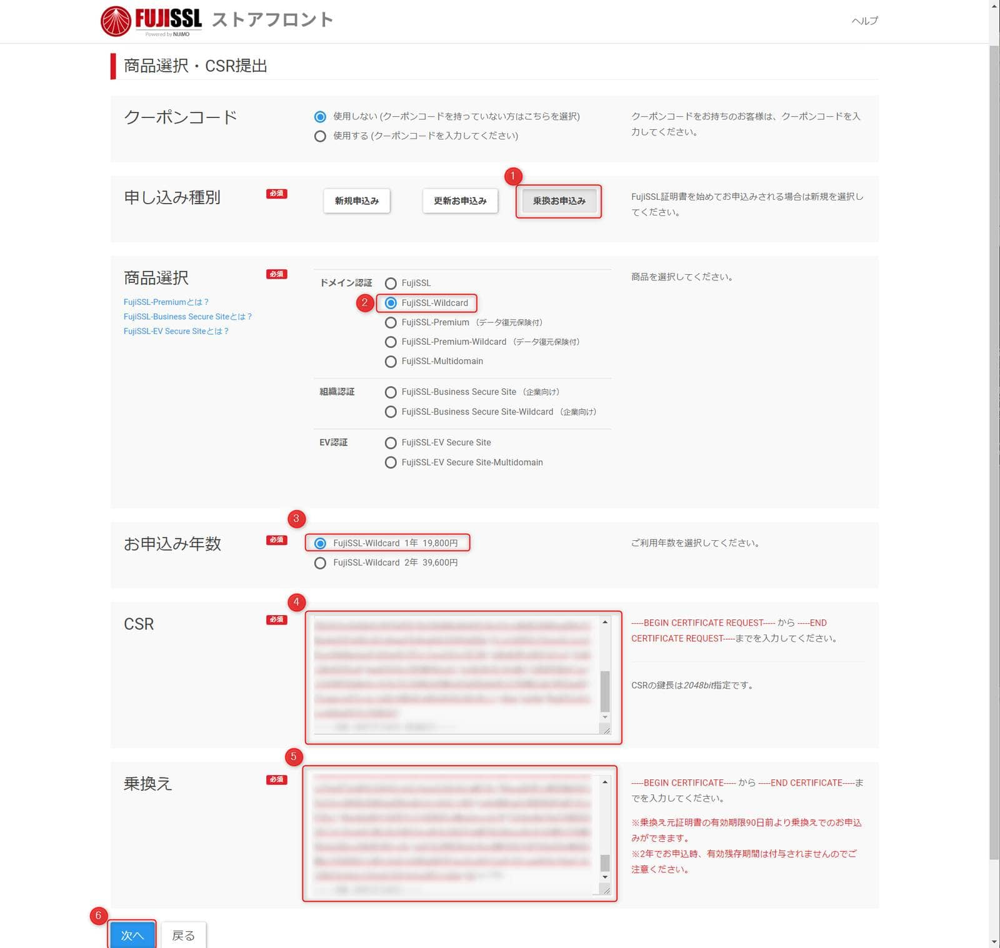
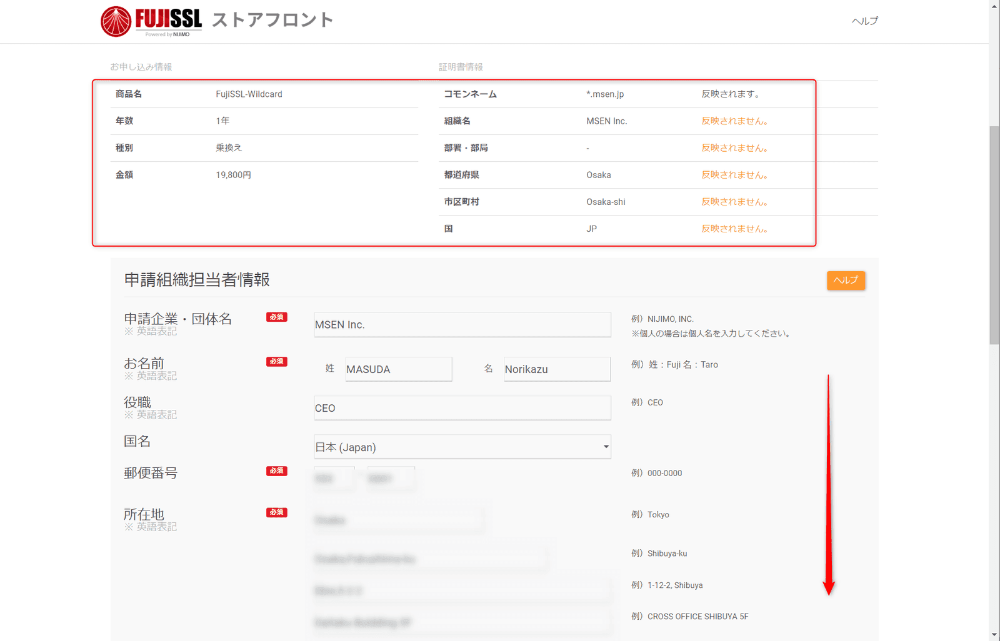
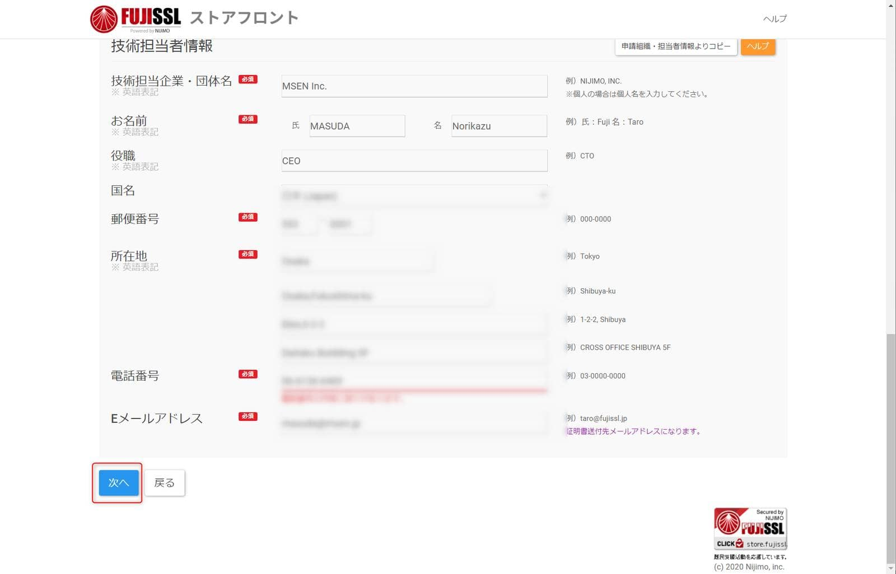
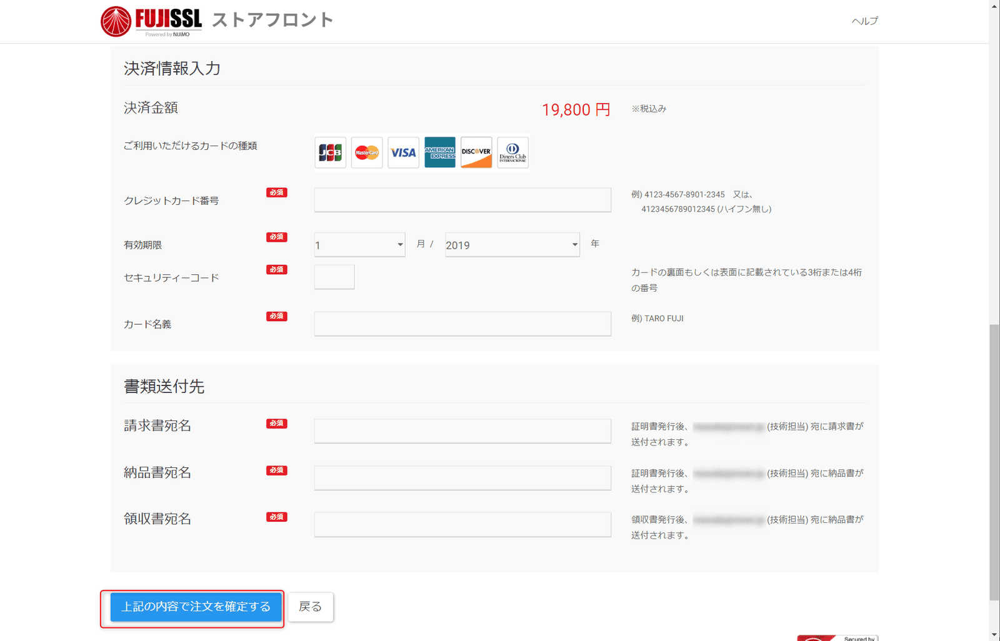
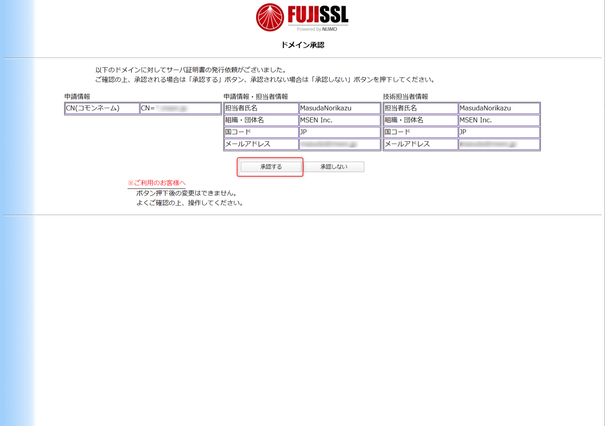
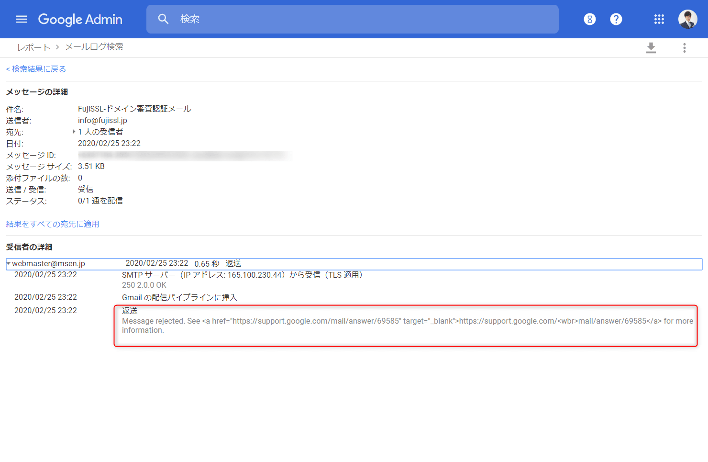

こんにちは。

弊社で利用しているSSL証明書の期限が期限間近となってきたため、発行していた機関で更新を実施したのですが色々あって他社に乗り換えることにしました。

以下は **更新前の証明書** です。

今回、他社乗り換え割引を利用すると価格的にも有利だった **FUJISSL** を選び、手続きをしてみましたのでその流れを紹介します。

[FujiSSL-安心・安全の純国産格安SSLサーバ証明書](https://www.fujissl.jp/)

## 乗り換えの手順
それでは早速やってみます。

1. 下記のリンクに接続します
[ストアフロント | FujiSSL](https://store.fujissl.jp/apply/req1)

1. **利用目的に同意** し **次へ** で進みます

1. 下記の画像を参考に **乗り換え申込** を進めます。 **②の部分は** ワイルドカード証明を指定しますが、 **一般的には一番上のFujiSSL** でOKと思います。**残期間を有効に活かすためには1年の申込が必須** です。 **2年ではダメ** なので注意。**⑤の乗り換え部分** は **更新前の証明書の文字列をコピー＆ペースト** します。(乗り換え申込は 証明書の **残期間が90日を切ってから** 申込可能です

1. 弊社は **メール認証** を選択しました。 **承認のために実際に受信できるメールアドレスが必要** ですが、 **メールアドレスがadmin@など指定** されています。  **指定されているメールアドレスに持ち合わせがなく、メーリングリストやグループメールなどで受信しようとすると迷惑メールなどに分類される等のフィルタで受信できない恐れがありますので注意** が必要です。

1. 内容を確認し **次へ** で進みます

1. **支払い情報を入力** し、 **上記の内容で注文を確定する** をクリックします

1. 以上で手続き完了です

## 手続き後の承認メール再送(キャンセル手続き等も同じ)
手続き後にメールを再送したい場合は、以下の **ポータルサイトから再送を要求** することができます。
[ユーザーポータル | FujiSSL](https://product.fujissl.jp/)

1. ユーザーポータルに必要な情報を入力し進むと、以下のような承認メールが到着しますので接続します

1. **承認** ボタンを押します

↓
これで **承認処理は完了** です

完了すると、連絡先メールアドレスに **領収書** , **請求書** , **納品書** と**証明書情報** が届きます。

届いた証明書を設定し、無事 **1年＋残期間が延長** されました。

## あとがき

作業の中の発生したトラブルを記載します。

- 承認メールに指定したメールアドレスをGSuiteのグループで対処しようとしたが出来なかった
    上記手順内にも記載しましたが、 **承認メールは admin@ など、指定されたメールアドレス** になります。
    
    指定されているアドレスが、運用しているものにあればいいですがなかなかそうはいかないと思います。
    
    そこで、 **メーリングリストやグループメールで対処しようとする** のが効率的だと思いますが、 **GSuiteのグループメールで対処しよう** と思いましたが、以下のような **エラーで返送** されてしまっていました。

    
    **サポートに** 問い合わせると、 **返送されたメール(FUJISSL側) のメッセージID が必要** だと言われ、提供を求めると拒否され(そりゃそうだ)、完全に詰んでいました。
    
    **ホワイトリストにドメインを追加** したり対処をしてみましたが **改善せず**、有効期限切れ間近ということもあり **承認メールアドレス用にアカウントを作成** して対処しました・・・。
    このあたりの解決事例があればコメントなどで教えていただけると嬉しいです。
    
    本来は以下のようなメールログになります。

    結局残り期間が近づいていたため、メールアドレスを作成することで対処しました。

- ワイルドカードで作成すると届いたZIPが解凍できない
    今回、ワイドカード証明書を発行しましたが、 **発行される証明書のファイル名に * が含まれるため**、メールで添付されている **ZIPファイルをLaplusで解凍するとエラー** になりました。
    

    **7zipのExplorer形式で解凍するとできそう** でした。
    
    ただ、 **メール本文にも証明書の文字列が記載されているので問題にはならない** かと思います。

それでは次回の記事でお会いしましょう。
