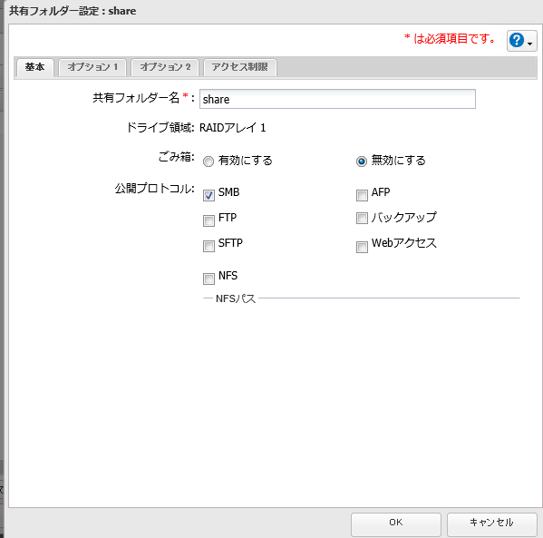
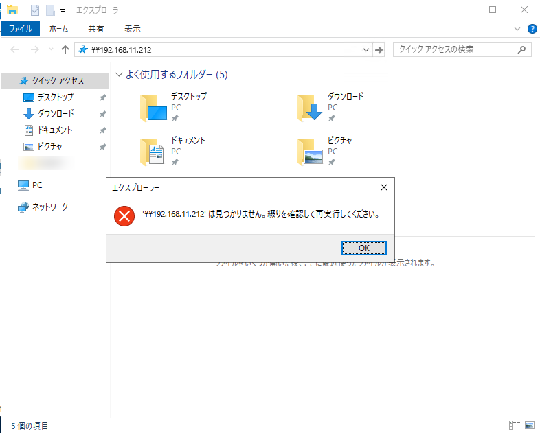
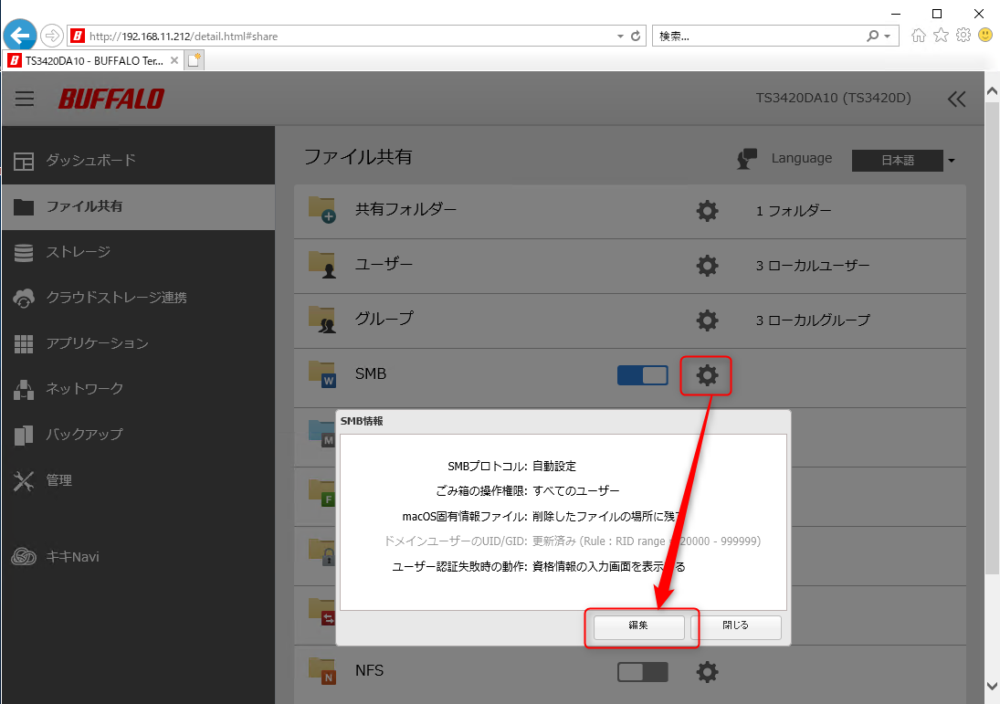
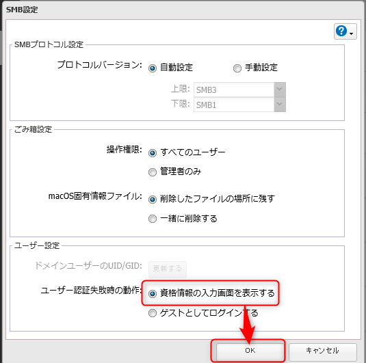
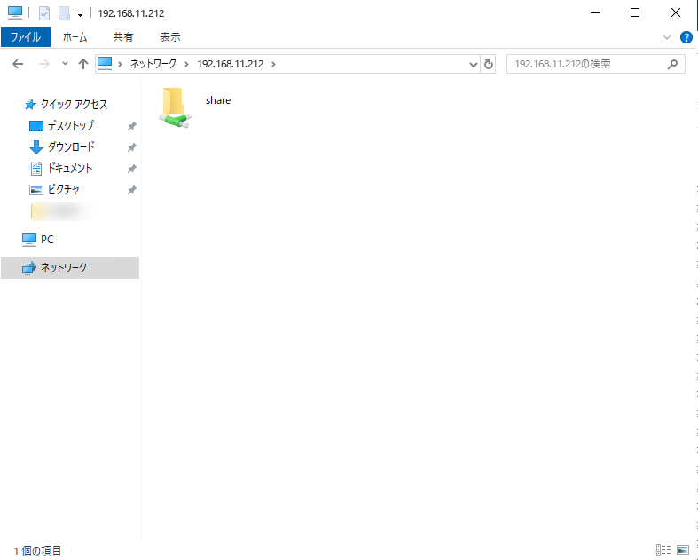

こんにちは。

今回は、**Windows Server 2019 から Buffalo のTerastationのファイル共有にアクセスできずはまった件** について紹介します。

## 環境
- アクセス元 Windows Server 2019 Standard (1809)
- アクセス先 Buffalo Terastation [TS3420DN1204](https://www.buffalo.jp/product/detail/ts3420dn1204.html)
    - IP は 192.168.11.212

## 共有設定
Terastationの **共有設定はとてもシンプルSMBのみ許可** しています。

この設定だけで、本来は  `\\192.168.11.212` でアクセスできるはずです。

## 接続できない

しかし、 **接続できない** ・・・
認証ポップアップすらでません。

**ファイアウォールを無効** にしたり、 **再起動したり** しましたが、解決せず・・・。

## テラステーションのSMBプロトコル設定変更で解決

以下の手順で解決しました。

1. テラステーションに管理者でログイン
1. ファイル共有 -> SMBプロトコルの設定画面を開く

1. ユーザー設定の部分で デフォルト設定の 「ゲストとしてログインする」から **資格情報の入力画面を表示する** に変更して OK をクリックする

**再起動は不要** でした。

再確認すると・・・ **接続できました！** 

## あとがき

切り分けの中で、Windows 10の別端末からはTerastationの設定変更前でも接続できたので、サーバー側の設定に何かありそうなのですが、執筆時点では不明のままです。何か分かれば追記したいと思います。

それでは次回の記事でお会いしましょう。