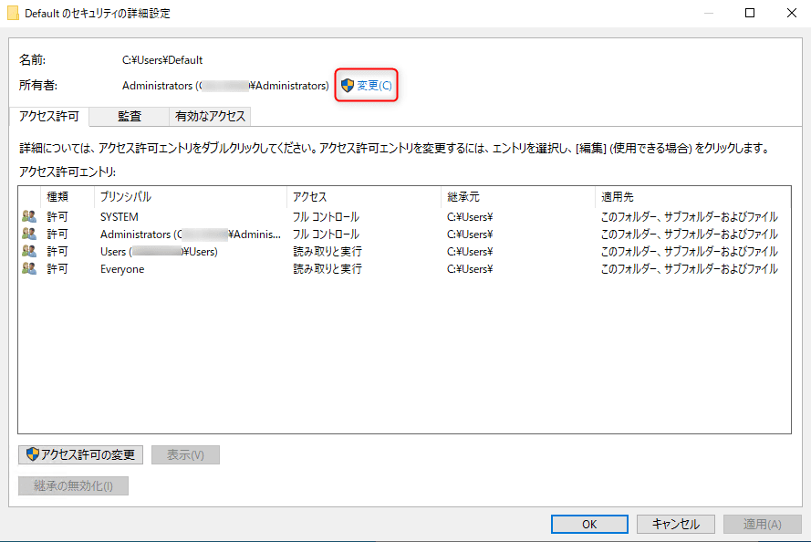

こんにちは。

今回は執筆時の最新 **Windows 10 1909 を利用** して、 **デフォルトプロファイルをSysprepを利用せずにカスタム** してみよう、という記事です。
※デフォルトプロファイルの説明は割愛します。

<a href="images/update-the-default-profile-without-using-sysprep-1.png"></a>

**一度もログインしたことのないユーザーがログイン** すると、こういう画面が出てきて、
<a href="images/update-the-default-profile-without-using-sysprep-2.png"></a>

このようなデスクトップ画面になると思います。
<a href="images/update-the-default-profile-without-using-sysprep-3.jpg"></a>

ログインに時間がかかる上に、設定などがカスタムできないので教室の運用などには適しません。

そこで、 **どのユーザーでログインしても同じ設定を適用させるためデフォルトプロファイルをカスタム** します。

## 下準備

デフォルトプロファイルのひな形となるユーザーを作成します。

今回の手順では、 **profile** というユーザーを作成しました。
**Administrators グループ** に参加させます。
<a href="images/update-the-default-profile-without-using-sysprep-4.png"></a>

## profile ユーザーでログイン

作成した **profile ユーザーでログイン** します。

今回は簡単に、以下のとおりカスタムしました。

1. Chrome をインストール

1. トップページを弊社のホームページに設定
<a href="images/update-the-default-profile-without-using-sysprep-5.png"></a>

この profile ユーザーのプロファイルをデフォルトプロファイルに設定します。

## カスタムしたデフォルトプロファイルの作成
1. **OSインストール時に作成した管理ユーザーでログイン** します (profileユーザーではありません)
1. `C:\Users` を開き、隠しファイルを表示します
1. **Default フォルダをDefault.org にリネーム** します
<a href="images/update-the-default-profile-without-using-sysprep-6.png"></a>
1. **コマンドプロンプトを管理者権限** で開きます
1. 以下のコマンドを実行し、  **C:\Users\profile から C:\Users\Default を作成** します
    ```
    robocopy.exe C:\Users\profile C:\Users\Default /MIR /R:0 /W:0 /NP /NDL /TEE /XJD /XJF
    ```
1. コマンドでコピー完了後、 **Default フォルダを右クリックし、セキュリティタブ→詳細設定** と進みます
<a href="images/update-the-default-profile-without-using-sysprep-7.png"></a>
1. **所有者の変更** をクリックします
<a href="images/update-the-default-profile-without-using-sysprep-8.png"></a>
1. **選択するオブジェクト名にSYSTEMと入力** し、OKをクリックします
<a href="images/update-the-default-profile-without-using-sysprep-9.png"></a>
1. **サブコンテナーとオブジェクトの所有者を置き換える** にチェックを入れ、 **継承の無効化** をクリックします
<a href="images/update-the-default-profile-without-using-sysprep-10.png"></a>
1. **継承されたアクセス許可をこのオブジェクトの明示的なアクセス許可に変換します。** をクリックします
<a href="images/update-the-default-profile-without-using-sysprep-11.png"></a>
1. 閉じた画面で **OK** をクリックします
<a href="images/update-the-default-profile-without-using-sysprep-12.png"></a>
1. 次の画面も **OK** をクリックします
<a href="images/update-the-default-profile-without-using-sysprep-13.png"></a>

## Edgeが動かない対策
前項で作成した、Defaultプロファイルでログインすると、 **Edgeを起動するとすぐに落ちてしまう現象** が発生しました。
[video width="1280" height="1024" mp4="https://mseeeen.msen.jp/wp-content/uploads/2020/06/2020-06-08_09h57_02.mp4"][/video]

**C:\Users\Default\AppData\Local\Packages\Microsoft.MicrosoftEdge_8wekyb3d8bbwe** を削除すると回避できました。

しかし、**すぐに落ちてしまう現象は回避される** のですが、 **起動するとか以下のようなエラー** になります。
**2回目の起動では正常** になりますが、この現象は **執筆時点で未解決** です。

<a href="images/update-the-default-profile-without-using-sysprep-14.png"></a>

一度閉じて、再度開くと正常になります。
<a href="images/update-the-default-profile-without-using-sysprep-15.png"></a>

また、 **「なぜ削除しないといけなのか」** についても不明なので判明すれば記事を更新させていただきます。

## 動作確認
**プロファイルが作成されていない** 初めてログインする **masudaでログイン** してみると以下のとおり期待通りの結果になりました
<a href="images/update-the-default-profile-without-using-sysprep-16.png"></a>

## 一時プロファイルになる現象
動作確認を繰り返していると、以下の画像のように **アカウントにサインインできません** というプロファイルが正しく作成できない (一時プロファイルになる) 現象が発生しました。

<a href="images/update-the-default-profile-without-using-sysprep-17.png"></a>

前項でも記載したおり、masuda でログインすると `C:\User\smasuda` が出来ます。

評価を繰り返す中で、 **再度初めてログインする状態にするため** に **C:\Users\masuda をフォルダごと削除して評価** をしていました。

**フォルダを削除すると、確かに初回ログインになる** のですが **一度でもログインした情報はレジストリにも保持する** ようで、 **不整合を起こしてこのエラー** になっていました。

以下の記事がとても参考になりました。
https://windowsfaq.net/trouble/fix-corrupted-user-profile/2/

## 一時プロファイルになる現象を解消する
この不整合を解消する方法は以下のとおりです。

1. レジストリエディタを開き、 **HKEY_LOCAL_MACHINE -> SOFTWARE -> Microsoft -> Windows NT -> CurrentVersion -> ProfileList** と進みます。

1. **S-1-5-21からはじまるサブキーを開き** 、 **ProfileImagePath の値を確認** し、C:\Users配下からフォルダ削除してしまったユーザー名のものがあればサブキーごと削除します。
<a href="images/update-the-default-profile-without-using-sysprep-18.png"></a>

**これで解消** しました！

## プロファイルは正しく削除しましょう(反省)
プロファイルを削除する場合は、以下の手順で削除しましょう。

1. **ファイル名を指定して実行** から `sysdm.cpl` を実行します
<a href="images/update-the-default-profile-without-using-sysprep-19.png"></a>

1. 詳細設定タグ → ユーザープロファイルの設定
<a href="images/update-the-default-profile-without-using-sysprep-20.png"></a> 

1. **削除したいユーザーを選択し削除をクリック** します
<a href="images/update-the-default-profile-without-using-sysprep-21.png"></a>

これで **ゴミは残りません** 。

## あとがき
執筆時点ですっきりうまく実現できないのは、

* 既定のアプリ設定が引き継げない
<a href="images/update-the-default-profile-without-using-sysprep-22.png"></a>

です。

既定のアプリ設定が引き継げない件は解決次第、別記事にしたいと思います。

それでは次回の記事でお会いしましょう。