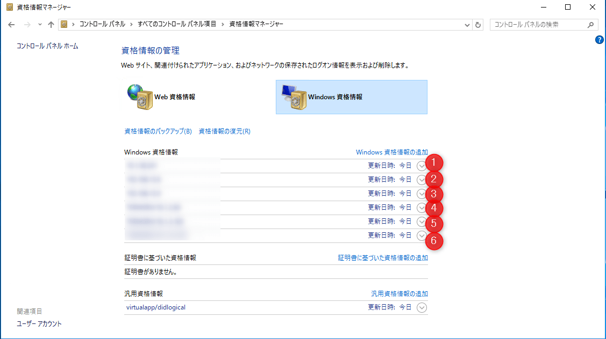

こんにちは。

今回は、 **Windows Server 2016** で **資格マネージャーからWindows資格情報を保存** したのに、 **サインアウト→サインインで保存した情報が消えてしまう** という現象が発生した記事です。

結論から記載しますと、 評価環境から本番環境の共有フォルダに接続するために資格情報を利用していたのですが、 **評価環境と本番環境のNetBIOSドメイン名が同じ** であり、 **資格情報の入力にNetBIOSドメイン名を入力していたことが原因** でした。

以下のような環境です。

## 現象について

以下のように設定を終えました。 **7つ** ありますよね。

サインアウト→サインインすると・・・、 **6つになり1つ消え** てしまいました。

## 原因と解決

冒頭にも記載しましたが、 **評価環境と本番環境のNetBIOSドメイン名が同じ** で、 **ユーザー名の指定にNetBIOSドメイン名とユーザー名を「\」で結合する方法を利用していたため** 発生していました。

このように入力していました。

これを、 **UPN表記に変更することで解決** しました。

## あとがき

今回紹介した事例で、**NetBIOSドメイン名** が **評価環境は hyoka** で、**本番環境は honban** じゃない？と思われた方もいると思います。

はい、Active Directoryを構築する際、 **手動でNetBIOSドメイン名を変更することができ** 今回のケースも変更していました。

古い記事ですがActive Directory構築時の画像は、以下の記事の(5)が参考になります。
[Deployment Active Directory](https://www.itmedia.co.jp/help/howto/win/win2000/0007special/tokusyu/2000_04_1/11.html)

よって、なかなか発生するケースではないと思いますが、はまりました・・・。

参考になれば幸いです。
それでは次回の記事でお会いしましょう。