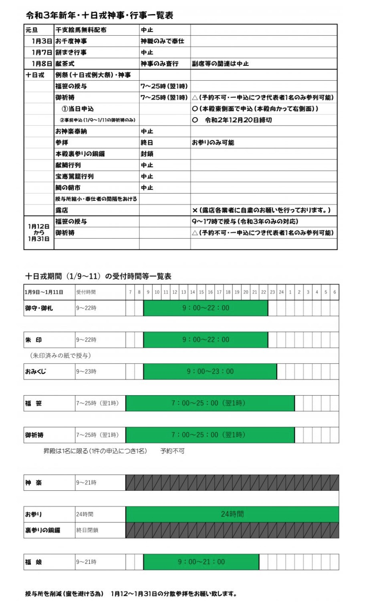
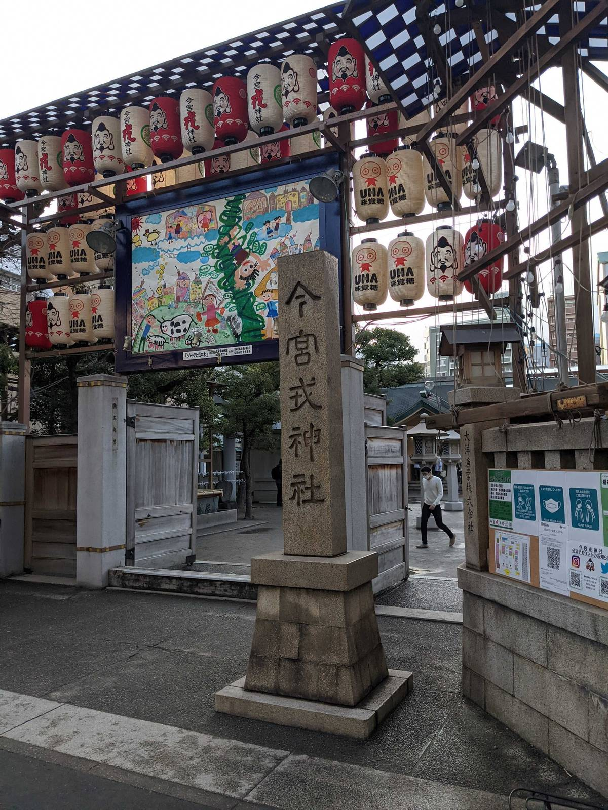
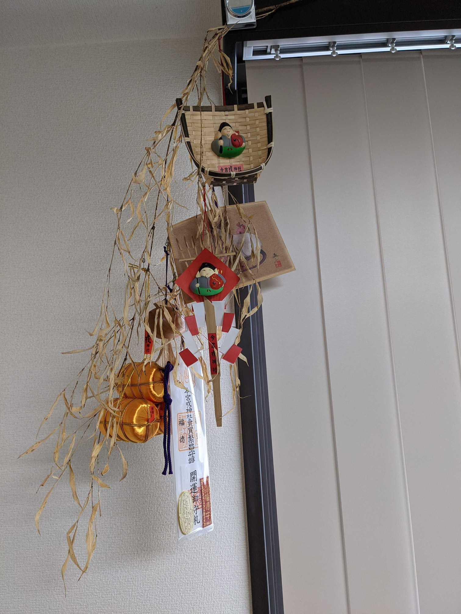
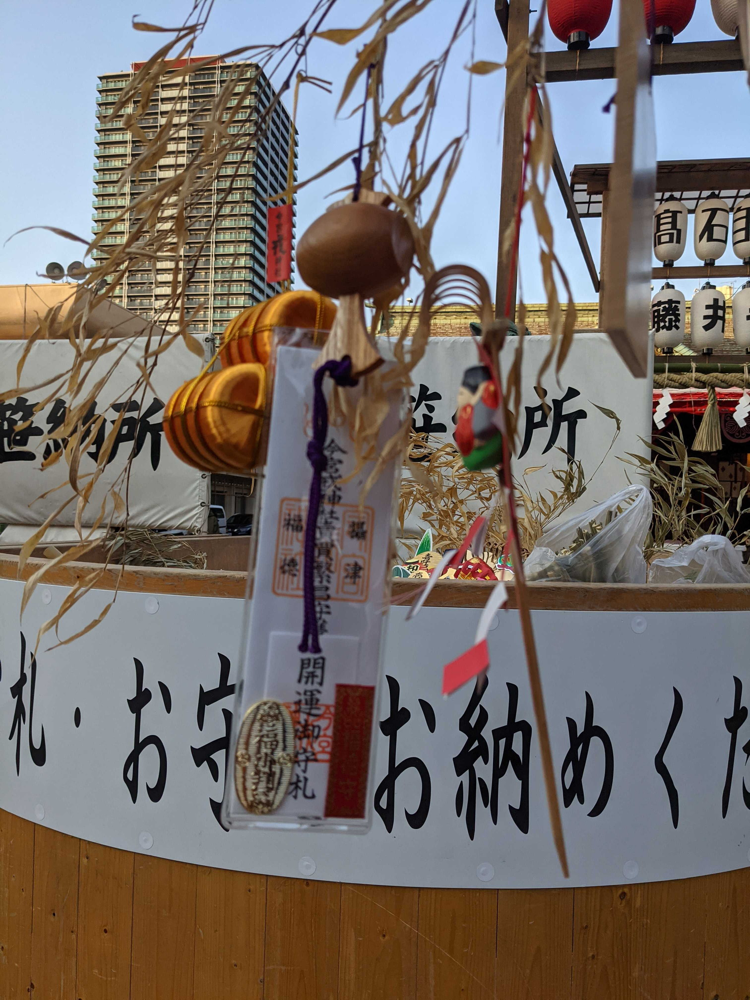
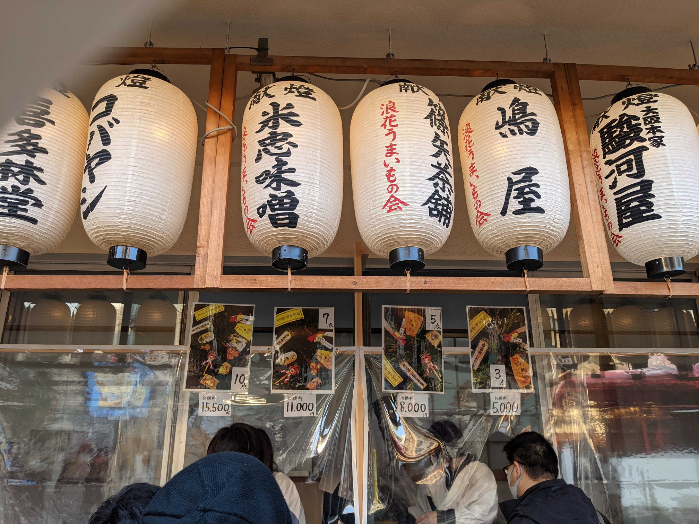
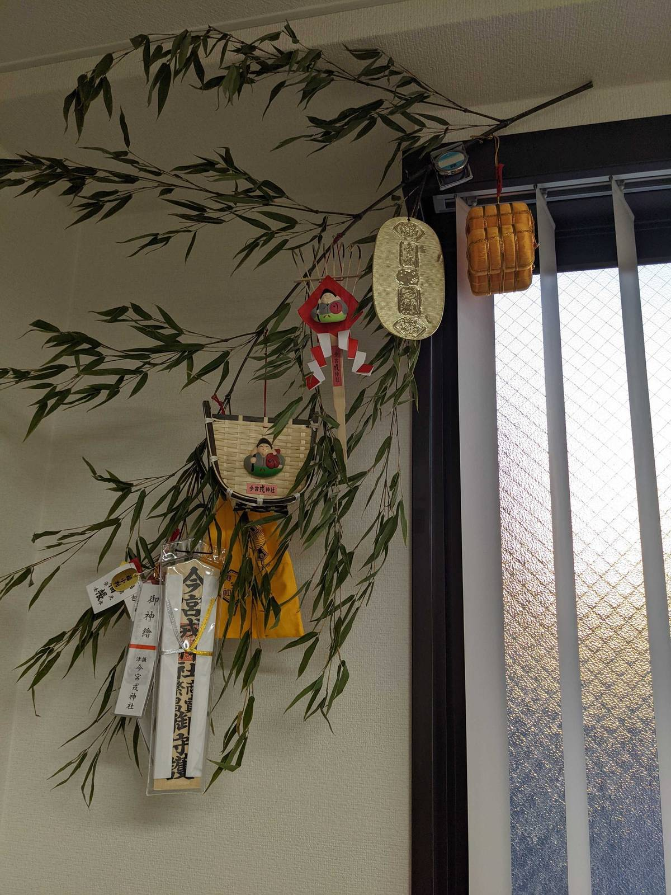
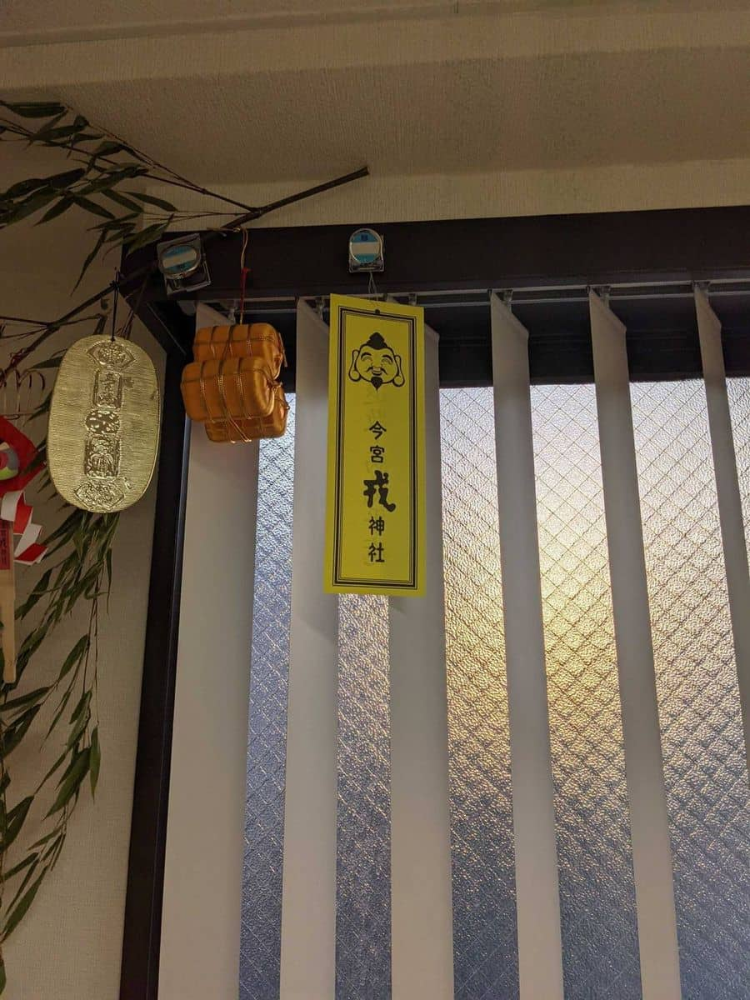

新年あけましておめでとうございます。
本年もよろしくお願いいたします。

例年であれば、十日戎 が賑わう時期に参拝するのですが、今年はコロナ渦で開催が制限されたことと、密集を避けるため1/16(土) の夕方に参拝しました。

今年の日程は以下のように変更されていました。

[今宮戎神社ホームページ抜粋](http://www.imamiya-ebisu.jp/covid-19)

## 参拝・福笹

混雑もなくとても静かな状態でした。
毎年聞いていた「 **商売繁盛で笹もってこい** 」のアナウンスもなく少し寂しかったです。

返納した去年の福笹です。

今年も1年間ありがとうございました。

福笹ですが、毎年この時期は期末となっていて、次の期に向けて飾りを1つずつ増やしていました。

ただ、今年は **緊急事態宣言後に参拝したため福笹の配布が中止** となっており、
**3点、5点、7点、10点 と決められた飾りが取り付けられた笹** となっていました。

今年の笹です。
**来期は7期目なので飾り7点** の予定だったので、ちょうど7点がラインアップされていてよかったです。

笹が大きかったこともありますが、7個も飾りがつくとずっしり重いです。

笹を授与いただいた際に「よければどうぞ」、とお札をいただいたので横に飾りました。

、
## あとがき

毎年買っていた、ベビーカステラと、干支の飴は販売がなく購入できませんでした、残念。。

コロナ渦が落ち着くのはまだ先になりそうですが、来年(2022年)は8つの飾りを選べることを祈っています。

2021年もスタッフ一同頑張って参りますのでどうぞよろしくお願いいたします。
※今年は皆での参拝は自粛したため写真はありません。

