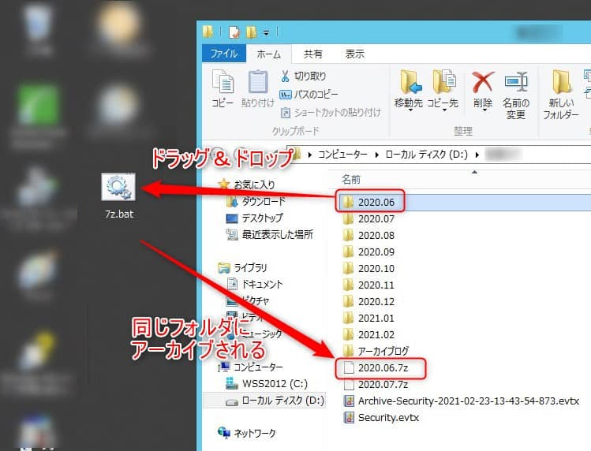
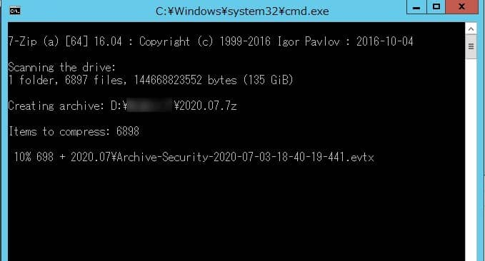

こんにちは。

今回は、 **ファイルやフォルダをバッチファイルにドラッグ＆ドロップするとフォルダと同じ場所に7zで圧縮されたファイルが生成されるバッチファイル** を紹介します。

7z は **インストールしなくても利用できる 7z-extra を利用** します。

プログラムをインストールせず使えるので制限の厳しい環境で生きるかもしれません。
弊社では不定期にログを圧縮する運用があり利用しています。

## 前提
- 7z-extra を所定のパスに配置する

1. 以下より7zの圧縮ファイルをダウンロードします
[/70662/7z1900-extra.7zをダウンロード - 7-Zip - OSDN](https://ja.osdn.net/projects/sevenzip/downloads/70662/7z1900-extra.7z/)
1. ダウンロードした 7z ファイルを解凍し、`C:\7z-extra` に配置します

## バッチファイル

以下のバッチファイルを作成します。

```
@echo off
set ZIP_PATH="C:\7z-extra\x64\7za.exe"
for %%f in (%*) do (
  %ZIP_PATH% a -t7z %%f.7z %%f
)
 
pause
```

バッチファイルも以下にアップロードしておきました。
<a href="https://mseeeen.msen.jp/wp-content/uploads/2021/02/7z.zip">バッチファイル</a>

## 実行

利用方法はとても簡単でバッチファイルにドラッグ＆ドロップするだけです。
<a href="images/batch-file-that-can-be-compressed-to-7z-by-drag-and-drop-1.jpg"></a>

経過も表示され、完了するとpauseで止まります。
<a href="images/batch-file-that-can-be-compressed-to-7z-by-drag-and-drop-2.jpg"></a>

<a href="images/batch-file-that-can-be-compressed-to-7z-by-drag-and-drop-3.jpg"></a>

誰かのお役に立てますように。
それでは次回の記事でお会いしましょう。