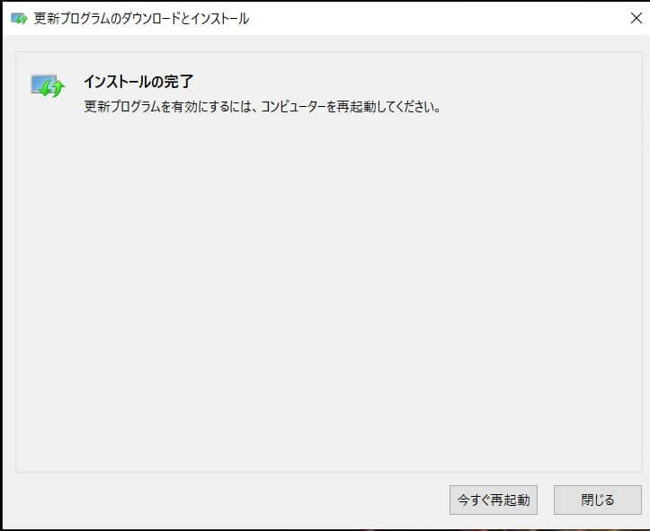

こんにちは。

**2021/3/16** にお客さまより、 **「Excelから印刷しようとするとブルースクリーンになる、助けてほしい」** と連絡がありました。

ブルースクリーンの写真を送っていただくと、以下の画面でした。

画像から、 **win32kfull.sys が関連しているトラブル** が読み取れましたので調べてみるとリアルタイムな日付の記事で色々と引っかかりました。私は以下を参考にしました。

[Microsoft、Windows 10の印刷トラブルに対処したパッチを緊急リリース【16:20追記】 - 窓の杜](https://forest.watch.impress.co.jp/docs/news/1312366.html)

参考にした記事によると、 **セキュリティ更新プログラムが原因で、特定のプリンターを使用した際にブルースクリーン（BSoD）エラーが発生する問題** ということでした。

Windows アップデートカタログから お客様の Windows 10 のバージョンにあった [KB500156](https://www.catalog.update.microsoft.com/Search.aspx?q=KB5001567) をダウンロードし適用しました。
※容量は450MBと大物です。

以下の流れでインストールしました。

これで無事解消しました。

ちなみに、お客様のプリンタは **富士ゼロックスのDocuentre-V C2263** でした。
弊社 **OKI MC362w では発生していません**。

参考になれば幸いです。