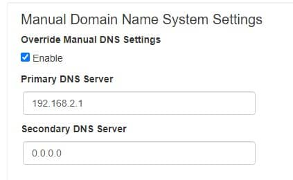
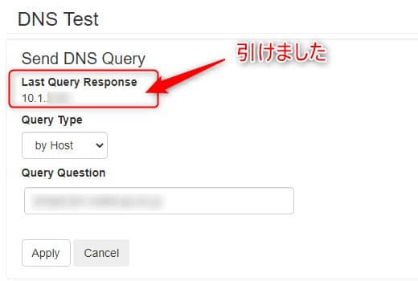

こんにちは。

今回は、dnsmasq を利用してサクッとキャッシュサーバーを構築する方法を紹介します。

> dnsmasqは、小規模なコンピュータ ネットワーク向けに、ドメイン ネーム システム(DNS)キャッシング、動的ホスト構成プロトコル(DHCP)サーバー、ルーター通知、およびネットワーク ブート機能を提供するフリー ソフトウェアです。
[dnsmasq - ウィキペディア](https://en.wikipedia.org/wiki/Dnsmasq) 抜粋

## 想定
- 小規模で閉じたネットワーク
- とりあえず早く名前解決したい
- BINDとか面倒

## 評価環境
- AlmaLinux release 8.3 (Purple Manul) ※RHEL8でも同様にいけると思います
- Schneider Electric のネットワークカード( UPS Network Management Card 2 )

以下の環境で **UPSから名前解決をしたい！** というケースでした


## 設定前のテスト
Schneider Electric のネットワークカード からテストします。

事前に、DNSサーバーを設定します。


はい、引けません。


## dnsmasq 設定
今回は、`/etc/resolv.conf` に記載のDNSサーバーに転送するので事前に記載しておきます。

**/etc/resolv.conf**
```sh
nameserver 192.168.1.11
nameserver 192.168.1.12
```

では、インストールします。
```
dnf -y install dnsmasq
```

以上で完了です。

設定ファイルは、 `/etc/dnsmasq.conf` にあります。

2点だけ変更します。

1. shortnameの名前解決要求を上位DNSサーバに転送しない ( domain-needed )
1. プライベートIPアドレスの逆引き要求を上位DNSサーバに転送しない ( bogus-priv )

diffは以下のとおりです。
```
# diff -u /etc/dnsmasq.conf.org /etc/dnsmasq.conf
--- /etc/dnsmasq.conf.org       2021-06-09 21:45:58.817354453 +0900
+++ /etc/dnsmasq.conf   2021-06-09 21:57:56.744114367 +0900
@@ -16,9 +16,9 @@
 # these requests from bringing up the link unnecessarily.

 # Never forward plain names (without a dot or domain part)
-#domain-needed
+domain-needed
 # Never forward addresses in the non-routed address spaces.
-#bogus-priv
+bogus-priv

 # Uncomment these to enable DNSSEC validation and caching:
 # (Requires dnsmasq to be built with DNSSEC option.)
```

`dnsmasq` を有効にして起動します。
```
systemctl enable dnsmasq
systemctl start dnsmasq
```

`/var/log/messages` に以下のようなログが出力されます。
```
Jun  9 23:57:08 jimsyslog dnsmasq[1898]: reading /etc/resolv.conf
Jun  9 23:57:08 jimsyslog dnsmasq[1898]: using nameserver 192.168.1.11#53
Jun  9 23:57:08 jimsyslog dnsmasq[1898]: using nameserver 192.168.1.12#53
Jun  9 23:57:08 jimsyslog dnsmasq[1898]: read /etc/hosts - 2 addresses
```

`dnsmasq` はデフォルトで `53/tcp` で待ち受けるので `firewalld` でポートをオープンにします。
```
firewall-cmd --add-service=dns --zone=public --permanent
firewall-cmd --reload
```

ポートの待ち受けも確認しておきましょう。
```
# ss -tanu | grep 53
udp    UNCONN  0       0                0.0.0.0:53               0.0.0.0:*
udp    UNCONN  0       0                   [::]:53                  [::]:*
tcp    LISTEN  0       32               0.0.0.0:53               0.0.0.0:*
tcp    LISTEN  0       32                  [::]:53                  [::]:*
```

## 設定後のテスト
再度、Schneider Electric のネットワークカード からテストします。

無事名前解決できましたね。


## あとがき
めんどくさがりの私へ、ここまで記載した内容をコピペで実行できるように以下を記載しておきます。
# resolv.conf は事前に設定ください。

```
dnf -y install dnsmasq
sed -i -e 's/\#domain-needed/domain-needed/g' /etc/dnsmasq.conf
sed -i -e 's/\#bogus-priv/bogus-priv/g' /etc/dnsmasq.conf
systemctl enable dnsmasq
systemctl start dnsmasq
firewall-cmd --add-service=dns --zone=public --permanent
firewall-cmd --reload
```

それでは次回の記事でお会いしましょう。