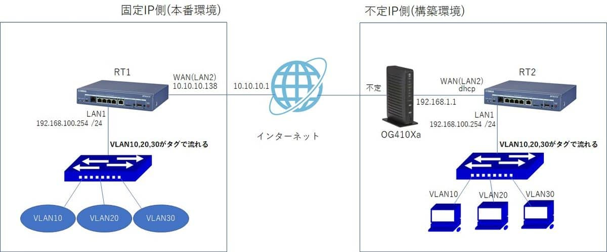
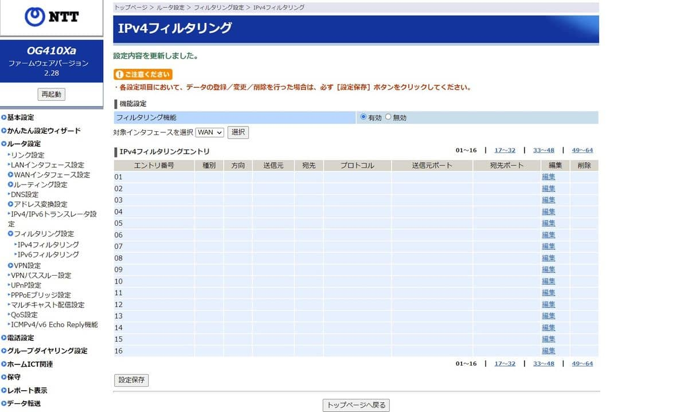
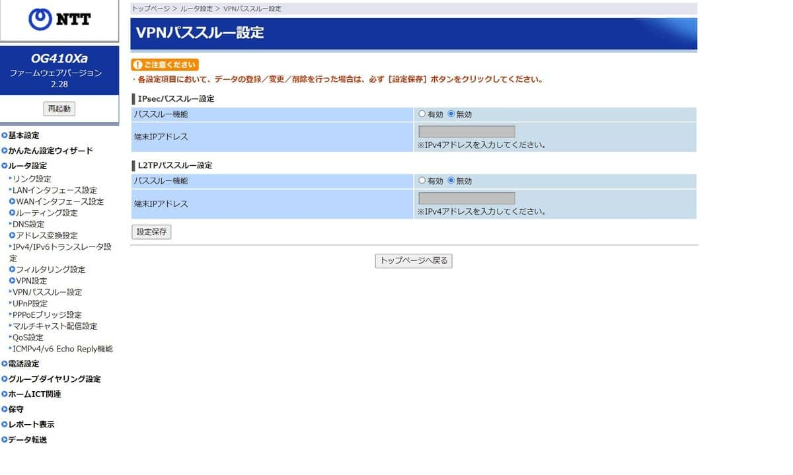
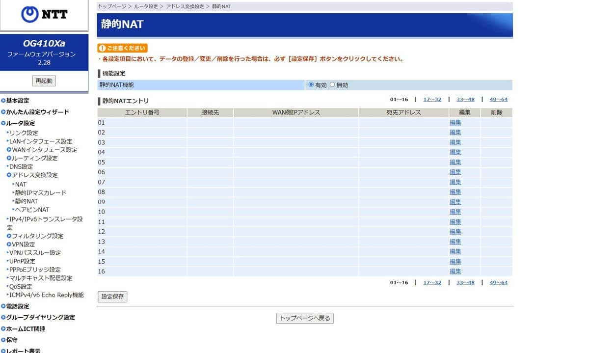
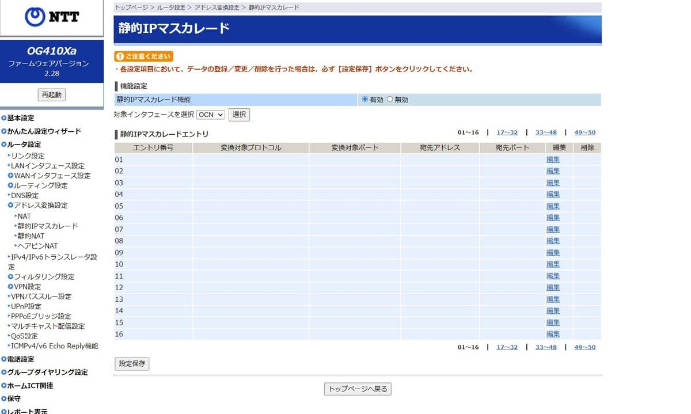

こんにちは。

今回は、ヤマハのVPNルーター RTX830 を利用し、**アグレッシブモードを利用し2拠点間でL2VPNを構築** する手順を紹介します。

IPsecには **メインモード** と **アグレッシブモード** の 2つがあります。
**メインモードが両拠点固定IPアドレス** で、 **アグレッシブモードが片拠点固定IPアドレス** となります。

## 利用シーン

**本番(現地)環境と構築環境が離れている状態で、構築環境から本番環境のネットワークを使いたい !** 、そんなときにこの2拠点間のVPNがあれば効率よく進めることができます。

## 利用した機器
- [YAMAHA RTX830](https://network.yamaha.com/products/routers/rtx830/index) x 2
    - 執筆時点で非常に品薄
- インテリジェントL2スイッチ x2
    - VLANを扱うことができればOK

## 環境

今回の2拠点間のVPNは、**片方が固定IP**、**片方が不定IP** です。
不定IP側は、**フレッツ光ネクスト＋OCN** です。

途中経路上で **必要通信(UDP/500, ESP, UDP/4500)が許可されていることが前提** になります。

**VLANは 10, 20, 30** と3つ設定する例とします。

イメージは以下のようになります。



それでは、各機器の設定を紹介します。

## 各機器の設定

### 不定IP側 - NTT OG410Xa

OCN から提供されている情報でインターネットに接続する設定を実施する以外、特別な設は不要です。

- IPフィルターも有効な状態でOK



- VPN パススルーも設定不要


- NAT も設定不要



- IPマスカレード(NAPT) も設定不要


### YAMAHA RTX830 (図中 RT1,RT2)

**RT1, RT2 共通**
- L2TPv3に関連した設定
    - L2TPv3の自動接続 : 有り
    - L2TPv3トンネル認証 : あり (パスワード : yamaha)
    - L2TPv3トンネルの切断タイマ : 切断タイマを設定しない
    - L2TPv3キープアライブ : 使用する インターバル60秒 ダウン検出までのカウント3回
    - L2TPv3キープアライブのログ出力 : 有り
    - L2TPv3のコネクション制御に関するログ出力 : 有り
    - L2TPv3のRemote End ID : yamaha
- IPsecに関連した設定(両ルーターで共通(aggressiveモード))
    - 暗号化アルゴリズム : aes-cbc
    - 認証方式 : sha-hmac
    - IKEキープアライブ : 使用する
    - IKEキープアライブのログ出力 : 有り
    - NATトラバーサル : 有効
    - 事前共有鍵 : yamaha
    - local nameおよびremote name : l2tpv3

### 不定IP側(イニシエーター側) YAMAHA RTX830 (図中 RT2)

**ポイント**
- グローバルIPアドレス : 不定
- LAN側IPアドレス : 192.168.100.254/24
- Pre-Shared Key : yamaha
- L2TPv3のホスト名 : RT2
- L2TPv3のRouter ID : 192.168.1.254

以下のコンフィグを投入します。

```
# show config
# RTX830 Rev.15.02.17 (Fri Jul 10 09:59:21 2020)
# MAC Address : ac:44:f2:xx:xx:xx, ac:44:f2:xx:xx:xx
# Memory 256Mbytes, 2LAN
# main:  RTX830 ver=00 serial=xxx MAC-Address=ac:44:f2:xx:xx:xx MAC-Address=ac:44:f2:xx:xx:xx
# Reporting Date: Oct 25 12:41:46 2021
console character ja.utf8
bridge member bridge1 lan1 tunnel1
ip bridge1 address 192.168.100.254/24
vlan lan1/1 802.1q vid=10 name=VLAN10
vlan lan1/2 802.1q vid=20 name=VLAN20
vlan lan1/3 802.1q vid=30 name=VLAN30
ip lan1/3 address 192.168.254.253/24
ip lan2 address dhcp
ip lan2 nat descriptor 1
tunnel select 1
 tunnel encapsulation l2tpv3
 tunnel endpoint address 192.168.100.254 10.10.10.138
 ipsec tunnel 101
  ipsec sa policy 101 1 esp aes-cbc sha-hmac
  ipsec ike keepalive log 1 on
  ipsec ike keepalive use 1 on
  ipsec ike local address 1 192.168.100.254
  ipsec ike local name 1 l2tpv3
  ipsec ike nat-traversal 1 on
  ipsec ike pre-shared-key 1 text yamaha
  ipsec ike remote address 1 10.10.10.138
  ipsec ike log 1 key-info message-info payload-info
 l2tp always-on on
 l2tp hostname RT2
 l2tp tunnel auth on yamaha
 l2tp tunnel disconnect time off
 l2tp keepalive use on 60 3
 l2tp keepalive log on
 l2tp syslog on
 l2tp local router-id 192.168.100.254
 l2tp remote router-id 192.168.100.1
 l2tp remote end-id yamaha
 ip tunnel tcp mss limit auto
 tunnel enable 1
nat descriptor type 1 masquerade
nat descriptor address outer 1 primary
nat descriptor address inner 1 auto
nat descriptor masquerade static 1 1 192.168.100.254 udp 500
nat descriptor masquerade static 1 2 192.168.100.254 esp
nat descriptor masquerade static 1 3 192.168.100.254 udp 4500
ipsec auto refresh on
ipsec transport 1 101 udp 1701
syslog notice on
syslog debug on
telnetd host lan
l2tp service on l2tpv3
statistics traffic on
```

### 固定IP側(センター側) YAMAHA RTX830 (図中 RT1)

- グローバルIPアドレス : 10.10.10.138
- LAN側IPアドレス : 192.168.100.1/24
- Pre-Shared Key : yamaha
- L2TPv3のホスト名 : RT1
- L2TPv3のRouter ID : 192.168.1.1

以下のコンフィグを投入します。

```
# show config
# RTX830 Rev.15.02.10 (Fri Jun  7 10:04:56 2019)
# MAC Address : ac:44:f2:xx:xx:xx, ac:44:f2:xx:xx:xx
# Memory 256Mbytes, 2LAN
# main:  RTX830 ver=00 serial=xxx MAC-Address=ac:44:f2:xx:xx:xx MAC-Address=ac:44:f2:92:32:8f
# Reporting Date: Oct 25 12:57:40 2021
console character ja.sjis
ip route default gateway 10.10.10.1
bridge member bridge1 lan1 tunnel1
ip bridge1 address 192.168.100.1/24
vlan lan1/1 802.1q vid=10 name=VLAN10
vlan lan1/2 802.1q vid=20 name=VLAN20
vlan lan1/3 802.1q vid=30 name=VLAN30
ip lan1/3 address 192.168.254.254/24
ip lan2 address 10.10.10.138/24
ip lan2 nat descriptor 1
tunnel select 1
 tunnel encapsulation l2tpv3
 ipsec tunnel 101
  ipsec sa policy 101 1 esp aes-cbc sha-hmac
  ipsec ike keepalive log 1 on
  ipsec ike keepalive use 1 on
  ipsec ike local address 1 192.168.100.1
  ipsec ike remote name 1 l2tpv3
  ipsec ike nat-traversal 1 on
  ipsec ike pre-shared-key 1 text yamaha
  ipsec ike remote address 1 any
  ipsec ike log 1 key-info message-info payload-info
 l2tp always-on on
 l2tp hostname RT1
 l2tp tunnel auth on yamaha
 l2tp tunnel disconnect time off
 l2tp keepalive use on 60 3
 l2tp keepalive log on
 l2tp syslog on
 l2tp local router-id 192.168.100.1
 l2tp remote router-id 192.168.100.254
 l2tp remote end-id yamaha
 ip tunnel tcp mss limit auto
 tunnel enable 1
nat descriptor type 1 masquerade
nat descriptor address outer 1 primary
nat descriptor address inner 1 auto
nat descriptor masquerade static 1 1 192.168.100.1 udp 500
nat descriptor masquerade static 1 2 192.168.100.1 esp
nat descriptor masquerade static 1 3 192.168.100.1 udp 4500
ipsec auto refresh on
ipsec transport 1 101 udp 1701
syslog notice on
syslog debug on
telnetd host lan
l2tp service on l2tpv3
statistics traffic on
```

## あとがき
