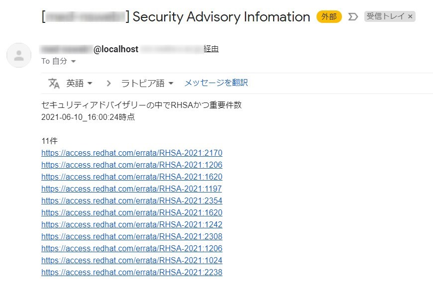

こんにちは。

今回は、RHEL8で動作しているシステムの脆弱性を日々チェックしたいと思い、スクリプトを作成しましたので紹介します。

## スクリプト概要
- RHEL8 でセキュリティアドバイザリーの　**RHSAに該当し、かつ「重要」と判断** されている **一覧をメールで送信** する

RHSA は以下のように定義されています。
>RHSA (Red Hat Security Advisory): RHSA アドバイザリーには、1 つ以上のセキュリティーの修正と、バグ修正または機能強化が含まれます。 RHSA アドバイザリーは、RHBA および RHEA アドバイザリーよりも優先されます。

セキュリティアドバイザリーの意味
[RHSA、RHBA、および RHEA アドバイザリーの説明 - Red Hat Customer Portal](https://access.redhat.com/ja/articles/2280941)

## 環境・前提
- Red Hat Enterprise Linux release 8 ※恐らくRedhat系ならいけると思います
- スクリプトを実行するサーバー自身をチェックする
- スクリプトを実行するサーバーで `sendmail` コマンドでメールが送信できること

## コマンド説明
- 動作しているシステムで該当するセキュリティアドバイザリーをチェックする
    `dnf updateinfo list available`
- RHSA かつ 重要 を抜き出す
    `dnf updateinfo list available | grep RHSA | grep "重要" | awk '{ print $1 }' | uniq`

実行すると以下のようになります。
```sh
# dnf updateinfo list available | grep RHSA | grep "重要" | awk '{ print $1 }' | uniq
RHSA-2021:2170
RHSA-2021:1206
RHSA-2021:1620
RHSA-2021:1197
RHSA-2021:2354
RHSA-2021:1620
RHSA-2021:1242
RHSA-2021:2308
RHSA-2021:1206
RHSA-2021:1024
RHSA-2021:2238
```

## スクリプト本体

```sh
#!/bin/bash

### 変数 ###
## セキュリティアドバイザリーのURLベース
URL=https://access.redhat.com/errata/

## セキュリティアドバイザリーの中でRHSAかつ重要を抽出
result=(`dnf updateinfo list available | grep RHSA | grep "重要" | awk '{ print $1 }' | uniq`)

## 該当件数を取得
num=${#result[*]}

## スクリプト実行時間を取得
time=`date +%Y-%m-%d_%H:%M:%S`

## メールタイトル
subject="[`hostname`] Security Advisory Infomation"

## 送信元メールアドレス
from=`hostname`@localhost

## 送信先メールアドレス
to=to-address@example.com

## メール本文テキスト
body=/tmp/security_advisory_${time}.txt

### メール本文作成処理 ###
echo "From: ${from}" > ${body}
echo "To: ${to}" >> ${body}
echo "Subject: ${subject}" >> ${body}
echo >> ${body}
echo "セキュリティアドバイザリーの中でRHSAかつ重要件数" >> ${body}
echo -n ${time} >> ${body}
echo "時点" >> ${body}
echo >> ${body}
echo -n ${num} >> ${body}
echo "件" >> ${body}
for i in "${result[@]}"
do
  echo "$URL$i" >> ${body}
done
echo -n >> ${body}

## メール送付処理
/usr/bin/cat ${body} | /usr/sbin/sendmail -i -t

## メール本文削除処理
rm -rf ${body}
```

このようなメールが通知されます。



## あとがき
これを cron に登録して日々チェックしようかなと考えています。

アドバイザリーの抽出条件等を変更したり、抽出した結果をURLベースではなく `dnf -y upgrade` と結合して自動アップデートなど応用は利くかな！？と思っています。

何か思いついたら記事にしたいと思います。

それでは次回の記事でお会いしましょう。