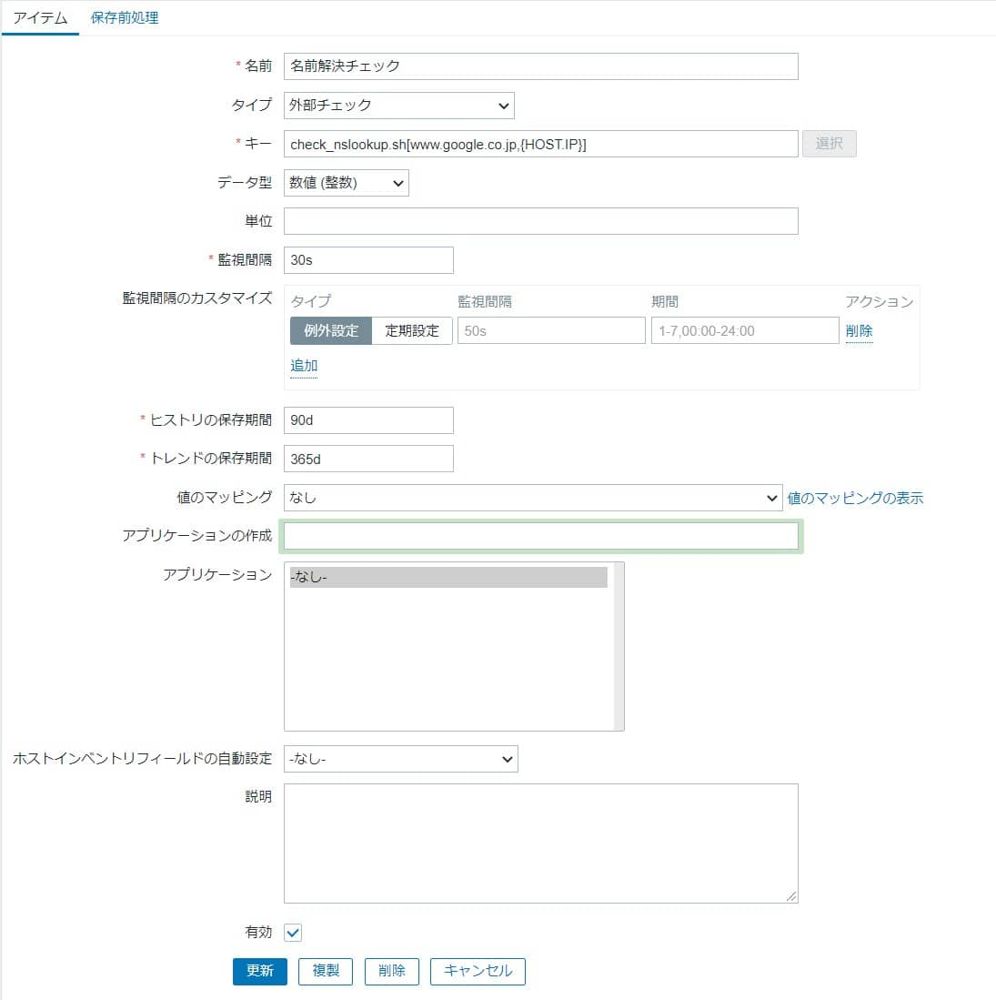

こんにちは。

Zabbixで監視しているDNSサーバーで nslookup を使って名前解決が出来ているかチェックする仕組みを作ってみたので紹介します。

標準で準備されているのかと思いきやなかったので自作しました。

## 環境
- Zabbixサーバー 4.0.0-2
- Zabbixエージェント 5.5.0-0.4beta1

## こんな人に使ってほしい
1. すでにDNSサービス ( 53/tcp )の監視を行っている
1. 監視している「1」のサーバーで正常に名前解決が出来るのか確認したい
※1. は動作要件として必須ではありません。

<a href="images/check-dns-server-can-resolve-names-with-zabbix-1.jpg"></a>

## 監視までの流れ
1. Zabbixサーバーに監視用スクリプトを配置
1. Zabbixサーバーで外部チェックでアイテムを登録する
1. Zabbixサーバーでトリガーを設定する

## Zabbixサーバー要件・チェックスクリプト仕様

- Zabbix サーバーで `nslookup` コマンドが利用できること
- bash スクリプトで作成する
- ファイル名は `check_nslookup.sh` とする
- チェック対象はホスト登録しているIPアドレスとする( ホストのエージェントインターフェースのIPアドレスです )
- チェック対象のFQDNは手書きする
- FQDN が名前解決できたら 1 を返す、解決できなければ 0 を返す

## チェックスクリプト
**check_nslookup.sh**
```bash
#!/bin/bash

nslookup=`nslookup $1 $2`
result=0

if [[ $nslookup == *$1* ]]; then
  result=1
  echo $result
else
  echo $result
fi
```

## チェックスクリプトの配置
チェックスクリプトをZabbix サーバーの以下のパスに配置します。

`/usr/lib/zabbix/externalscripts/check_nslookup.sh`

ファイルのパーミッションは `0700` オーナーは `zabbix` に設定します。
```
-rwx------ 1 zabbix zabbix 132 Jun 10 12:31 check_nslookup.sh
```

## Zabbixサーバーの設定
1. アイテムの作成
以下のようなアイテムを作成します。
<a href="images/check-dns-server-can-resolve-names-with-zabbix-2.jpg"></a>
    - 名前：任意名
    - タイプ：外部チェック
    - キー：`check_nslookup.sh[www.google.co.jp,{HOST.IP}]`
    ※ `www.google.co.jp` の部分はチェックする FQDN を入力してください
    - データ型：数値(整数)
    - 監視間隔：30s ※デフォルト
    - ヒストリの保存期間：90d ※デフォルト
    - トレンドの保存期間：365d ※デフォルト
    - 有効：チェック
1. トリガーの作成
以下のようなトリガーを作成します。
<a href="images/check-dns-server-can-resolve-names-with-zabbix-3.jpg"></a>
    - 名前：任意名
    - 深刻度：致命的な障害 ※適宜変更ください
    - 条件式：`{host1:check_nslookup.sh[www.google.co.jp,{HOST.IP}].last()}=0`
    - 正常イベント生成：条件式
    - 障害イベント生成モード：単一
    - 正常時のイベントクローズ：全ての障害
    - 有効：チェック

以上で設定は完了です。

無事監視ができました。

<a href="images/check-dns-server-can-resolve-names-with-zabbix-4.jpg"></a>

## あとがき

作成したきっかけは、BINDのアップデートなどを実施する都度、名前解決が出来ているかを手動でチェックするのは面倒だな、という思いからでした。

それでは次回の記事でお会いしましょう。